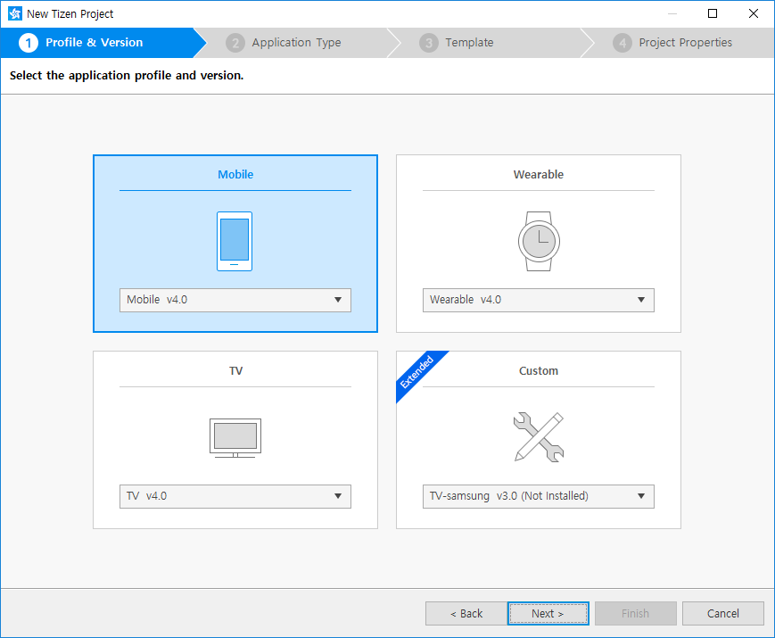
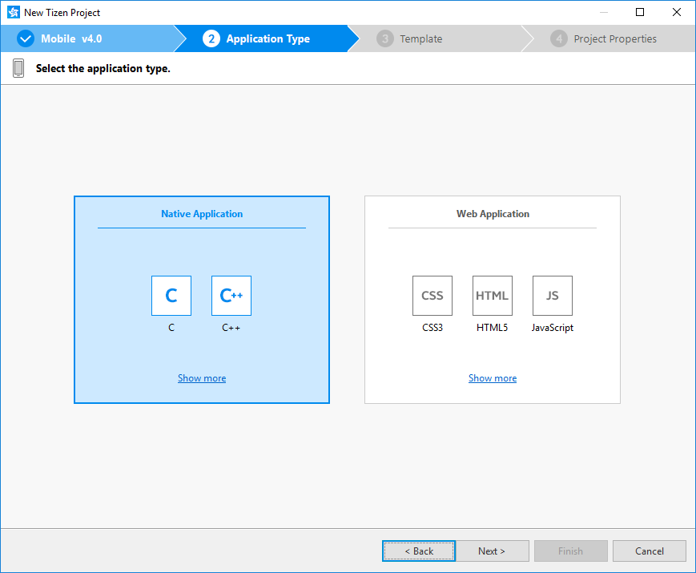
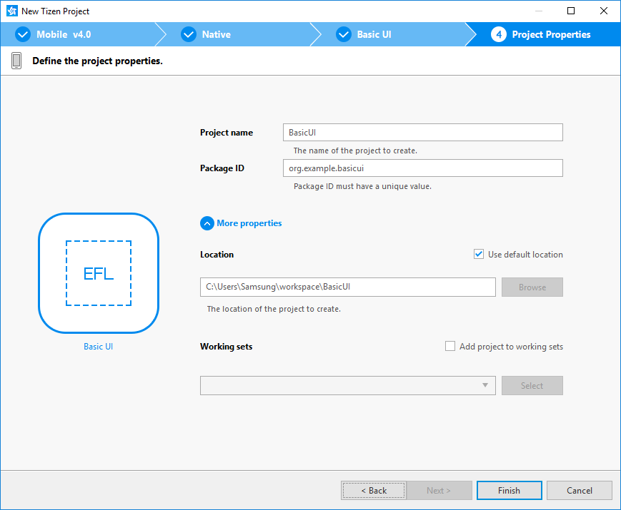
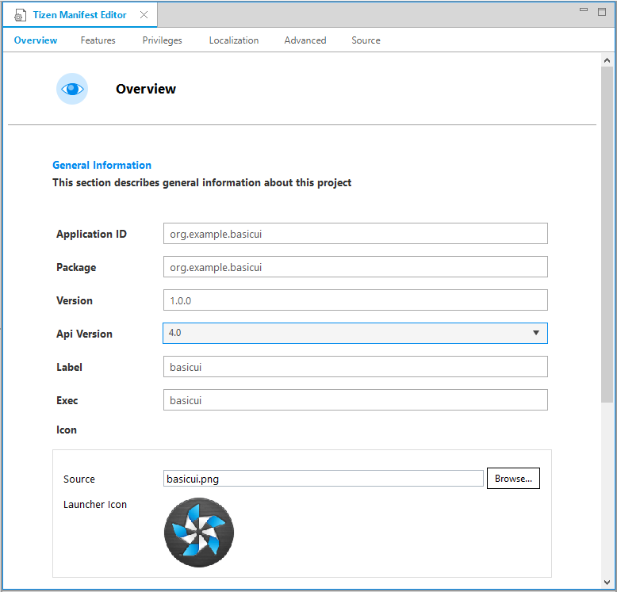
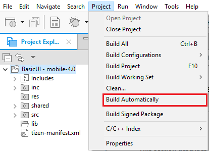
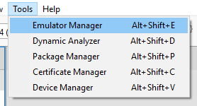
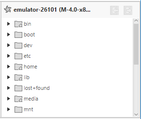
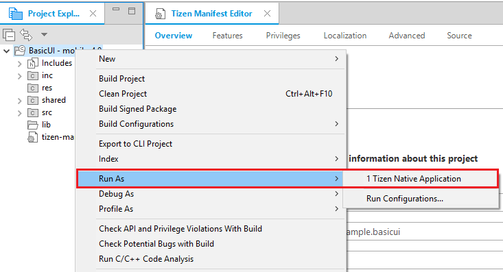

# Creating Your First Tizen Mobile Native Application

**Welcome to Tizen mobile native application development!**

A mobile native application is created using the C language, and can be run on Tizen mobile devices. The application uses the native API, which provides various interfaces to the device hardware allowing you to take advantage of numerous capabilities tailored to run with limited device resources.

Study the following instructions to help familiarize yourself with the Tizen [native application development
process](../process/app-dev-process-n.md) as well as using the Tizen
Studio and installing the created application on the emulator or target device. With the instructions, you can create and run a basic mobile native application, which displays some text on the screen with no user interaction:

1.  Before you get started with developing Tizen applications, download   and install the [Tizen
    Studio](../../../tizen-studio/download/download.md).

    For more information on the installation process, see the
    [installation
    guide](../../../tizen-studio/download/installing-sdk.md).

2. [Create a mobile native project](#create) using the Tizen Studio.

    This step shows how you can use a predesigned project template that creates all the basic files and folders required for your project.

3. [Build the application](#build).

    After you have implemented code for the features you want, this step shows how you can build the application to validate and compile the code.

4. [Run the application](#run).

    This step shows how you can run the application on the emulator or a real target device.

5. [Build a UI](#build_ui).

    This step shows how you can make small alterations to the
    application UI to improve the usability of your application.

When you are developing a more complex application, you can take
advantage of the [native tools included in the Tizen
Studio](../../../tizen-studio/native-tools/cover-native-n.md)
to ease the tasks of creating functionality and designing the
application UI.

<a name="create"></a>
## Creating a Project


The following example shows you how to create and configure a basic
mobile native application project in the Tizen Studio. An application
project contains all the files that make up an application.

The following figure illustrates the application to be created. The
application screen displays the **Hello Tizen** text and no user
interaction is provided. If you click the **Back** key on the device, the application moves to the background.

**Figure: Mobile native Basic UI application**


To create the application project:

1.  Launch the Tizen Studio.

2. Make sure the **Native** perspective is selected in the top right
    corner of the Tizen Studio window.

    

    If not, select it. If the perspective is not visible, in the Tizen
    Studio menu, select **Window &gt; Perspective &gt; Open
    Perspective &gt; Other &gt; Native**, and click **OK**.

3. In the Tizen Studio menu, select **File &gt; New &gt; Tizen
    Project**.

    

    The Project Wizard opens.

4. In the Project Wizard, define the project details.

    The Project Wizard is used to create the basic application skeleton
    with the required folder structure and mandatory files. You can
    easily create different applications by selecting an applicable
    template or sample for the Project Wizard to use.

    a.  Select the **Template** project type and click **Next**.

      

    b. Select the profile (**Mobile**) and version from a drop-down
      list and click **Next**.

      The version depends on the platform version you have installed
      and with which you are developing the application.

      

    c. Select the **Native Application** application type and click
      **Next**.

      

    d. Select the **Basic UI** template and click **Next**.

      

    e. Define the project properties and click **Finish**.

      You can fill the project name (3-50 characters) and the unique
      package ID. You can also select the location and working sets by  clicking **More properties**.

      

      The Project Wizard sets up the project, creates the application        files using the default content from the template, and closes.        For more information on the Project Wizard and the available        templates, see [Creating Tizen Projects with Tizen Project        Wizard](../../../tizen-studio/native-tools/project-wizard-n.md).

You can see the created project in the **Project Explorer** view. The
most important files and folders include:

-   `inc`: Default folder for included source files

-   `res`: Folder for resource files used by the application only

-   `shared`: Folder for resource files to be shared with other
    applications

-   `src`: Folder for source code files

-   `lib`: Folder for external library files

-   `tizen-manifest.xml`: Manifest file used by the platform to install
    and launch the application

**Figure: Application in the Project Explorer**


> **Note**  
> You can [view and modify the application
configuration](#configuration) in the manifest editor. In this example, no configuration changes are required.


Your application project is now ready for further actions. Next, build the application.

<a name="configuration"></a>
### Managing the Application Configuration

To view and modify the application configuration:

1.  In the **Project Explorer** view, double-click the
    `tizen-manifest.xml` file of the application. The Tizen Studio opens
    the file in the manifest editor.

2. In the manifest editor, view and modify the configuration details
    using the various tabs:

    

    -   **Overview**: Define general information, such as the package,
        label, and icon of the application.

    - **Features**: Define required software and hardware features.
        This information is used for application filtering in the Tizen
        market place.

    - **Privileges**: Define the security-sensitive APIs or API groups
        accessed and used by the application.

    - **Localization**: Define localized values for the application
        label, description, and icon.

    - **Advanced**: Define advanced features, such as application
        metadata, data control for services, application control
        functionalities, and account details.

    - **Source**: View and edit the source code of the
        `tizen-manifest.xml` file. Changes made and saved on the other
        tabs are reflected in the source code and vice versa.

        > **Note**  
        > The `tizen-manifest.xml` file must conform to both the
        XML file format and the Tizen native application
        specification requirements. Editing the file in the **Source**  tab is intended for advanced users only.

3. To save any changes, in the Tizen Studio menu, select **File &gt;
    Save All**.

For more information on configuring the application, see [Setting the
Application Manifest](../process/setting-properties-n.md#manifest).

<a name="build"></a>
## Building Your Application

After you have created the application project, you can implement the
required features. In this example, only the default features from the
project template are used, and no code changes are required.

When your application code is ready, you must build the application. The
building process performs a validation check and compiles your files.

You can build the application in the following ways:

-   **Automatically**

    The automatic build means that the Tizen Studio automatically
    rebuilds the application whenever you change a source or resource
    file and save the application project.

    To use the automatic build:

    1.  Select the project in the **Project Explorer** view.
    2. In the Tizen Studio menu, select **Project &gt; Build
        Automatically**.

        

        A check mark appears next to the menu option.

    You can toggle the automatic build on and off by reselecting
    **Project &gt; Build Automatically**.

- **Manually**

    The manual build means that you determine yourself when the
    application is built.

    To manually build the application, right-click the project in the
    **Project Explorer** view and select **Build Project**.

    **Figure: Manually building the application**

    

    Alternatively, you can also select the project in the **Project
    Explorer** view and do one of the following:

    -   In the Tizen Studio menu, select **Project &gt; Build Project**.
    -   Press the **F10** key.

You can have more than one build configuration. To see the current
active configuration or change it, right-click the project in the
**Project Explorer** view and select **Build Configurations &gt; Set
Active**. The default configuration is `Debug`. For more information,
see [Building Applications](../process/building-app-n.md).

After you have built the application, run it.

<a name="run"></a>
## Running Your Application

You can run the application on the emulator or a real target device.

<a name="emulator"></a>
### Running on the Emulator

To run the application on the emulator:

1.  Launch an emulator instance in the [Emulator
    Manager](../../../tizen-studio/common-tools/emulator-manager.md):  
    a. In the Tizen Studio menu, select **Tools > Emulator
      Manager**.

      

    b. In the Emulator Manager, select a mobile emulator from the list  and click **Launch**.

      If no applicable emulator instance exists, [create a new
      one](../../../tizen-studio/common-tools/emulator-manager.md#create).

      

      The emulator is launched in its own window. You can also see the     new emulator instance in the **Device Manager**. To view the      emulator folder structure, click the arrow next to the       emulator instance.

      

2. Generate a security profile.

    Before you run the application, you must [sign your application
    package with a certificate
    profile](../../../tizen-studio/common-tools/certificate-registration.md)    in the Tizen Studio.

3. Run the application:  
    a.  In the **Project Explorer** view, right-click the project and        select **Run As &gt; Tizen Native Application**.

      

      Alternatively, you can also select the project in the **Project        Explorer** view and do one of the following:  
      -   Press the **Ctrl+F11** key.
      -   Click the run icon in the toolbar.

   If you have created multiple emulator instances, select the
    instance you want from the combo box in the toolbar before
    selecting to run the application. If you select an offline
    emulator, it is automatically launched when you select to run
    the application.

    

    b. Confirm that the application launches on the emulator.

      

      > **Note**  
      > If the emulator display has switched off, you cannot        see the application launch. To see the application on the        emulator screen:  
      >    1.  To switch the display on, in the key window next to the            emulator screen, click `Power`.  
      >    2.  On the home screen, swipe left.

      While the application is running, the **Log** view in the Tizen        Studio shows the log, debug, and exception messages from the        methods defined in the log macros. To see the view, in the Tizen        Studio menu, go to **Window &gt; Show View &gt; Log**.

For more information on using the emulator features, see [Using Emulator Control Keys, Menu, and
Panel](../../../tizen-studio/common-tools/emulator-control-panel.md)
and [Using Extended Emulator
Features](../../../tizen-studio/common-tools/emulator-features.md).

<a name="target"></a>
### Running on a Target Device

To run the application on a target device:

1.  Connect the mobile target device to your computer using a USB cable.
2. Generate an author certificate.

    Before you run the application, you must [sign your application
    package with a certificate
    profile](../../../tizen-studio/common-tools/certificate-registration.md)    in the Tizen Studio.

3. Run the application:  
    a.  In the **Device Manager**, select the device.  
    b. In **Project Explorer** view, right-click the project and select        **Run As &gt; Tizen Native Application**.

      

      Alternatively, you can also select the project in the **Project        Explorer** view and do one of the following:
      -   Press the **Ctrl+F11** key.
      -   Click the run icon in the toolbar.

  If you have both a connected device and existing emulator
  instances, select the device from the combo box in the toolbar
  before selecting to run the application.

    

    c. Confirm that the application launches on the target device.


  > **Note**  
  > The application is launched using the default debug    run configuration. To create and use another configuration:  
  >    1.  In the `Project Explorer` view, right-click the project and        select `Run As > Run Configurations`.
  >    2. In the `Run Configurations` window, click the
        `New Launch Configuration` icon (), define the
        configuration details, and launch the application by clicking        `Run`.
  >
  >    


<a name="build_ui"></a>
## Building a Simple UI

The following steps demonstrate how to create a simple user interface for a mobile device using EFL.

This guide consists of the following:

1.  Defining the data structure
2.  Registering life-cycle callbacks
3.  Creating UI objects

<a name="data"></a>
### Defining the Data Structure

A pointer to important objects is stored in the following data
structure:

```c++
struct appdata {
    Evas_Object *win;
    Evas_Object *conform;
    Evas_Object *label;
};
typedef struct appdata appdata_s;
```

<a name="register"></a>
### Registering Life-cycle Callbacks

The `main()` function has callbacks that manage specific parts of the application life-cycle:

-   `app_create`
    -   Called when the application process starts.
    -   Used to create UI components.
-   `app_terminate`
    -   Called while the application process is terminating.
    -   Called after the main loop quits.
-   `app_resume` (UI applications only)
    -   Called when the application window is shown.
-   `app_pause` (UI applications only)
    -   Called when the application window is totally hidden.
-   `app_control`
    -   Called after the `app_create` callback when the process starts         or called when a launch request is received while the process         is running.
    -   Can receive `app_control` data (parameters for launching
        the application).
    -   Used to implement parameter-specific actions of the application.

```c++
int
main(int argc, char *argv[])
{
    appdata_s ad = {0,};
    int ret = 0;

    ui_app_lifecycle_callback_s event_callback = {0,};
    app_event_handler_h handlers[5] = {NULL,};

    event_callback.create = app_create;
    event_callback.terminate = app_terminate;
    event_callback.pause = app_pause;
    event_callback.resume = app_resume;
    event_callback.app_control = app_control;

    ret = ui_app_main(argc, argv, &event_callback, &ad);
    if (ret != APP_ERROR_NONE)
        dlog_print(DLOG_ERROR, LOG_TAG, "app_main() failed. Err=%d", ret);

    return ret;
}
```

<a name="ui"></a>
### Creating UI Objects

The `app_create()` function is called when the process starts, and it calls the `create_base_gui()` function:

```c++
static bool
app_create(void *data)
{
    /*
       Hook to take necessary actions before the main event loop starts
       Initialize UI resources and application data
       If this function returns true, the application main loop starts
       If this function returns false, the application is terminated
    */
    appdata_s *ad = data;

    create_base_gui(ad);

    return true;
}
```

In the `create_base_gui()` function, you can create a simple user
interface that consists of window, conformant, and label objects. The function receives a pointer to fill in the `ad` structure.

```c++
static void
create_base_gui(appdata_s *ad)
{
    /* Window */
    ad->win = elm_win_util_standard_add(PACKAGE, PACKAGE);
    elm_win_autodel_set(ad->win, EINA_TRUE);

    if (elm_win_wm_rotation_supported_get(ad->win)) {
        int rots[4] = {0, 90, 180, 270};
        elm_win_wm_rotation_available_rotations_set(ad->win, (const int *)(&rots), 4);
    }

    evas_object_smart_callback_add(ad->win, "delete,request", win_delete_request_cb, NULL);
    eext_object_event_callback_add(ad->win, EEXT_CALLBACK_BACK, win_back_cb, ad);

    /* Conformant */
    ad->conform = elm_conformant_add(ad->win);
    elm_win_indicator_mode_set(ad->win, ELM_WIN_INDICATOR_SHOW);
    elm_win_indicator_opacity_set(ad->win, ELM_WIN_INDICATOR_OPAQUE);
    evas_object_size_hint_weight_set(ad->conform, EVAS_HINT_EXPAND, EVAS_HINT_EXPAND);
    elm_win_resize_object_add(ad->win, ad->conform);
    evas_object_show(ad->conform);

    /* Label */
    ad->label = elm_label_add(ad->conform);
    elm_object_text_set(ad->label, "<align=center>Hello Tizen</align>");
    evas_object_size_hint_weight_set(ad->label, EVAS_HINT_EXPAND, EVAS_HINT_EXPAND);
    elm_object_content_set(ad->conform, ad->label);

    /* Show the window after the base GUI is set up */
    evas_object_show(ad->win);
}
```

To break down the above code:

-   Window objects can be created by using the
    `elm_win_util_standard_add()` function and adding callbacks on
    window objects. One of the callbacks handles the `delete,request`
    event when the window is to be closed, and the other handles the
    `EEXT_CALLBACK_BACK` event when the hardware back key is pressed.

    ```c++
    /*
       Window
       Create and initialize elm_win, which is mandatory to manipulate a window
    */
    ad->win = elm_win_util_standard_add(PACKAGE, PACKAGE);
    elm_win_autodel_set(ad->win, EINA_TRUE);

    if (elm_win_wm_rotation_supported_get(ad->win)) {
        int rots[4] = {0, 90, 180, 270};
        elm_win_wm_rotation_available_rotations_set(ad->win, (const int *)(&rots), 4);
    }
    evas_object_smart_callback_add(ad->win, "delete,request", win_delete_request_cb, NULL);
    eext_object_event_callback_add(ad->win, EEXT_CALLBACK_BACK, win_back_cb, ad);
    ```

- You can create a conformant object that is based on the window. The     conformant goes inside the window first.

    The `elm_win_indicator_mode_set()` function decides whether the
    indicator is visible, and the `elm_win_indicator_opacity_set()`
    function sets the indicator opacity mode.

    You can set the conformant object as a resize object of the window
    by using the `elm_win_resize_object_add()` function. It means that
    the conformant size and position are controlled by the window
    object directly.

    The `evas_object_show()` function makes the conformant
    object visible.

    ```c++
    /*
       Conformant
       Create and initialize elm_conformant, which is mandatory for the base GUI
       to have a proper size when an indicator or virtual keypad is visible
    */
    ad->conform = elm_conformant_add(ad->win);
    elm_win_indicator_mode_set(ad->win, ELM_WIN_INDICATOR_SHOW);
    elm_win_indicator_opacity_set(ad->win, ELM_WIN_INDICATOR_OPAQUE);
    evas_object_size_hint_weight_set(ad->conform, EVAS_HINT_EXPAND, EVAS_HINT_EXPAND);
    elm_win_resize_object_add(ad->win, ad->conform);
    evas_object_show(ad->conform);
    ```

- You can add a label object for text by using the
    `elm_label_add()` function. It adds a new label to the parent
    (conformant object).

    You can also set the text to the label by using the
    `elm_object_text_set()` function.

    ```c++
    /*
       Label
       Create an actual view of the base GUI
       Modify this part to change the view
    */
    ad->label = elm_label_add(ad->conform);
    elm_object_text_set(ad->label, "<align=center>Hello Tizen</align>");
    evas_object_size_hint_weight_set(ad->label, EVAS_HINT_EXPAND, EVAS_HINT_EXPAND);
    elm_object_content_set(ad->conform, ad->label);
    ```

- When all the UI components are ready, make the window object visible
    by using the `evas_object_show()` function. This sets the window to
    display everything on the screen at once.

    ```c++
    /* Show the window after the base GUI is set up */
    evas_object_show(ad->win);
    ```
