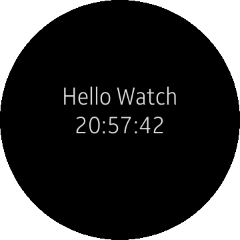
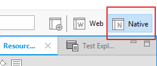
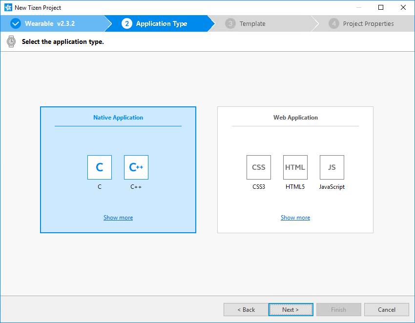
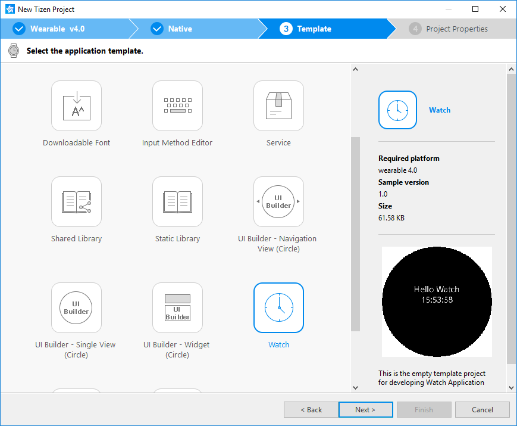
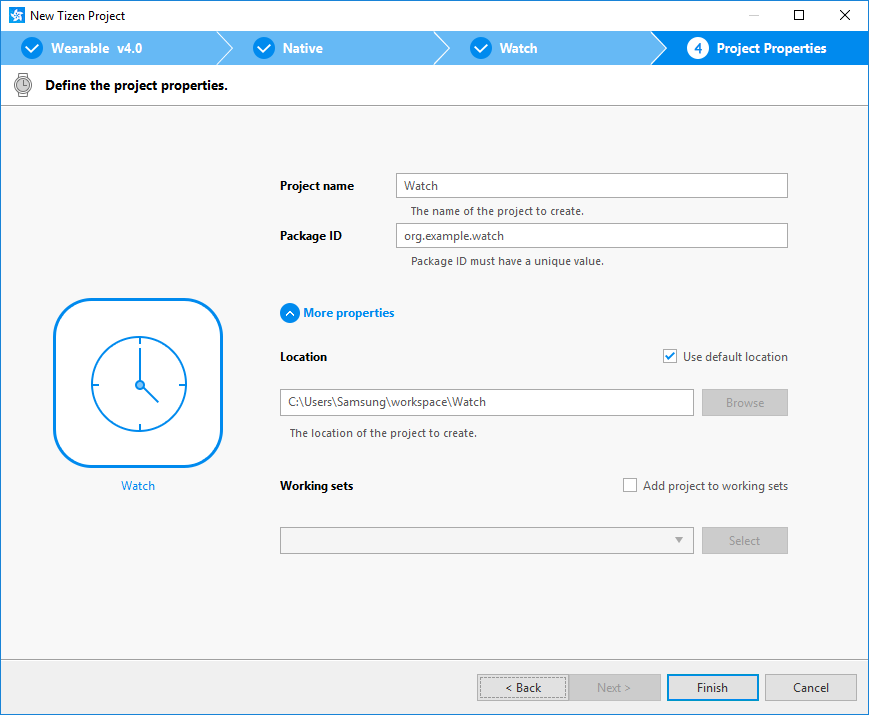
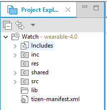
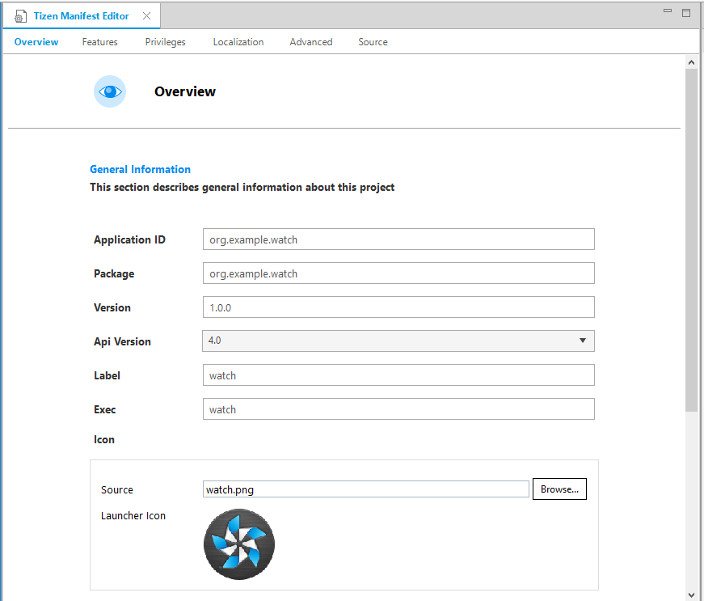
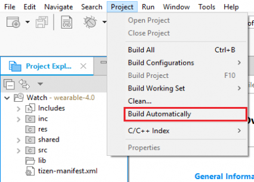
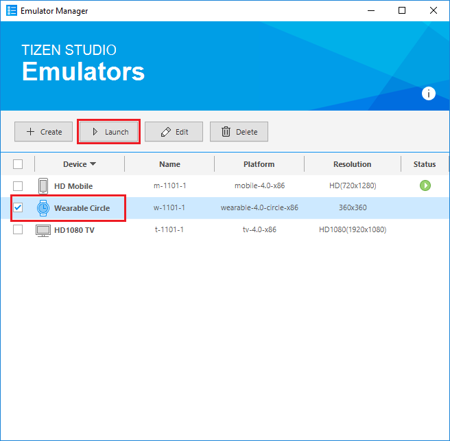
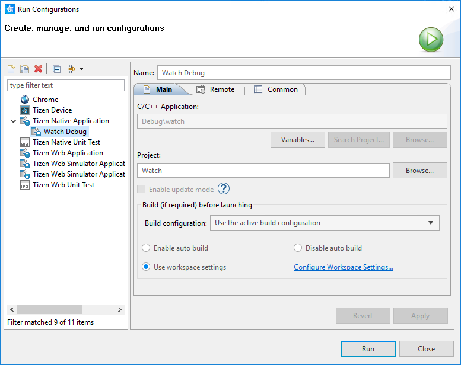

# Creating Your First Tizen Wearable Native Watch Application

**Welcome to Tizen wearable native watch application development!**

A wearable native watch application is created using the C language, and can be run on Tizen wearable devices to display a customized watch face to the user.

Study the following instructions to help familiarize yourself with the Tizen [native application development process](../process/app-dev-process-n.md) as well as using the Tizen Studio and installing the created application on the emulator or target device. With the instructions, you can create and run a basic wearable native watch application, which displays some text and the current time on the screen:

1. Before you get started with developing Tizen applications, download and install the [Tizen Studio](../../../../org.tizen.studio/html/download/download.htm).For more information on the installation process, see the [installation guide](../../../../org.tizen.studio/html/download/installing_sdk.htm).
2. [Create a wearable native watch project](#project) using the Tizen Studio.This step shows how you can use a predesigned project template that creates all the basic files and folders required for your project.
3. [Build the application](#build).After you have implemented code for the features you want, this step shows how you can build the application to validate and compile the code.
4. [Run the application](#run).This step shows how you can run the application on the emulator or a real target device.
5. [Build a UI](#build).This step shows how you can make small alterations to the application UI to improve the usability of your application.

When you are developing a more complex application, you can take advantage of the [native tools included in the Tizen Studio](../../../../org.tizen.studio/html/native_tools/cover_native_n.htm) to ease the tasks of creating functionality and designing the application UI.

## Creating a Project

The following example shows you how to create and configure a basic wearable native watch application project in the Tizen Studio. An application project contains all the files that make up an application.

The following figure illustrates the application to be created. The application screen displays the **Hello Watch** text and the current time, which continues to be refreshed every second while the application runs.

**Figure: Wearable native Watch application**



To create the application project:

1. Launch the Tizen Studio.

2. Make sure the **Native** perspective is selected in the top right corner of the Tizen Studio window.

   

   If not, select it. If the perspective is not visible, in the Tizen Studio menu, select **Window > Perspective > Open Perspective > Other > Native**, and click **OK**.

3. In the Tizen Studio menu, select **File > New > Tizen Project**.

   

   The Project Wizard opens.

4. In the Project Wizard, define the project details.

   The Project Wizard is used to create the basic application skeleton with the required folder structure and mandatory files. You can easily create different applications by selecting an applicable template or sample for the Project Wizard to use.

   1. Select the **Template** project type and click **Next**.

      

   2. Select the profile (**Wearable**) and version from a drop-down list and click **Next**.

      The version depends on the platform version you have installed and with which you are developing the application.

      

   3. Select the **Native Application** application type and click **Next**.

      

   4. Select the **Watch** template and click **Next**.

      

   5. Define the project properties and click **Finish**.

      You can fill the project name (3-50 characters) and the unique package ID. You can also select the location and working sets by clicking **More properties**.

      

      The Project Wizard sets up the project, creates the application files using the default content from the template, and closes. For more information on the Project Wizard and the available templates, see [Creating Tizen Projects with Tizen Project Wizard](../../../../org.tizen.studio/html/native_tools/project_wizard_n.htm).

You can see the created project in the **Project Explorer** view. The most important files and folders include:

- `inc`: Default folder for included source files
- `res`: Folder for resource files used by the application only
- `shared`: Folder for resource files to be shared with other applications
- `src`: Folder for source code files
- `lib`: Folder for external library files
- `tizen-manifest.xml`: Manifest file used by the platform to install and launch the application

**Figure: Application in the Project Explorer**



**Note**You can [view and modify the application configuration](#configuration) in the manifest editor. In this example, no configuration changes are required.

Your application project is now ready for further actions. Next, build the application.

### Managing the Application Configuration

To view and modify the application configuration:

1. In the **Project Explorer** view, double-click the `tizen-manifest.xml` file of the application. The Tizen Studio opens the file in the manifest editor.

2. In the manifest editor, view and modify the configuration details using the various tabs:

   

   - **Overview**: Define general information, such as the package, label, and icon of the application.

   - **Features**: Define required software and hardware features. This information is used for application filtering in the Tizen market place.

   - **Privileges**: Define the security-sensitive APIs or API groups accessed and used by the application.

   - **Localization**: Define localized values for the application label, description, and icon.

   - **Advanced**: Define advanced features, such as application metadata and some miscellaneous options.

   - **Source**: View and edit the source code of the `tizen-manifest.xml` file. Changes made and saved on the other tabs are reflected in the source code and vice versa.

     **Note**The `tizen-manifest.xml` file must conform to both the XML file format and the Tizen native application specification requirements. Editing the file in the **Source** tab is intended for advanced users only.

3. To save any changes, in the Tizen Studio menu, select **File > Save All**.

For more information on configuring the application, see [Setting the Application Manifest](../process/setting-properties-n.md#manifest).

## Building Your Application

After you have created the application project, you can implement the required features. In this example, only the default features from the project template are used, and no code changes are required.

When your application code is ready, you must build the application. The building process performs a validation check and compiles your files.

You can build the application in the following ways:

- **Automatically**

  The automatic build means that the Tizen Studio automatically rebuilds the application whenever you change a source or resource file and save the application project.

  To use the automatic build:

  1. Select the project in the **Project Explorer** view.
  2. In the Tizen Studio menu, select **Project > Build Automatically**.A check mark appears next to the menu option.

  You can toggle the automatic build on and off by reselecting **Project > Build Automatically**.

- **Manually**

  The manual build means that you determine yourself when the application is built.

  To manually build the application, right-click the project in the **Project Explorer** view and select **Build Project**.

  **Figure: Manually building the application**

  

  Alternatively, you can also select the project in the **Project Explorer** view and do one of the following:

  - In the Tizen Studio menu, select **Project > Build Project**.
  - Press the **F10** key.

You can have more than one build configuration. To see the current active configuration or change it, right-click the project in the **Project Explorer** view and select **Build Configurations > Set Active**. The default configuration is `Debug`. For more information, see [Building Applications](../process/building-app-n.md).

After you have built the application, run it.

## Running Your Application

You can run the application on the emulator or a real target device.

### Running on the Emulator

To run the application on the emulator:

1. Launch an emulator instance in the [Emulator Manager](../../../../org.tizen.studio/html/common_tools/emulator_manager.htm):In the Tizen Studio menu, select **Tools > Emulator Manager**.In the Emulator Manager, select a wearable emulator from the list and click **Launch**.If no applicable emulator instance exists, [create a new one](../../../../org.tizen.studio/html/common_tools/emulator_manager.htm#create).The emulator is launched in its own window. You can also see the new emulator instance in the **Device Manager**. To view the emulator folder structure, click the arrow next to the emulator instance.

2. Generate a security profile.

   Before you run the application, you must [sign your application package with a certificate profile](../../../../org.tizen.studio/html/common_tools/certificate_registration.htm) in the Tizen Studio.

3. Run the application:

   1. In the **Project Explorer** view, right-click the project and select **Run As > Tizen Native Application**.Alternatively, you can also select the project in the **Project Explorer** view and do one of the following:Press the **Ctrl+F11** key.Click the run icon in the toolbar.If you have created multiple emulator instances, select the instance you want from the combo box in the toolbar before selecting to run the application. If you select an offline emulator, it is automatically launched when you select to run the application.In the **Console** view, you can see that the application is successfully installed. However, it does not run on the emulator screen until you change the watch face in the emulator **Settings** menu.

   2. Change the watch face.

      When a watch application is successfully installed on the emulator, the watch UI is visible in the emulator **Clock** menu.

      To change the watch face and make the watch application visible:

      

      1. If the emulator display has been switched off, activate it by pressing the **Power** key (in the bottom right corner of the emulator).

      2. On the home screen (showing the default watch face), swipe up.

      3. Select **Settings > Clock**.

      4. Swipe right and select your watch application.

         The **Clock changed** message is displayed.

      5. Press the **Back** key (in the top right corner of the emulator device) multiple times, until the home screen with your new watch face is shown.

      While the application is running, the **Log** view in the Tizen Studio shows the log, debug, and exception messages from the methods defined in the log macros. To see the view, in the Tizen Studio menu, go to **Window > Show View > Log**.

For more information on using the emulator features, see [Using Emulator Control Keys, Menu, and Panel](../../../../org.tizen.studio/html/common_tools/emulator_control_panel.htm) and [Using Extended Emulator Features](../../../../org.tizen.studio/html/common_tools/emulator_features.htm).

### Running on a Target Device

To run the application on a target device:

1. Connect the wearable target device to your computer:

   1. Define settings on the device:

      - Go to **Settings > Connections**, and switch on Bluetooth.
      - Go to **Settings > Connections**, and switch on Wi-Fi.The device and the computer must be connected to the same Wi-Fi network.Note the IP address the device is using.
      - Go to **Settings > Gear info**, and switch on the debugging mode.

   2. In the terminal, enter the following commands:

      ```
      cd tizen-sdk/tools
      ./sdb connect <IP address of Gear S2>
      ```

      Use the IP address you noted before.

      Instead of the terminal, you can also use the [Remote Device Manager](../wearable/first-app-wn.md#remote_device) for the connection.

   3. In the first attempt, the connection fails and the device asks for user confirmation. To allow Gear to read log data, copy files to and from your computer, and install the application manually, click the accept mark.

      

   4. In the **Device Manager**, confirm that the device is connected (shown in the device list).

2. Generate an author certificate.

   Before you run the application, you must [sign your application package with a certificate profile](../../../../org.tizen.studio/html/common_tools/certificate_registration.htm) in the Tizen Studio.

3. Run the application:

   1. In the **Device Manager**, select the device.

   2. In **Project Explorer** view, right-click the project and select **Run As > Tizen Native Application**.Alternatively, you can also select the project in the **Project Explorer** view and do one of the following:Press the **Ctrl+F11** key.Click the run icon in the toolbar.If you have both a connected device and existing emulator instances, select the device from the combo box in the toolbar before selecting to run the application.

   3. Confirm that the application launches on the target device.

      Like with the [emulator](#watchface), you must change the watch face in the device settings before you can see the watch application UI on the device.

   **Note**The application is launched using the default debug run configuration. To create and use another configuration:In the `Project Explorer` view, right-click the project and select `Run As > Run Configurations`.In the `Run Configurations` window, click the `New Launch Configuration` icon (), define the configuration details, and launch the application by clicking `Run`.

## Building a Simple UI

The following example is based on a template project for a wearable watch application, which was introduced in [Creating a Project](#project).

The template project makes it easy to create your watch application. Without modification, you can build and run the project. However, it is important to understand the following template code to customize it.

### Initializing the Watch Application

To initialize the watch application:

1. To use the functions and data types of the [Watch Application](../../../../org.tizen.native.wearable.apireference/group__CAPI__WATCH__APP__MODULE.html) API, include the `<watch_app.h>` header file in your application:`#include <watch_app.h>`All header files that you need are already included in the `watchapplication.h` file, which is generated by the Tizen Studio when the template project is created.

2. Set the life-cycle callbacks in the [watch_app_lifecycle_callback_s](../../../../org.tizen.native.wearable.apireference/structwatch__app__lifecycle__callback__s.html) structure, and pass the structure to the `watch_app_main()` function of the [Watch Application](../../../../org.tizen.native.wearable.apireference/group__CAPI__WATCH__APP__MODULE.html) API to start the watch application event loop

   ```
   int
   main(int argc, char* argv[])
   {
       appdata_s ad = {0,};
       int ret = 0;
       watch_app_lifecycle_callback_s event_callback = {0,};

       event_callback.create = app_create;
       event_callback.time_tick = app_time_tick;

       ret = watch_app_main(argc, argv, &event_callback, &ad);

       return ret;
   }
   ```

   1. The `create` event is triggered before the application main loop starts. In this callback, you can initialize the application resources, such as create windows and data structures.

      ```
      static bool
      app_create(int width, int height, void* data)
      {
          /*
             Hook to take necessary actions before the main event loop starts
             This usually means initializing the UI and application data
          */

          return true;
      }
      ```

   2. The `time_tick` event is triggered at least once per second. The watch applications can get the current time from the `watch_time` time handle to draw a normal watch.

      ```
      static void
      app_time_tick(watch_time_h watch_time, void* data)
      {
          /* Called at least once per second */
          /* Draw a normal watch with the hour, minute, and second */
      }
      ```

      **Note**For more information on the application life-cycle callbacks, see [Applications](../../../../org.tizen.guides/html/native/app_management/applications_n.htm).

### Drawing the Watch UI

To draw the watch UI, you need the current time handle and the window object of the idle screen:

1. Get the window object with the `watch_app_get_elm_win()` function of the [Watch Application](../../../../org.tizen.native.wearable.apireference/group__CAPI__WATCH__APP__MODULE.html) API:

   ```
   struct appdata {
       Evas_Object *win;
       Evas_Object *conform;
       Evas_Object *label;
   };
   typedef struct appdata appdata_s;

   static void
   create_base_gui(appdata_s *ad, int width, int height)
   {
       int ret;
       watch_time_h watch_time = NULL;

       ret = watch_app_get_elm_win(&ad->win);

       if (ret != APP_ERROR_NONE) {
           dlog_print(DLOG_ERROR, LOG_TAG, "failed to get window. err = %d", ret);

           return;
       }

       evas_object_resize(ad->win, width, height);

       ad->conform = elm_conformant_add(ad->win);
       evas_object_size_hint_weight_set(ad->conform, EVAS_HINT_EXPAND, EVAS_HINT_EXPAND);
       elm_win_resize_object_add(ad->win, ad->conform);
       evas_object_show(ad->conform);

       ad->label = elm_label_add(ad->conform);
       evas_object_resize(ad->label, width, height / 3);
       evas_object_move(ad->label, 0, height / 3);
       evas_object_show(ad->label);

       ret = watch_time_get_current_time(&watch_time);

       if (ret != APP_ERROR_NONE) {
           dlog_print(DLOG_ERROR, LOG_TAG, "failed to get current time. err = %d", ret);

           return;
       }

       update_watch(ad, watch_time, 0);
       watch_time_delete(watch_time);
       evas_object_show(ad->win);
   }

   static bool
   app_create(int width, int height, void *date)
   {
       /* Define system callbacks */

       appdata_s *ad = data;
       create_base_gui(ad, width, height);

       return true;
   }
   ```

2. You can get the current local time handle in the `time_tick` callback function and then draw the watch UI with the handle. For example, you can use the `watch_time_get_minute()` function of the Watch Application API to retrieve the current minute value.

   ```
   static void
   update_watch(appdata_s *ad, watch_time_h watch_time, int ambient)
   {
       char watch_text[TEXT_BUF_SIZE];
       int hour24;
       int minute;
       int second;
       if (watch_time == NULL)
           return;

       watch_time_get_hour24(watch_time, &hour24);
       watch_time_get_minute(watch_time, &minute);
       watch_time_get_second(watch_time, &second);
       if (!ambient) {
           snprintf(watch_text, TEXT_BUF_SIZE,
                    "<align=center>Hello Watch<br/>%02d:%02d:%02d</align>",
                    hour24, minute, second);
       } else {
           snprintf(watch_text, TEXT_BUF_SIZE,
                    "<align=center>Hello Watch<br/>%02d:%02d</align>",
                    hour24, minute);
       }

       elm_object_text_set(ad->label, watch_text);
   }

   static void
   app_time_tick(watch_time_h watch_time, void* data)
   {
       appdata_s *ad = data;
       update_watch(ad, watch_time, 0);
   }
   ```

### Using the Ambient Mode

On a low-powered wearable device, an ambient mode is available. In this mode, the watch application shows a limited UI and receives only the ambient tick event every minute to reduce power consumption.

The details of the limited UI drawn in the ambient mode depend on the device. In addition, due to the ambient mode being a low power mode, there are limits to the colors that can be shown on the screen. Usually, when designing the ambient mode UI, draw it with limited colors (cyan, magenta, yellow, red, green, blue, black and white), and use less than 15% of the pixels on the screen. If you do not want to draw your own ambient mode UI, set the `ambient-support` attribute to `false` in the watch application manifest file to allow the platform to show a default ambient mode UI.

**Note**To use the ambient mode, the user must enable it in the device settings. In addition, on the Gear S2 device, the ambient mode activates only when you are wearing the watch on the wrist.

To use the ambient mode:

1. Define the ambient mode callbacks:

   - The `ambient_changed` callback is called when the ambient mode is enabled or disabled on the device. You can use the callback to initialize your ambient mode UI.
   - The `ambient_tick` callback is called every minute while the device is in the ambient mode. You can use the callback to update the time on your watch application in the ambient mode. In this callback, do not perform time-consuming tasks and always update the UI as fast as possible. The platform can put the device to sleep shortly after the ambient tick expires.

   ```
   static void
   app_ambient_tick(watch_time_h watch_time, void* data)
   {
       appdata_s *ad = data;
       update_watch(ad, watch_time, 1);
   }

   static void
   app_ambient_changed(bool ambient_mode, void* data)
   {
       if (ambient_mode)
           /* Prepare to enter the ambient mode */
       else
           /* Prepare to exit the ambient mode */
   }
   ```

2. Register the ambient mode callbacks:

   ```
   int
   main(int argc, char* argv[])
   {
       appdata_s ad = {0,};
       int ret = 0;
       watch_app_lifecycle_callback_s event_callback = {0,};

       event_callback.create = app_create;
       event_callback.time_tick = app_time_tick;

       event_callback.ambient_tick = app_ambient_tick;
       event_callback.ambient_changed = app_ambient_changed;

       ret = watch_app_main(argc, argv, &event_callback, &ad);

       return ret;
   }
   ```