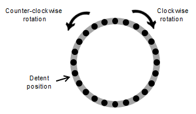

# Event Handling

The Tizen platform supports event handling for user interactions. To
provide a full user experience for your application users, you must
handle various events in your application.

This feature is supported in wearable applications only.

<a name="rotary"></a>
## Rotary Events

The Tizen platform supports rotary events for user interaction on a
wearable rotary device or sensor. The rotary device can rotate clockwise
or counter-clockwise, and dispatch an event for each movement. The
rotary device has points called **detent**. If the rotary device detects
the detent point while rotating, it dispatches a separate new event
about the point. The number of the available detent points depends on
the device hardware.

**Figure: Rotary device**



Rotary events are used to deliver the rotary device or sensor data to
the application. The following table describes the rotary events.

**Table: Rotary events**

| Type | Description | Attribute |
| --- | --- | --- |
| rotarydetent | Event is triggered when a device detects the detent point. | `detail.direction`: the rotation direction.<br>The available values are `CW` for clockwise and `CCW` for counter-clockwise rotation.|

To bind an event callback on rotary events, use the following code:  
```c++
document.addEventListener('rotarydetent', function(ev) {
    /* Get the direction value from the event */
    var direction = ev.detail.direction;

    if (direction == 'CW') {
        /* Add behavior for clockwise rotation */
        console.log('clockwise');
    } else if (direction == 'CCW') {
        /* Add behavior for counter-clockwise rotation */
        console.log('counter-clockwise');
    }
});
```

<a name="ambient"></a>
## Ambient Events

On a low-powered wearable device, an ambient mode is available for watch
applications. To reduce power consumption, a Tizen watch application
displayed on the idle screen in ambient mode can show a limited UI and
receives only the ambient tick event every minute.

The details of the limited UI drawn in the ambient mode depend on the
device. In addition, due to the ambient mode being a low-power mode,
there are limits to the colors that can be shown on the screen. Usually,
when designing the ambient mode UI, draw it with limited colors (cyan,
magenta, yellow, red, green, blue, black and white), and use less than
15% of the pixels on the screen. If you do not want to draw your own
ambient mode UI, set the `ambient_support` attribute to `disable` in the
watch application `config.xml` file to allow the platform to show a
default ambient mode UI.

Since Tizen 2.3.2, some devices introduce a high color mode for the
ambient mode. In the high color mode, you can use more colors (usually,
24-bit color) for drawing the ambient mode UI. To check whether the
device supports the high color mode, use the following code:  
```c++
/* Check whether high color mode is supported */
var isHighColorMode = tizen.systeminfo.getCapability('http://tizen.org/feature/screen.always_on.high_color');
```

> **Note**  
> To use the ambient mode, the user must enable it in the    device settings. In addition, on the Gear S2 device, the ambient mode activates only when you are wearing the watch on the wrist.

The following table describes the ambient mode events.

**Table: Ambient events**

| Type | Description | Attribute |
| --- | --- | --- |
| ambientmodechanged | Event is triggered when a device enables or disables the ambient mode. | `detail.ambientMode`: the status of the mode.<br>The available values are `true` when the ambient mode is enabled and `false` when the ambient mode is disabled. |
| timetick | Event is triggered once a minute while the device is in the ambient mode to notify the application that it can update its UI.<br> **Note**<br> The `http://tizen.org/privilege/alarm` privilege must be set to get timetick events. | - |

To bind an event callback on ambient events, use the following code:  
```c++
document.addEventListener('ambientmodechanged', function(ev) {
    var mode = ev.detail.ambientMode;
    if (mode == true) {
        /* Change the UI for ambient mode */
    } else {
        /* Change the UI for normal mode */
    }
});

document.addEventListener('timetick', function(ev) {
    /* Update the UI */
});
```
