Creating Your First Tizen Wearable Web Watch Application
========================================================

**Welcome to Tizen wearable Web watch application development!**

A wearable Web application is basically a Web site stored on a wearable
device. You can create it using Web-native languages, such as HTML5,
CSS, and JavaScript. and run it on Tizen wearable devices to display a
customized watch face to the user.

Study the following instructions to help familiarize yourself with the
Tizen [Web application development
process](../process/app-dev-process-w.md) as well as using the Tizen
Studio and installing the created application on the emulator or target
device. With the instructions, you can create and run a basic wearable
Web watch application, which displays an analog watch face with the
current time on the screen:

1.  Before you get started with developing Tizen applications, download
    and install the [Tizen
    Studio](../../../tizen-studio/download/download.md).

    For more information on the installation process, see the
    [installation
    guide](../../../tizen-studio/download/installing-sdk.md).

2.  [Create a wearable Web watch project](#create) using the
    Tizen Studio.

    This step shows how you can use a predesigned project template that
    creates all the basic files and folders required for your project.

3.  [Build the application](#build).

    After you have implemented code for the features you want, this step
    shows how you can build the application to validate and compile
    the code.

4.  [Run the application](#run).

    This step shows how you can run the application on the emulator or a
    real target device.

5.  [Build a UI](#ui).

    This step shows how you can make small alterations to the
    application UI to improve the usability of your application.

When you are developing a more complex application, you can take
advantage of the [Web tools included in the Tizen
Studio](../../../tizen-studio/web-tools/cover-web-w.md) to
ease the tasks of creating functionality and designing the application
UI.

Creating a Project <a name="create"></a>
------------------

The following example shows you how to create and configure a basic
wearable Web watch application project in the Tizen Studio. An
application project contains all the files that make up an application.

The following figure illustrates the application to be created. The
application screen displays the analog watch face and the current time,
which continues to be refreshed every second while the application runs.

**Figure: Wearable Web Watch application**


To create the application project:

1.  Launch the Tizen Studio.

2.  Make sure the **Web** perspective is selected in the top right
    corner of the Tizen Studio window.

    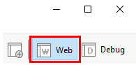

    If not, select it. If the perspective is not visible, in the Tizen
    Studio menu, select **Window &gt; Perspective &gt; Open
    Perspective &gt; Other &gt; Web**, and click **OK**.

3.  In the Tizen Studio menu, select **File &gt; New &gt; Tizen
    Project**.

    

    The Project Wizard opens.

4.  In the Project Wizard, define the project details.

    The Project Wizard is used to create the basic application skeleton
    with the required folder structure and mandatory files. You can
    easily create different applications by selecting an applicable
    template or sample for the Project Wizard to use.

    a.  Select the **Sample** project type and click **Next**.

      

    b.  Select the profile (**Wearable**) and version from a drop-down        list and click **Next**.

      The version depends on the platform version you have installed
      and with which you are developing the application.

      

    c.  Select the **Web Application** application type and click        **Next**.

      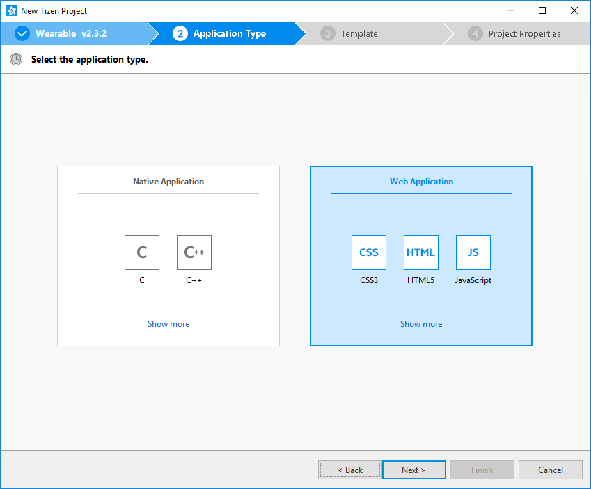

    d.  Select the **Watch &gt; Basic Watch** sample and click **Next**.

      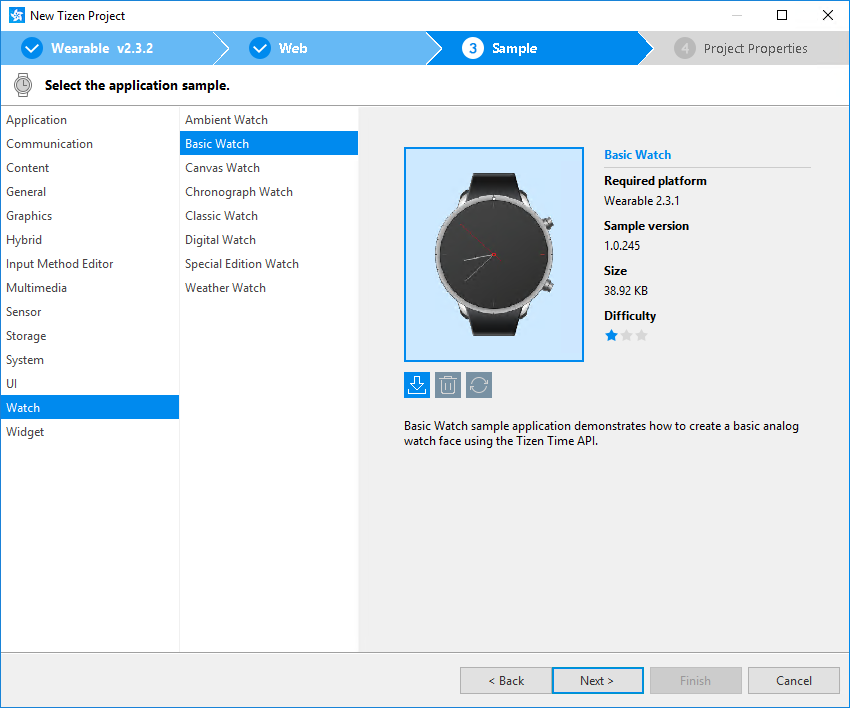

    e.  Define the project properties and click **Finish**.

      You can fill the project name (3-50 characters) and the unique
      package ID. You can also select the location and working sets by        clicking **More properties**.

      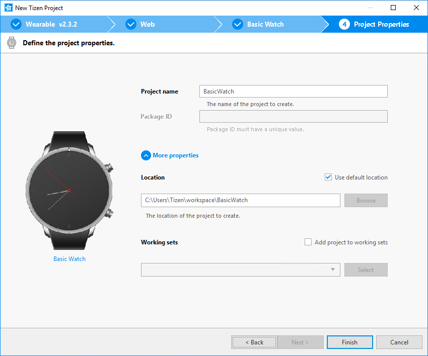

      The Project Wizard sets up the project, creates the application        files using the default content from the template, and closes.        For more information on the Project Wizard and the available        templates, see [Creating Tizen Projects with Tizen Project        Wizard](../../../tizen-studio/web-tools/project-wizard-w.md).

You can see the created project in the **Project Explorer** view. The
most important files and folders include:

-   `css`: Folder for CSS files used by the application to style its
    content

-   `js`: Folder for JavaScript files used by the application to
    implement its functional logic

-   `config.xml`: Application configuration file used by the platform to
    install and launch the application

-   `icon.png`: Application icon file used by the platform to represent
    the application

-   `index.html`: Main HTML file for the layout of the application
    screen

**Figure: Application in the Project Explorer**


> **Note** <br>
> You can [view and modify the application
configuration](#configuration) in the Web application configuration
editor. In this example, no configuration changes are required.


Your application project is now ready for further actions. Next, build
the application.

### Managing the Application Configuration <a name="configuration"></a>

To view and modify the application configuration:

1.  In the **Project Explorer** view, double-click the `config.xml` file
    of the application. The Tizen Studio opens the file in the Web
    application configuration editor.

2.  In the configuration editor, view and modify the configuration
    details using the various tabs:

    

    -   **Overview**: Define general information, such as the name and
        icon of the application.

    -   **Features**: Define required software and hardware features.
        This information is used for application filtering in the Tizen
        market place.

    -   **Privileges**: Define the security-sensitive APIs or API groups
        accessed and used by the application.

    -   **Policy**: Request network resource permissions to access
        external network resources.

    -   **Localization**: Define localized values for the application
        name, description, and license.

    -   **Preferences**: Define name-value pairs that can be set or
        retrieved through the application.

    -   **Tizen**: Edit the Tizen schema extension properties of
        the application.

    -   **Source**: View and edit the source code of the
        `config.xml` file. Changes made and saved on the other tabs are
        reflected in the source code and vice versa.

        <div class="note">

        **Note** The `config.xml` file must conform to both the XML file
        format and the W3C specification requirements. Editing the file
        in the **Source** tab is intended for advanced users only.

        </div>

3.  To save any changes, in the Tizen Studio menu, select **File &gt;
    Save All**.

For more information on configuring the application, see [Setting the
Web Application
Configuration](../process/setting-properties-w.md#set_widget).

Building Your Application <a name="build"></a>
-------------------------

After you have created the application project, you can implement the
required features. In this example, only the default features from the
project template are used, and no code changes are required.

When your application code is ready, you must build the application. The
building process performs a validation check and compiles your
JavaScript and CSS files.

You can build the application in the following ways:

-   **Automatically**

    The automatic build means that the Tizen Studio automatically
    rebuilds the application whenever you change a source or resource
    file and save the application project.

    To use the automatic build:

    1.  Select the project in the **Project Explorer** view.
    2.  In the Tizen Studio menu, select **Project &gt; Build
        Automatically**.

        

        A check mark appears next to the menu option.

    You can toggle the automatic build on and off by reselecting
    **Project &gt; Build Automatically**.

-   **Manually**

    The manual build means that you determine yourself when the
    application is built.

    To manually build the application, right-click the project in the
    **Project Explorer** view and select **Build Project**.

    **Figure: Manually building the application**

    

    Alternatively, you can also select the project in the **Project
    Explorer** view and do one of the following:

    -   In the Tizen Studio menu, select **Project &gt; Build Project**.
    -   Press the **F10** key.

After you have built the application, run it.

Running Your Application <a name="run"></a>
------------------------

You can run the Web watch application on the
[emulator](../process/run-debug-app-w.md#emulator) or a [real target
device](../process/run-debug-app-w.md#target).


> **Note** <br>
> Since the Web Simulator does not support a circular UI, this
topic does not cover the instructions for running the application on the
Web Simulator.


### Running on the Emulator <a name="emulator"></a>

To run the application on the emulator:

1.  Launch an emulator instance in the [Emulator
    Manager](../../../tizen-studio/common-tools/emulator-manager.md):

    a.  In the Tizen Studio menu, select **Tools &gt; Emulator        Manager**.

      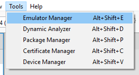

    b.  In the Emulator Manager, select a wearable emulator from the
      list and click **Launch**.

      If no applicable emulator instance exists, [create a new
      one](../../../tizen-studio/common-tools/emulator-manager.md#create).

      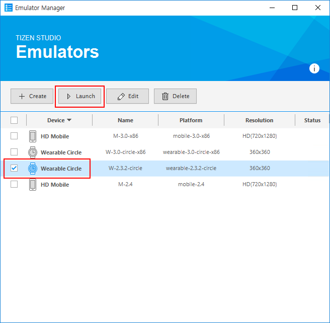

      The emulator is launched in its own window. You can also see the        new emulator instance in the **Device Manager**. To view the        emulator folder structure, click the arrow next to the        emulator instance.

      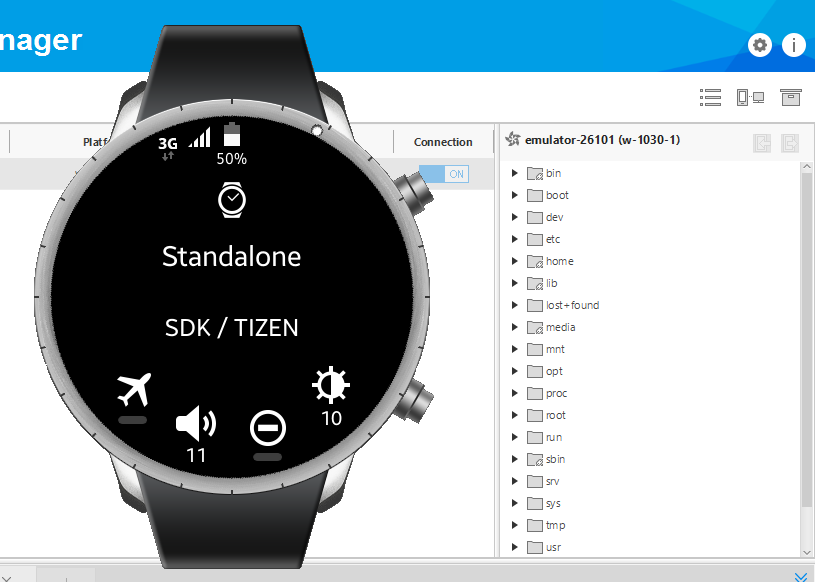

2.  Generate a security profile.

    Before you run the application, you must [sign your application
    package with a certificate
    profile](../../../tizen-studio/common-tools/certificate-registration.md)
    in the Tizen Studio.

3.  Run the application:

    a.  In the **Project Explorer** view, right-click the project and        select **Run As &gt; Tizen Web Application**.

      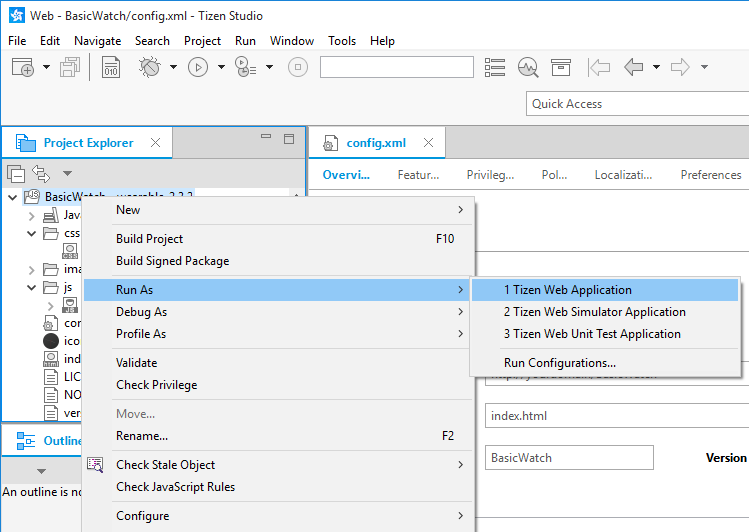

      Alternatively, you can also select the project in the **Project        Explorer** view and do one of the following:

      -   Press the **Ctrl+F11** key.
      -   Click the run icon in the toolbar.

    If you have created multiple emulator instances, select the
    instance you want from the combo box in the toolbar before
    selecting to run the application. If you select an offline
    emulator, it is automatically launched when you select to run
    the application.

    

    In the **Console** view, you can see that the application is
    successfully installed. However, it does not run on the emulator
    screen until you change the watch face in the emulator
    **Settings** menu.

    

    b.         Change the watch face.

      When a watch application is successfully installed on the
      emulator, the watch UI is visible in the emulator
      **Clock** menu.

      To change the watch face and make the watch application visible:

      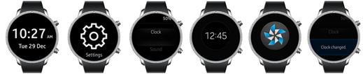

      *  If the emulator display has been switched off, activate it
      by pressing the **Power** key (in the bottom right corner of           the emulator).

      *  On the home screen (showing the default watch face),
      swipe up.

      *  Select **Settings &gt; Clock**.

      *  Swipe right and select your watch application.

         The **Clock changed** message is displayed.

      *  Press the **Back** key (in the top right corner of the   emulator device) multiple times, until the home screen with            your new watch face is shown.

      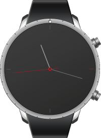

       While the application is running, the **Log** view in the Tizen        Studio shows the log, debug, and exception messages from the        methods defined in the log macros. To see the view, in the Tizen        Studio menu, go to **Window &gt; Show View &gt; Log**.

For more information on using the emulator features, see [Using Emulator
Control Keys, Menu, and
Panel](../../../tizen-studio/common-tools/emulator-control-panel.md)
and [Using Extended Emulator
Features](../../../tizen-studio/common-tools/emulator-features.md).

### Running on a Target Device <a name="target"></a>

To run the application on a target device:

1.  Connect the wearable target device to your computer:

    a.  Define settings on the device:

      -   Go to **Settings &gt; Connections**, and switch
            on Bluetooth.

            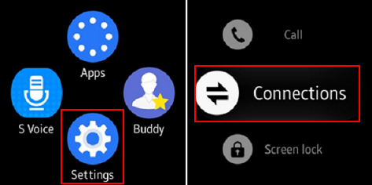

            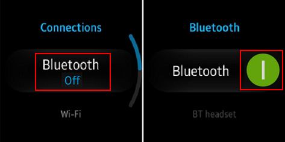

      -   Go to **Settings &gt; Connections**, and switch on Wi-Fi.

            The device and the computer must be connected to the same
            Wi-Fi network.

            Note the IP address the device is using.

            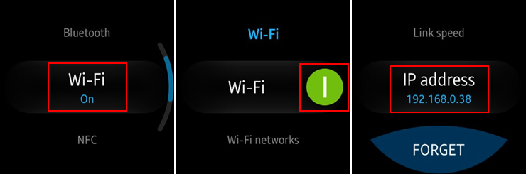

      -   Go to **Settings &gt; Gear info**, and switch on the
            debugging mode.

            

    b.  In the terminal, enter the following commands:

      ``` {.prettyprint}
        cd tizen-sdk/tools
        ./sdb connect <IP address of Gear S2>
      ```

    Use the IP address you noted before.

    Instead of the terminal, you can also use the [Remote Device
    Manager](../wearable/first-app-ww.md#remote_device) for
    the connection.

    c.  In the first attempt, the connection fails and the device asks        for user confirmation. To allow Gear to read log data, copy        files to and from your computer, and install the application        manually, click the accept mark.

    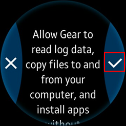

    d.  In the **Device Manager**, confirm that the device is connected        (shown in the device list).

    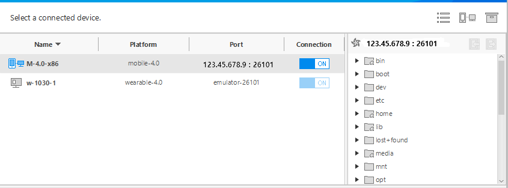

2.  Generate an author certificate.

    Before you run the application, you must [sign your application
    package with a certificate
    profile](../../../tizen-studio/common-tools/certificate-registration.md)
    in the Tizen Studio.

3.  Run the application:

    a.  In the **Device Manager**, select the device.

    b.  In **Project Explorer** view, right-click the project and select        **Run As &gt; Tizen Web Application**.

      

      Alternatively, you can also select the project in the **Project        Explorer** view and do one of the following:

      -   Press the **Ctrl+F11** key.
      -   Click the run icon in the toolbar.

      If you have both a connected device and existing emulator
      instances, select the device from the combo box in the toolbar
      before selecting to run the application.

      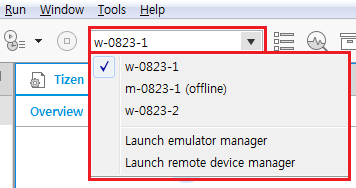

    c.  Confirm that the application launches on the target device.

      Like with the [emulator](#watchface), you must change the watch        face in the device settings before you can see the watch        application UI on the device.


>    **Note** <br>
> The application is launched using the default debug
    run configuration. To create and use another configuration:
>    1.  In the `Project Explorer` view, right-click the project and
        select `Run As > Run Configurations`.
>    2.  In the `Run Configurations` window, click the
        `New Launch Configuration` icon (), define the
        configuration details, and launch the application by clicking
        `Run`.
>
>  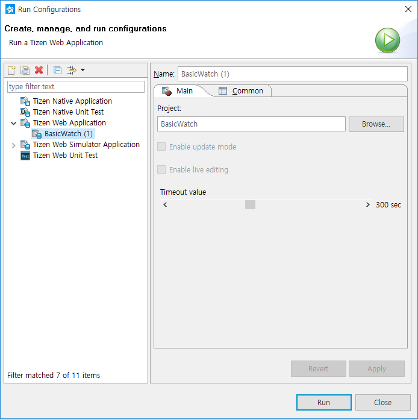


Building a Simple UI <a name="ui"></a>
--------------------

The following example is based on a template project for a wearable
watch application, which was introduced in [Creating a
Project](#create).

The template project makes it easy to create your watch application.
Without modification, you can build and run the project. However, it is
important to understand the following template code to customize it.

### Initializing the Watch Application <a name="init"></a>

To initialize the watch application:

1.  To set the application configuration, use the `config.xml` file:

    -   By default, the BasicWatch sample has the application category
        defined as
        `<tizen:category name="http://tizen.org/category/wearable_clock"/>`.

        To run your application on Samsung Gear 2, Samsung Gear 2 Neo,
        and Samsung Gear S devices, use
        `<tizen:category name="com.samsung.wmanager.WATCH_CLOCK"/>` instead.

    -   To enable a custom UI for the [ambient
        mode](../details/event_handling_w.htm#ambient), the
        `ambient_support` attribute must be set to `enable`.

    ``` {.prettyprint}
    <widget xmlns:tizen="http://tizen.org/ns/widgets" xmlns="http://www.w3.org/ns/widgets"
            id="http://yourdomain/BasicWatch" version="1.0.0" viewmodes="maximized">
       <tizen:application id="rko5hPHRgI.BasicWatch" package="rko5hPHRgI" required_version="2.3.1"
                          ambient_support="enable"/>
       <tizen:category name="http://tizen.org/category/wearable_clock"/>

       <!--Get timetick events, occuring once a minute to enable the UI to be updated-->
       <tizen:privilege name="http://tizen.org/privilege/alarm"/>

       <tizen:setting background-support="disable" encryption="disable" hwkey-event="enable"/>
    </widget>
    ```

2.  To initialize the application and define basic features, use the
    `main.js` file.

    Modify the `window.requestAnimationFrame()` method to make the
    application compatible with the main browsers:

    ``` {.prettyprint}
    window.requestAnimationFrame = window.requestAnimationFrame ||
        window.webkitRequestAnimationFrame ||
        window.mozRequestAnimationFrame ||
        window.oRequestAnimationFrame ||
        window.msRequestAnimationFrame ||
        function(callback) {
            'use strict';
            window.setTimeout(callback, 1000 / 60);
        };
    ```

3.  Initialize the canvas context and define the canvas area:

    ``` {.prettyprint}
    window.onload = function onLoad() {
        'use strict';

        canvas = document.querySelector('canvas');
        ctx = canvas.getContext('2d');
        clockRadius = document.body.clientWidth / 2;

        canvas.width = document.body.clientWidth;
        canvas.height = canvas.width;
    ```

4.  Define an event listener to detect back key events and time tick:

    ``` {.prettyprint}
        /* Add eventListener for tizenhwkey */
        window.addEventListener('tizenhwkey', function(e) {
            if (e.keyName === 'back') {
                try {
                    tizen.application.getCurrentApplication().exit();
                } catch (err) {
                    console.error('Error: ', err.message);
                }
            }
        });

        /* Add eventListener for timetick */
        window.addEventListener('timetick', function() {
            console.log('timetick is called');
            ambientWatch();
        });
    };
    ```

### Drawing the Watch UI <a name="draw"></a>

To draw the watch UI:

1.  To define the application layout, use the `index.html` file.

    By default, the BasicWatch sample application layout contains only
    the main screen that displays the clock on a
    [canvas](http://www.w3.org/TR/2012/CR-html5-20121217/embedded-content-0.html#the-canvas-element) element.

    ```
    <head>
       <meta charset="utf-8"/>
       <meta name="viewport" content="width=device-width, initial-scale=1.0, maximum-scale=1.0"/>
       <meta name="description" content="Basic Watch based on HTML canvas element"/>
       <title>BasicWatch</title>
       <link rel="stylesheet" type="text/css" href="css/style.css"/>
    </head>
    <body>
       <div id="box">
          <canvas class="canvas"></canvas>
       </div>
       <script src="js/main.js"></script>
    </body>
    ```

2.  To draw the watch face on the canvas, use the `main.js` file:

    a.  Create the clock in the middle of the canvas, and define the
      watch face style:

      ``` {.prettyprint}
        function renderDots() {
            'use strict';

            var dx = 0,
                dy = 0,
                i = 1,
                angle = null;

            ctx.save();
            ctx.translate(canvas.width / 2, canvas.height / 2);
            ctx.beginPath();
            ctx.fillStyle = '#999999';
      ```

    b.  Create 4 dots on the sides of the watch face and use the
      `fill()` method to style the dots:

      ``` {.prettyprint}
            for (i = 1; i <= 4; i++) {
                angle = (i - 3) * (Math.PI * 2) / 4;
                dx = clockRadius * 0.9 * Math.cos(angle);
                dy = clockRadius * 0.9 * Math.sin(angle);

                ctx.arc(dx, dy, 3, 0, 2 * Math.PI, false);
                ctx.fill();
            }
            ctx.closePath();
      ```

    c.  Create the center point:

      ``` {.prettyprint}
            ctx.beginPath();

            ctx.fillStyle = '#ff9000';
            ctx.strokeStyle = '#fff';
            ctx.lineWidth = 4;

            ctx.arc(0, 0, 7, 0, 2 * Math.PI, false);
            ctx.fill();
            ctx.stroke();
            ctx.closePath();
        }
      ```

3.  To display the actual time on the watch face, create the clock
    needles and set their position using the `main.js` file.

    Render the clock needles:

    a.  The needles can be created using the `renderNeedle()` method.

      To create the needle as a triangle or a polygon, assign the
      coordinate of the beginning point with the `moveTo()` method. To        assign the rest of the points of the triangle or polygon, use        the `lineTo()` method, which defines the position of the next        connecting vertex. You can also adjust the size of each clock        needle with the `lineTo()` method.

      ``` {.prettyprint}
        function renderNeedle(angle, radius) {
            'use strict';
            ctx.save();
            ctx.rotate(angle);
            ctx.beginPath();
            ctx.lineWidth = 4;
            ctx.strokeStyle = '#fff';
            ctx.moveTo(6, 0);
            ctx.lineTo(radius, 0);
            ctx.closePath();
            ctx.stroke();
            ctx.closePath();
            ctx.restore();
        }
      ```

    b.  Create the hour needle using the `renderHourNeedle()` method:

      ``` {.prettyprint}
        function renderHourNeedle(hour) {
            'use strict';

            var angle = null,
                radius = null;

            angle = (hour - 3) * (Math.PI * 2) / 12;
            radius = clockRadius * 0.55;
            renderNeedle(angle, radius);
        }
      ```

    c.  Create the minute needle using the `renderMinuteNeedle()`
        method:

      ``` {.prettyprint}
        function renderMinuteNeedle(minute) {
            'use strict';

            var angle = null,
                radius = null;

            angle = (minute - 15) * (Math.PI * 2) / 60;
            radius = clockRadius * 0.75;
            renderNeedle(angle, radius);
        }
      ```

4.  Indicate the current time in the `main.js` file:
    1.  Determine the current time using the `new Date()` method.

        To point the needles accurately, define variables for the
        current hour and minute.

        ``` {.prettyprint}
        function getDate() {
            'use strict';

            var date;
            try {
                date = tizen.time.getCurrentDateTime();
            } catch (err) {
                console.error('Error: ', err.message);
                date = new Date();
            }

            return date;
        }

        function watch() {
            'use strict';

            if (isAmbientMode === true) {
                return;
            }

            var date = getDate(),
                hours = date.getHours(),
                minutes = date.getMinutes(),
                seconds = date.getSeconds(),
                hour = hours + minutes / 60,
                minute = minutes + seconds / 60,
                nextMove = 1000 - date.getMilliseconds();
        ```

    2.  Every time a new time is indicated, erase the previous time (the
        previously positioned needles) using the `clearRect()` method:

        ``` {.prettyprint}
            ctx.clearRect(0, 0, ctx.canvas.width, ctx.canvas.height);
        ```

    3.  Point the clock needles to display the current time:

        ``` {.prettyprint}
            renderDots();
            renderHourNeedle(hour);
            renderMinuteNeedle(minute);

            ctx.restore();
            setTimeout(function() {
                window.requestAnimationFrame(watch);
            }, nextMove);
        }
        ```

### Using the Ambient Mode <a name="ambient"></a>

On a low-powered wearable device, an ambient mode is available. In this
mode, the watch application shows a limited UI and receives only the
ambient tick event every minute to reduce power consumption.

The details of the limited UI drawn in the ambient mode depend on the
device. In addition, due to the ambient mode being a low power mode,
there are limits to the colors that can be shown on the screen. Usually,
when designing the ambient mode UI, draw it with limited colors (cyan,
magenta, yellow, red, green, blue, black and white), and use less than
15% of the pixels on the screen. If you do not want to draw your own
ambient mode UI, set the `ambient_support` attribute to `disable` in the
`config.xml` watch application configuration file to allow the platform
to show a default ambient mode UI.


> **Note** <br>
> To use the ambient mode, the user must enable it in the device
settings. In addition, on the Gear S2 device, the ambient mode activates
only when you are wearing the watch on the wrist.
Since Tizen 2.3.2, some devices introduce a high color mode for the
ambient mode. In the high color mode, you can use more colors (usually,
24-bit color) for drawing the ambient mode UI. To check whether the
device supports the high color mode, use the following code:
>
>
>  ``` <br>
> bool support;
> int ret;
>
> ret =  
>system_info_get_platform_bool('http://tizen.org/feature/screen.always_on.high_color', &support);
> ```


To use the ambient mode:

1.  Define an event listener for the ambient mode:

    ``` {.prettyprint}
    /* Add eventListener for ambientmodechanged */
    window.addEventListener('ambientmodechanged', function(e) {
        console.log('ambientmodechanged: ' + e.detail.ambientMode);
        if (e.detail.ambientMode === true) {
            /* Render ambient mode */
            isAmbientMode = true;
            ambientWatch();
        } else {
            /* Render normal mode */
            isAmbientMode = false;
            window.requestAnimationFrame(watch);
        }
    });

    /* Normal mode */
    isAmbientMode = false;
    window.requestAnimationFrame(watch);
    ```

2.  Create the ambient mode dots:

    ``` {.prettyprint}
    function renderAmbientDots() {
        'use strict';

        ctx.save();

        ctx.translate(canvas.width / 2, canvas.height / 2);

        ctx.beginPath();

        ctx.fillStyle = '#000000';
        ctx.strokeStyle = '#fff';
        ctx.lineWidth = 4;

        ctx.arc(0, 0, 7, 0, 2 * Math.PI, false);
        ctx.fill();
        ctx.stroke();
        ctx.closePath();
    }
    ```

3.  Indicate time in the ambient mode:

    ``` {.prettyprint}
    function ambientWatch() {
        'use strict';
        /* Get the current time */
        var date = getDate(),
            hours = date.getHours(),
            minutes = date.getMinutes(),
            seconds = date.getSeconds(),
            hour = hours + minutes / 60,
            minute = minutes + seconds / 60;

        /* Erase the previous time */
        ctx.clearRect(0, 0, ctx.canvas.width, ctx.canvas.height);

        renderAmbientDots();
        renderHourNeedle(hour);
        renderMinuteNeedle(minute);

        ctx.restore();
    }
    ```
