Content

-   [Creating a Project](#create)
-   [Building Your Application](#build)
-   [Running Your Application](#run)
-   [Building a Simple UI](#ui)


Creating Your First Tizen Wearable Web Application
==================================================

**Welcome to Tizen wearable Web application development!**

A wearable Web application is basically a Web site stored on a wearable
device. You can create it using Web-native languages, such as HTML5,
CSS, and JavaScript.

Study the following instructions to help familiarize yourself with the
Tizen [Web application development
process](../process/app-dev-process-w.md) as well as using the Tizen
Studio and installing the created application on the emulator or target
device. With the instructions, you can create and run a basic wearable
Web application, which displays some text on the screen and changes the
text when the user clicks it:

1.  Before you get started with developing Tizen applications, download
    and install the [Tizen
    Studio](../../../tizen-studio/download/download.md).

    For more information on the installation process, see the
    [installation
    guide](../../../tizen-studio/download/installing-sdk.md).

2.  [Create a wearable Web project](#create) using the Tizen Studio.

    This step shows how you can use a predesigned project template that
    creates all the basic files and folders required for your project.

3.  [Build the application](#build).

    After you have implemented code for the features you want, this step
    shows how you can build the application to validate and compile
    the code.

4.  [Run the application](#run).

    This step shows how you can run the application on the emulator,
    simulator, or a real target device.

5.  [Build a UI](#ui).

    This step shows how you can make small alterations to the
    application UI to improve the usability of your application.

When you are developing a more complex application, you can take
advantage of the [Web tools included in the Tizen
Studio](../../../tizen-studio/web-tools/cover-web-w.md) to
ease the tasks of creating functionality and designing the application
UI.

Creating a Project {#create}
------------------

The following example shows you how to create and configure a basic
wearable Web application project in the Tizen Studio. An application
project contains all the files that make up an application.

The following figure illustrates the application to be created:

-   On the left, the figure shows the application screen when the
    application starts. The screen displays the **Basic** text.

-   On the right, the figure shows the application screen after you tap
    the text. The screen now displays the **Tizen** text. Tapping the
    text area switches between the 2 texts.

**Figure: Wearable Web Basic application**

 

To create the application project:

1.  Launch the Tizen Studio.

2.  Make sure the **Web** perspective is selected in the top right
    corner of the Tizen Studio window.

    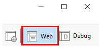

    If not, select it. If the perspective is not visible, in the Tizen
    Studio menu, select **Window &gt; Perspective &gt; Open
    Perspective &gt; Other &gt; Web**, and click **OK**.

3.  In the Tizen Studio menu, select **File &gt; New &gt; Tizen
    Project**.

    

    The Project Wizard opens.

4.  In the Project Wizard, define the project details.

    The Project Wizard is used to create the basic application skeleton
    with the required folder structure and mandatory files. You can
    easily create different applications by selecting an applicable
    template or sample for the Project Wizard to use.

    a.  Select the **Template** project type and click **Next**.

        

    b.  Select the profile (**Wearable**) and version from a drop-down
        list and click **Next**.

        The version depends on the platform version you have installed
        and with which you are developing the application.

        

    c.  Select the **Web Application** application type and click
        **Next**.

        

    d.  Select the **Basic UI** template and click **Next**.

        

    e.  Define the project properties and click **Finish**.

        You can fill the project name (3-50 characters) and the unique
        package ID. You can also select the location and working sets by
        clicking **More properties**.

        

        The Project Wizard sets up the project, creates the application
        files using the default content from the template, and closes.
        For more information on the Project Wizard and the available
        templates, see [Creating Tizen Projects with Tizen Project
        Wizard](../../../tizen-studio/web-tools/project-wizard-w.md).

You can see the created project in the **Project Explorer** view. The
most important files and folders include:

-   `css`: Folder for CSS files used by the application to style its
    content

-   `js`: Folder for JavaScript files used by the application to
    implement its functional logic

-   `config.xml`: Application configuration file used by the platform to
    install and launch the application

-   `icon.png`: Application icon file used by the platform to represent
    the application

-   `index.html`: Main HTML file for the layout of the application
    screen

**Figure: Application in the Project Explorer**


<div class="note">

**Note** You can [view and modify the application
configuration](#configuration) in the Web application configuration
editor. In this example, no configuration changes are required.

</div>

Your application project is now ready for further actions. Next, build
the application.

### Managing the Application Configuration <a name="configuration"></a>

To view and modify the application configuration:

1.  In the **Project Explorer** view, double-click the `config.xml` file
    of the application. The Tizen Studio opens the file in the Web
    application configuration editor.

2.  In the configuration editor, view and modify the configuration
    details using the various tabs:

    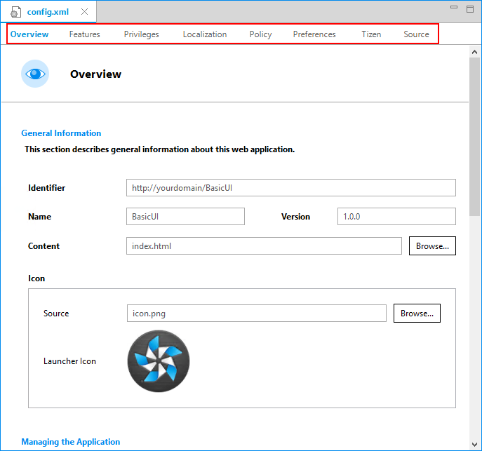

    -   **Overview**: Define general information, such as the name and
        icon of the application.

    -   **Features**: Define required software and hardware features.
        This information is used for application filtering in the Tizen
        market place.

    -   **Privileges**: Define the security-sensitive APIs or API groups
        accessed and used by the application.

    -   **Policy**: Request network resource permissions to access
        external network resources.

    -   **Localization**: Define localized values for the application
        name, description, and license.

    -   **Preferences**: Define name-value pairs that can be set or
        retrieved through the application.

    -   **Tizen**: Edit the Tizen schema extension properties of
        the application.

    -   **Source**: View and edit the source code of the
        `config.xml` file. Changes made and saved on the other tabs are
        reflected in the source code and vice versa.

        <div class="note">

        **Note** The `config.xml` file must conform to both the XML file
        format and the W3C specification requirements. Editing the file
        in the **Source** tab is intended for advanced users only.

        </div>

3.  To save any changes, in the Tizen Studio menu, select **File &gt;
    Save All**.

For more information on configuring the application, see [Setting the
Web Application
Configuration](../process/setting-properties-w.md#set_widget).

Building Your Application {#build}
-------------------------

After you have created the application project, you can implement the
required features. In this example, only the default features from the
project template are used, and no code changes are required.

When your application code is ready, you must build the application. The
building process performs a validation check and compiles your
JavaScript and CSS files.

You can build the application in the following ways:

-   **Automatically**

    The automatic build means that the Tizen Studio automatically
    rebuilds the application whenever you change a source or resource
    file and save the application project.

    To use the automatic build:

    1.  Select the project in the **Project Explorer** view.
    2.  In the Tizen Studio menu, select **Project &gt; Build
        Automatically**.

        

        A check mark appears next to the menu option.

    You can toggle the automatic build on and off by reselecting
    **Project &gt; Build Automatically**.

-   **Manually**

    The manual build means that you determine yourself when the
    application is built.

    To manually build the application, right-click the project in the
    **Project Explorer** view and select **Build Project**.

    **Figure: Manually building the application**

    

    Alternatively, you can also select the project in the **Project
    Explorer** view and do one of the following:

    -   In the Tizen Studio menu, select **Project &gt; Build Project**.
    -   Press the **F10** key.

After you have built the application, run it.

Running Your Application {#run}
------------------------

You can run the Web application on the
[emulator](../process/run-debug-app-w.md#emulator) or a [real target
device](../process/run-debug-app-w.md#target).

<div class="note">

**Note** Since the Web Simulator does not support a circular UI, this
topic does not cover the instructions for running the application on the
Web Simulator.

</div>

### Running on the Emulator {#emulator}

To run the application on the emulator:

1.  Launch an emulator instance in the [Emulator
    Manager](../../../tizen-studio/common-tools/emulator-manager.md):
    a.  In the Tizen Studio menu, select **Tools &gt; Emulator
        Manager**.

        

    b.  In the Emulator Manager, select a wearable emulator from the
        list and click **Launch**.

        If no applicable emulator instance exists, [create a new
        one](../../../tizen-studio/common-tools/emulator-manager.md#create).

        

        The emulator is launched in its own window. You can also see the
        new emulator instance in the **Device Manager**. To view the
        emulator folder structure, click the arrow next to the
        emulator instance.

        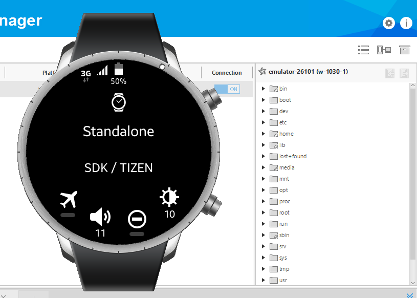

2.  Generate a security profile.

    Before you run the application, you must [sign your application
    package with a certificate
    profile](../../../tizen-studio/common-tools/certificate-registration.md)
    in the Tizen Studio.

3.  Run the application:
    a.  In the **Project Explorer** view, right-click the project and
        select **Run As &gt; Tizen Web Application**.

        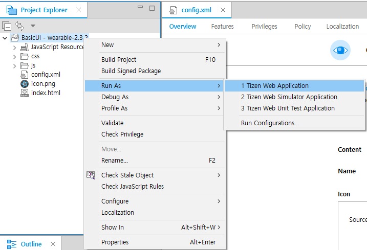

        Alternatively, you can also select the project in the **Project
        Explorer** view and do one of the following:

        -   Press the **Ctrl+F11** key.
        -   Click the run icon in the toolbar.

        If you have created multiple emulator instances, select the
        instance you want from the combo box in the toolbar before
        selecting to run the application. If you select an offline
        emulator, it is automatically launched when you select to run
        the application.

        

    b.  Confirm that the application launches on the emulator.

        

        <div class="note">

        **Note** If the emulator display has switched off, you cannot
        see the application launch. To switch the display on, click the
        **Power** key (in the right bottom corner of the emulator).

        </div>

        While the application is running, the **Log** view in the Tizen
        Studio shows the log, debug, and exception messages from the
        methods defined in the log macros. To see the view, in the Tizen
        Studio menu, go to **Window &gt; Show View &gt; Log**.

For more information on using the emulator features, see [Using Emulator
Control Keys, Menu, and
Panel](../../../tizen-studio/common-tools/emulator-control-panel.md)
and [Using Extended Emulator
Features](../../../tizen-studio/common-tools/emulator-features.md).

### Running on a Target Device {#target}

To run the application on a target device:

1.  Connect the wearable target device to your computer:
    a.  Define settings on the device:
        -   Go to **Settings &gt; Connections**, and switch
            on Bluetooth.

            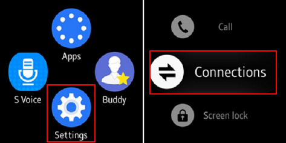

            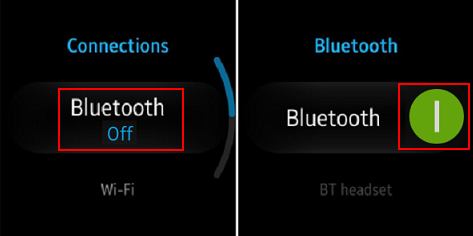

        -   Go to **Settings &gt; Connections**, and switch on Wi-Fi.

            The device and the computer must be connected to the same
            Wi-Fi network.

            Note the IP address the device is using.

            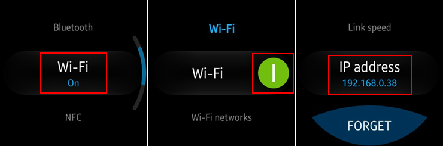

        -   Go to **Settings &gt; Gear info**, and switch on the
            debugging mode.

            

    b.  <div id="remote_device">

        </div>

        Use the Remote Device Manager to connect the wearable device:
        a.  In the **Device Manager**, click the **Remote Device
            Manager** button.

            

        b.  In the **Remote Device Manager** window, click **+**.

            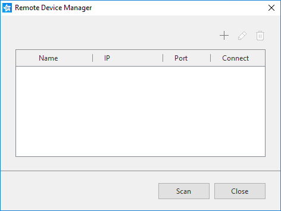

        c.  In the **Add Device** window, enter the device and network
            details (use the IP address you noted before), and click
            **Add**.

            

        d.  In the **Remote Device Manager** window, switch the new
            device on by clicking the switch under **Connect**.

            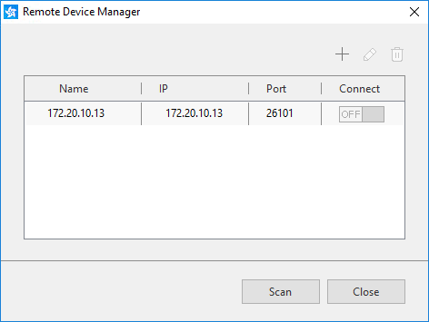

    c.  The device asks for user confirmation. To allow Gear to read log
        data, copy files to and from your computer, and install the
        application manually, click the accept mark.

        

    d.  In the **Device Manager**, confirm that the device is connected
        (shown in the device list).

        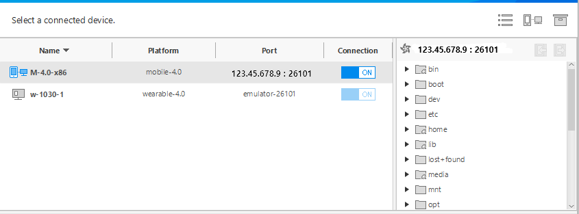

2.  Generate an author certificate.

    Before you run the application, you must [sign your application
    package with a certificate
    profile](../../../tizen-studio/common-tools/certificate-registration.md)
    in the Tizen Studio.

3.  Run the application:
    a.  In the **Device Manager**, select the device.
    b.  In **Project Explorer** view, right-click the project and select
        **Run As &gt; Tizen Web Application**.

        

        Alternatively, you can also select the project in the **Project
        Explorer** view and do one of the following:

        -   Press the **Ctrl+F11** key.
        -   Click the run icon in the toolbar.

        If you have both a connected device and existing emulator
        instances, select the device from the combo box in the toolbar
        before selecting to run the application.

        

    c.  Confirm that the application launches on the target device.

    <div class="note">

    **Note** The application is launched using the default debug
    run configuration. To create and use another configuration:
    1.  In the `Project Explorer` view, right-click the project and
        select `Run As > Run Configurations`.
    2.  In the `Run Configurations` window, click the
        `New Launch Configuration` icon (), define the
        configuration details, and launch the application by clicking
        `Run`.

        

    </div>

Building a Simple UI {#ui}
--------------------

Tizen Web UI supports various aspects of creating a visual outlook for
the user application to ensure the best possible user experience.

### W3C/HTML <a name="w3c"></a>

The W3C specifications provide HTML and CSS features for creating a user
interface. With HTML, you can define the structure of the application
screens, while CSS allows you to define the look and feel of the
screens.

#### HTML <a name="html"></a>

HTML DOM is a structured model to control Web elements. It is an
official W3C standard to express the document regardless of platforms or
languages, and the foundation of the HTML5 APIs.

The `<html>` element is the top-level element of the HTML DOM tree that
wraps the entire document, and it has the `<head>` and `<body>` elements
as child nodes:

``` {.prettyprint}
<!DOCTYPE html>
<html>
   <head>
      <!--Content-->
   </head>
   <body>
      <!--Content-->
   </body>
</html>
```

The `<head>` element contains the information that the browser refers to
when rendering the body element to interpret information, such as the
title of HTML document, CSS, and JavaScript:

-   `<title>`: Defines the title of the document.
-   `<meta>`: Defines information, such as encoding, creator, and
    keywords of the document.
-   `<style>`, `<link>`: Sets the styles of the document.
-   `<script>`, `<noscript>`: Adds functions to the document.

``` {.prettyprint}
<!DOCTYPE html>
<html>
   <head>
      <meta charset="utf-8"/>
      <meta name="viewport" content="width=device-width, initial-scale=1.0, maximum-scale=1.0">
      <meta name="description" content="Tizen Wearable Web Basic Template"/>

      <title>Tizen Wearable Web Basic Application</title>

      <link rel="stylesheet" type="text/css" href="css/style.css"/>
      <script src="js/main.js"></script>
   </head>
   <body>
      <!--Content-->
   </body>
</html>
```

The `<body>` element defines the area displaying content on the browser
screen:

``` {.prettyprint}
<body>
   <div id="main" class="page">
      <div class="contents">
         <span id="content-text">Basic</span>
      </div>
   </div>
</body>
```

The HTML code displays the **Basic** text on the screen.

**Figure: Screen with Basic text**

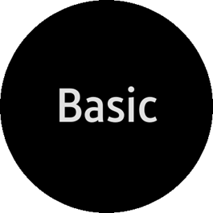

#### CSS <a name="css"></a>

CSS (Cascading Style Sheets) specifies the layout and styling of the Web
application.

There are various ways to connect CSS with HTML:

-   `style` attribute in an HTML element
-   `<link>` element in the `<head>` element
-   `@import` attribute in the CSS area
-   `<style>` element in the `<head>` element

Applying the style of an HTML element directly with the style attribute
has the highest priority. On the other hand, creating a separate CSS
file and managing it separately is convenient when it comes to applying
changes in the future. The file is connected to the HTML file using a
`<link>` element in the `<head>` element.

The following code shows how to link to a CSS file, and how to use the
`<style>` element to set the margin of the `<div>` element to be
automatic so that the browser calculates the margin automatically and
the text is placed in the center:

``` {.prettyprint}
<!DOCTYPE html>
<html>
   <head>
      <meta charset="utf-8"/>
      <meta name="viewport" content="width=device-width, initial-scale=1.0, maximum-scale=1.0">
      <meta name="description" content="Tizen Wearable Web Basic Template"/>

      <title>Tizen Wearable Web Basic Application</title>

      <link rel="stylesheet" type="text/css" href="css/style.css"/>
      <script src="js/main.js"></script>
   </head>
   <body>
      <div id="main" class="page">
         <div class="contents" style='margin:auto;'>
            <span id="content-text">Basic</span>
         </div>
      </div>
   </body>
</html>
```

The following lines in the CSS code describe the styling of the text in
an element with the `content-text` class name:

-   `css/style.css`:

    ``` {.prettyprint}
    html,
    body {
       width: 100%;
       height: 100%;
       margin: 0 auto;
       padding: 0;
       background-color: #222222;
       color: #ffffff;
    }
    .page {
       width: 100%;
       height: 100%;
       display: table;
    }
    .contents {
       display: table-cell;
       vertical-align: middle;
       text-align: center;
       -webkit-tap-highlight-color: transparent;
    }
    #content-text {
       font-weight: bold;
       font-size: 5em;
    }
    ```

-   `index.html`:

    ``` {.prettyprint}
    <body>
       <div id="main" class="page">
          <div class="contents">
             <span id="content-text">Basic</span>
          </div>
       </div>
    </body>
    ```

By default, the text uses the `#ffffff` color (white), defined for the
`<body>` element. If you change the CSS code and add a separate color
for the `content-text` class, the text color changes (in this case, to
`#ff0000` red):

``` {.prettyprint}
#content-text {
   font-weight: bold;
   font-size: 5em;
   color: #ff0000;
}
```

**Figure: Screen with a new text color**


### TAU (Tizen Advanced UI) <a name="tau"></a>

TAU is a Web UI library that enables you to create and manage various
kinds of UI components. The components represent a visual UI element,
such as a checkbox, listview, or progress. You can manipulate and
interact with the application screens through the UI components. UI
components for wearable devices have been enhanced to support a circular
screen. You can make an application that runs on both rectangular and
circular screens with a single source code.

The following figure shows the role of TAU and its relation with the Web
application.

**Figure: TAU and the Web application**


To create a Web application and design its UI with TAU:

1.  Install TAU templates.

    The Tizen Studio comes with the Package Manager tool, which you can
    use to install the TAU packages required for TAU
    application development.

    The TAU packages enable you to create the Web application using a
    TAU template.

    

2.  Start the application development with the TAU library.

    You can get the TAU library using a TAU template or a sample
    application as a basis for your application. The easiest way to
    start your first TAU application is to create a new project with a
    TAU template.

    To create a project with a TAU template:

    a.  Go to **File &gt; New &gt; Tizen Project**.
    b.  Select **Template &gt; Wearable v2.3.2 &gt; Web Application &gt;
        TAU Basic**.

        

    c.  Change the project name and properties and click **Finish**.

        

    d.  In the **Project Explorer** view, view the project.

        The TAU library is located in the `lib` folder.

        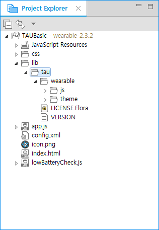

    You can import TAU with HTML. For better performance, all CSS files
    must be included in the header and all script elements must be put
    before closing the body element. The following example shows a basic
    TAU template.

    ``` {.prettyprint}
    <!DOCTYPE html>
    <html>
       <head>
          <link rel="stylesheet" href="lib/tau/wearable/theme/default/tau.min.css"/>
          <!--For a circular device, import tau.circle.min.css-->
          <link rel="stylesheet" media="all and (-tizen-geometric-shape: circle)" href="lib/tau/wearable/theme/default/tau.circle.min.css">
       </head>
       <body>
          <!--HTML BODY CONTENT-->
          <script type="text/javascript" src="lib/tau/wearable/js/tau.min.js"></script>
          <script type="text/javascript" src="js/circle-helper.js"></script>
       </body>
    </html>
    ```

    In HTML, use the `<script>` and `<link>` elements. These default
    elements are used to load the basic Tizen Advanced UI (TAU)
    libraries that must be included in Tizen Web applications:

    -   TAU library: `tau(.min).js`

        This element is mandatory, as it imports the TAU library, which
        you need to use the TAU JavaScript Interface.

    -   TAU theme: `tau(.min).css`

        This element is also mandatory, as it imports the TAU theme.

    -   TAU theme: `tau.circle(.min).css`

        This element is optional, but mandatory if you want to develop a
        Web application on a circular device.

    -   Support JavaScript: `circle-helper.js`

        This element is optional. If you import this file, you can
        easily get a listview that handles rotary events.

    You can add an additional `<script src="<CUSTOM_LIBRARY>">` or
    `<link rel="stylesheet" src="<CUSTOM_CSS>">` element to include your
    own scripts and style sheets. However, place them after the default
    `<script>` elements, as you can use any TAU APIs provided by the
    default libraries.

    To load your JavaScript file, include the file in the `<script>`
    element in the HTML `<body>` element. Since the TAU files are
    already loaded, you can use any APIs from these libraries as well.

    The following example shows a basic TAU template. Overwrite the
    `index.html` file content with the following code:

    ``` {.prettyprint}
    <!DOCTYPE html>
    <html>
       <head>
          <meta name="viewport" content="width=device-width, user-scalable=no"/>
          <title>Hello TAU</title>
          <link rel="stylesheet" href="lib/tau/wearable/theme/default/tau.min.css"/>
          <link rel="stylesheet" media="all and (-tizen-geometric-shape: circle)" href="lib/tau/wearable/theme/default/tau.circle.min.css">
          <!--Load theme file for your application-->
          <link rel="stylesheet" href="css/style.css"/>
       </head>
       <body>
          <!--HTML BODY CONTENT-->
          <script type="text/javascript" src="lib/tau/wearable/js/tau.min.js"></script>
          <script type="text/javascript" src="js/circle-helper.js"></script>
          <script src="js/app.js"></script>
       </body>
    </html>
    ```

3.  Create a simple page.

    a.  The body element of the HTML file contains 1 or more pages.

        To create a page in the `<body>` element, use the `ui-page`
        class with the `<div>` element:

        ``` {.prettyprint}
        <body>
           <div class="ui-page" id="main">
           </div>
           <!--Script import-->
           <script> ... </script>
        </body>
        ```

    b.  To layout the page, add a content area with the `ui-content`
        class and a header with the `ui-header` class:

        ``` {.prettyprint}
        <div class="ui-page" id="main">
           <header class="ui-header">
              <h2 class="ui-title">Hello World</h2>
           </header>
           <div class="ui-content">
              <p>This is content area</p>
           </div>
        </div>
        ```

        The following figure shows the screen that you can see if you
        run this code with the emulator.

        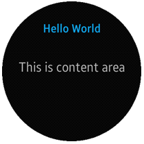

    c.  You can add your own style in the content and footer area with a
        defined `id` attribute:

        ``` {.prettyprint}
        <div class="ui-page" id="main">
           <header class="ui-header">
              <h2 class="ui-title">Hello World</h2>
           </header>
           <div class="ui-content" id="contentArea">
              <p>This is content area</p>
           </div>
        </div>
        ```

        In the `style.css` file, add a CSS style for the new `id`
        attribute:

        ``` {.prettyprint}
        #contentArea {
           color: #8be3d1;
        }
        ```

        With your new style, the screen looks like this.

        

    The page looks better, but not great yet. You can create your
    application UI with basic TAU UI components in the following steps.

4.  Add a list.

    You can add a list with the TAU Listview component using the `<ul>`
    element and the `ui-listview` class:

    -   Create a simple and basic static list. Overwrite the
        `<ul class="ui-content">` element content with the following
        code:

        ``` {.prettyprint}
        <div class="ui-content">
           <ul class="ui-listview">
              <li><a href="#">List Item1</a></li>
              <li><a href="#">List Item2</a></li>
              <li><a href="#">List Item3</a></li>
              <li><a href="#">List Item4</a></li>
              <li><a href="#">List Item5</a></li>
           </ul>
        </div>
        ```

        The screen now shows a basic list.

        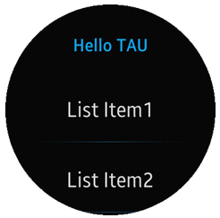

    -   For a more advanced option, you can also create a SnapListview.

        In a circular device, you can use a SnapListview, which is a
        circular-specialized listview component. To use this component,
        add several lines in your own JavaScript file. Note that if you
        already have added the `circle-helper.js` file, you do dot need
        to add the script again.

        The following example shows how to create a SnapListview using
        the `tau.helper` class:

        ``` {.prettyprint}
        (function(tau) {
            var page,
                list,
                listHelper;

            /* Check for a circular device */
            if (tau.support.shape.circle) {
                document.addEventListener('pagebeforeshow', function(e) {
                    page = e.target;
                    list = page.querySelector('.ui-listview');
                    if (list) {
                        /* Create SnapListView and binding rotary event using tau.helper */
                        listHelper = tau.helper.SnapListStyle.create(list);
                    }
                });

                document.addEventListener('pagebeforehide', function(e) {
                    listHelper.destroy();
                });
            }
        }(tau));
        ```

        After adding the above code, you can show a more attractive
        list, which can also be scrolled with bezel.

        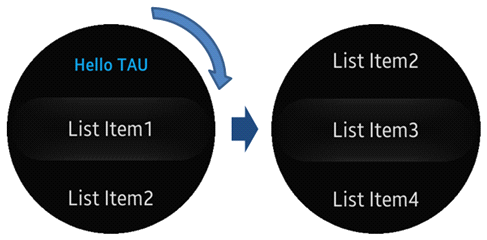

5.  Create another page.

    a.  In the Tizen Studio, you can create a new HTML file and
        rename it. Create a `second.html` file with the following
        content:

        ``` {.prettyprint}
        <!DOCTYPE html>
        <html>
           <head>
              <meta name="viewport" content="width=device-width, user-scalable=no"/>
              <title>Hello TAU</title>
              <link rel="stylesheet"  href="lib/tau/wearable/theme/default/tau.min.css">
              <link rel="stylesheet" media="all" href="lib/tau/wearable/theme/default/tau.circle.min.css">
           </head>
           <body>
              <div class="ui-page" id="second">
                 <header class="ui-header">
                    <h2 class="ui-title">Second Page</h2>
                 </header>
                 <div id="secondContent" class="ui-content">
                    Hello Tizen!
                 </div>
              </div>
              <script type="text/javascript" src="lib/tau/wearable/js/tau.min.js"></script>
           </body>
        </html>
        ```

    b.  Decorate the page in the same way as `index.html`.
    c.  Create navigation between the `index.html` and
        `second.html` pages.

        Go back to the `index.html` file and add a file path in the
        listview `<li><a href>` element:

        ``` {.prettyprint}
        <ul class="ui-listview">
           <li><a href="second.html">Go to Second Page</a></li>
           <li><a href="#">List Item2</a></li>
           <li><a href="#">List Item3</a></li>
           <li><a href="#">List Item4</a></li>
           <li><a href="#">List Item5</a></li>
        </ul>
        ```

    d.  Run the code, and see how you can move from the `index.html`
        page to the `second.html` page.

        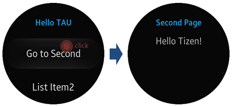

    Now, you can navigate from the first to the second page. In the next
    steps, you learn how to go back to the first page and exit the
    application in your code.

6.  Go back with the back key.

    You can navigate from page to page with the
    `<a href="PAGE_FILE_NAME">` elements, but you cannot go back. In
    this step, you learn to add some code in a JavaScript file to enable
    the user to return to the first page.

    a.  Add a new JavaScript file to the `index.html` file:

        ``` {.prettyprint}
        <body>
           <div class="ui-page" id="main">
              <header class="ui-header">
                 <h2 class="ui-title">Hello TAU</h2>
              </header>
              <div class="ui-content">
                 <ul class="ui-listview">
                    <li><a href="second.html">Go to Second</a></li>
                    <li><a href="#">List Item2</a></li>
                    <li><a href="#">List Item3</a></li>
                    <li><a href="#">List Item4</a></li>
                    <li><a href="#">List Item5</a></li>
                 </ul>
              </div>
           </div>
           <script type="text/javascript" src="lib/tau/wearable/js/tau.min.js"></script>
           <script type="text/javascript" src="js/circle-helper.js"></script>
           <script src="app.js"></script>
        </body>
        ```

    b.  In the new file (`app.js`), all kinds of logic can be added to
        the application. In this case, add several lines for
        handling navigation.

        Overwrite the `app.js` file content with the following code:

        ``` {.prettyprint}
        (function() {
            window.addEventListener('tizenhwkey', function(ev) {
                if (ev.keyName === 'back') {
                    var page = document.getElementsByClassName('ui-page-active')[0],
                        pageid = page ? page.id : '';

                    if (pageid !== 'main') {
                        window.history.back();
                    }
                }
            });
        }());
        ```

7.  Exit the application.

    You can make your application exit by adding more lines to the
    `app.js` file.

    You have to consider the fact that when the user clicks the back
    key, the application can only exit if it is showing the main page.
    If the second page is showing, the application must return to the
    main page.

    The following example shows how to handle the back key input with
    page navigation and application exit. This code is included in the
    **TAU Basic** project template `main.js` file by default.

    ``` {.prettyprint}
    (function() {
        window.addEventListener('tizenhwkey', function(ev) {
            if (ev.keyName === 'back') {
                var page = document.getElementsByClassName('ui-page-active')[0],
                    pageid = page ? page.id : '';

                if (pageid === 'main') {
                    try {
                         tizen.application.getCurrentApplication().exit();
                    } catch (ignore) {}
                } else {
                    window.history.back();
                }
            }
        });
    }());
    ```

    The above steps have created a simple Tizen wearable Web application
    with the TAU library. For more advanced UI components and APIs, see
    [Tizen Advanced
    UI](../../../guides/web/ui/tau/tau-w.md) and [TAU
    API
    Reference](../../../../org.tizen.web.apireference/html/ui_fw_api/ui_fw_api_cover.htm).

