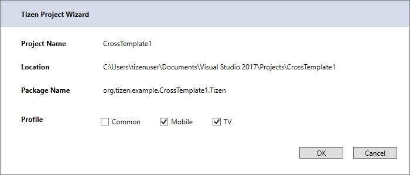
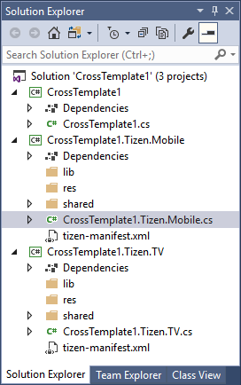

# Creating Your First Tizen .NET Application

The Tizen .NET framework allows you to easily and efficiently create applications for Tizen. With the following instructions, you can create a basic .NET application, which displays some text on the screen with no user interaction.

Before you get started with developing Tizen applications, set up the [development environment](how-to-install.md).

## Creating a Project

The following example shows how to create a basic Tizen .NET application project in Visual Studio. An application project contains all the files that make up an application.

To create a new Tizen .NET project:
1. Launch Visual Studio 2017.
2. In the Visual Studio menu, select **File &gt; New &gt; Project**.  
  
  The New Project dialog opens.

3. Select **Templates &gt; Visual C# &gt; Tizen &gt; Cross-Platform**, and select the **Blank App (Xamarin.Forms)** template.  
  Define the project properties and click **OK**. You can enter the name, location, and solution name.  
    
  The Tizen Project Wizard opens.
4.  Define the profiles to add to your solution, and click **OK**.  
    
  If you select the **Common** profile, you cannot select **Mobile** or **TV**.

A solution with 2 or 3 projects is created and shown in the **Solution Explorer** view:

- The **&lt;projectname&gt;** project contains the Xamarin.Forms code shared across platforms.
- If you select the common profile in the Tizen Project Wizard, a common project titled **&lt;projectname&gt;.Tizen** is added. It contains code to instantiate your common application within the Tizen framework.
- If you select the mobile profile in the Tizen Project Wizard, a mobile project titled **&lt;projectname&gt;.Tizen.Mobile** is added. It contains code to instantiate your mobile application within the Tizen framework.
- If you select the TV profile in the Tizen Project Wizard, a TV project titled **&lt;projectname&gt;.Tizen.TV** is added. It contains code to instantiate your TV application within the Tizen framework.  

**Figure: Project with mobile and TV profiles**

If you are already familiar with Xamarin.Forms, this project has the same structure as a Xamarin.Forms portable application. The **&lt;projectname&gt;** project is the portable class library and the others are the platform-specific projects; however, in Tizen .NET, only the Tizen platform-specific project is generated.

The `.cs` file in the portable project contains simple Xamarin.Forms code that makes a basic UI.
