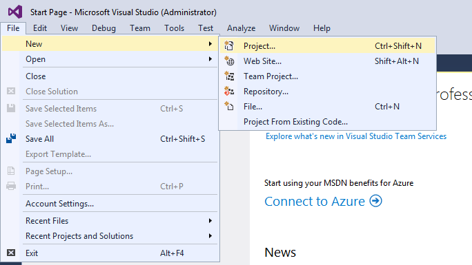

## Creating Your First Tizen .NET Application ##

The Tizen .NET framework allows you to efficiently and easily create beautiful applications for Tizen. A great way to experience this yourself is to follow the steps to your first Tizen .NET application. If you have to set up your development environment, please go to set up the development environment.

To get started,

* Creating a new project
* Building and running your application

After completing the above steps, you will have created your first application, and you can move on to Enhancing your application.

### Creating a Project ###

To build a Tizen .NET application, you must follow these general steps:

1. Create a project.
2. Design the user interface for the application.
3. Write code to implement the logic of the application.
4. Build and deploy the application.

You can perform all of these steps in the IDE. The Tizen .NET works in Microsoft's Visual Studio 2017. After making sure the development environment is properly set up, you can create a new Tizen .NET project:

1. Launch Visual Studio 2017.
2. To create a new project, select ```File > New > Project```.



3. In the New Project window, select Tizen in the Templates tree on the left, and select ```Blank App (Xamarin.Forms)```. Visual Studio defines a name, location and solution name for you, but you can modify the values: at least set the name to something meaningful.


Once you are happy with the name and location, click ```OK```.


Tizen Project Wizard window is shown as next step. You can define the package name and define which profiles are added in your solution. Click OK.  If you select Common profile, Mobile and TV profile cannot be selected.

A solution with 2 or 3 projects is created:

* One project is named <projectname> and contains the Xamarin.Forms code, which can be shared across platforms.

* If you selected the common profile in the Tizen Project Wizard, a common project is added with <projectname>.Tizen suffix and contains the code to instantiate your common application within the Tizen framework.

* If you selected the mobile profile in the Tizen Project Wizard, a mobile project is added with <projectname>.TizenMobile suffix and contains the code to instantiate your mobile application within the Tizen framework.

*If you selected the TV profile in the Tizen Project Wizard, a TV project is added with <projectname>.TizenTV suffix and contains the code to instantiate your TV application within the Tizen framework.

If you are already familiar with Xamarin.Forms, this project has almost the same structure as a Xamarin.Forms portable application, with the "Portable" project being the portable class library and the others being the platform-specific projects; however, for the Tizen .NET, only the Tizen platform-specific project is generated.


The ```.cs``` file in <projectname> project already contains simple Xamarin.Forms code, which makes a basic UI. Therefore, you can now build and run your application.

When you are done running your first application, you can enhance it further by reading a brief overview of what the code generated by the template is doing, and learning about a few more concepts to add to your application appeal.

---

