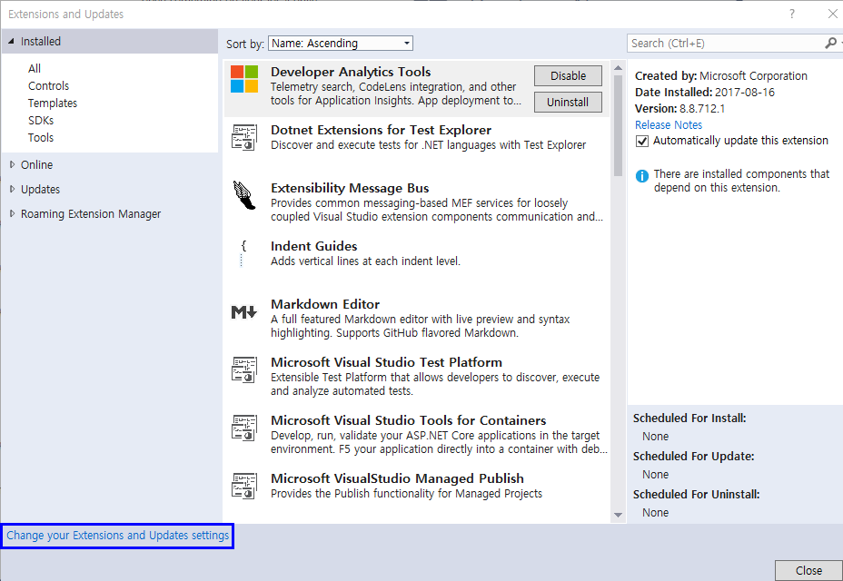
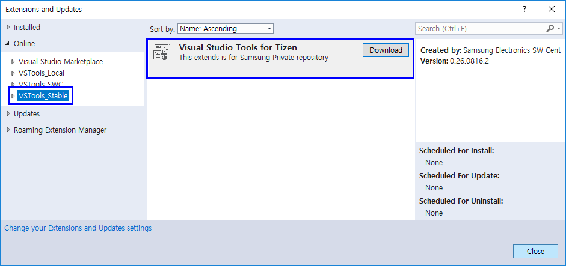
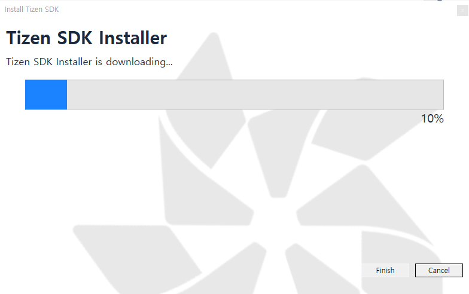
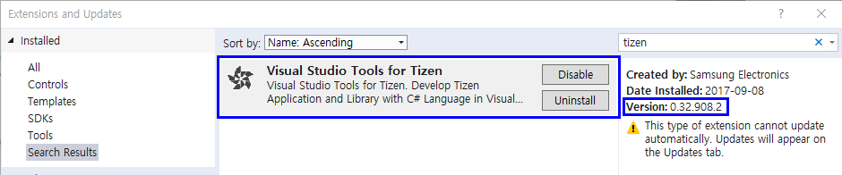
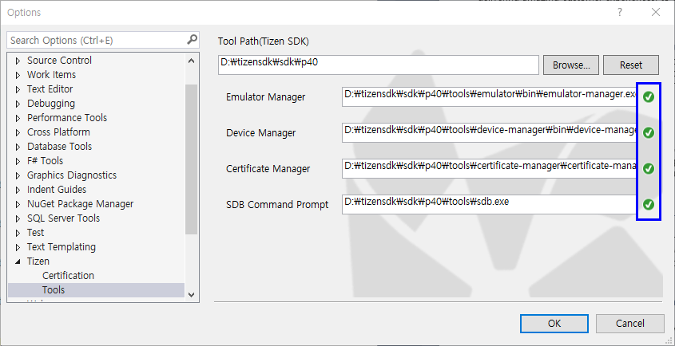

## What should be installed for Visual Studio Tools for Tizen ##
- VSIX : Visual Studio Extension for Tizen Packaging
- Tizen Baseline SDK : This is shared with Tizen Studio, and this supports tools for developing Tizen .NET App
  - This contains Certificate Manager, Device Manager, Emulator, SDB and on-demand rpm.

---

## Prerequisite ##
To work with Visual Studio Tools for Tizen, make sure that your system meets the following requirements.
For the installation of Visual Studio Tools for Tizen, your system requires more than 1.5GB available disk space.

### Visual Studio 2017 ###
Visual Studio Tools for Tizen works with all variations including Community. Installation or re-installation with below toolsets :
   - .NET desktop development
   - .NET Core cross-platform development
   
### .NET Core 2.0 SDK or later ###
This update is needed to set the .NET development environment. For more information, see https://www.microsoft.com/net/download/core.

### Java Development Kit (JDK) Requirements ###
You must install a Java Development Kit (JDK) 8 or higher to use Tizen Baseline SDK. Do not install OpenJDK.

Download the JDK from the [official Oracle Web site](http://www.oracle.com/technetwork/java/javase/downloads/index.html). Select the appropriate platform for your hardware architecture and Windows® version. Then, run the downloaded execution file and follow the displayed instructions.

### Emulator Prerequisites ###
Tizen emulator for Visual Studio requires an equivalent environment with an emulator in the Tizen Studio. To check the hardware and software requirements of the Tizen emulator, see [Emulator Requirements](https://developer.tizen.org/development/tizen-studio/download/installing-tizen-studio/prerequisites#emulator).

* Intel HAXM environment is required for accelerating the Tizen emulator. Intel HAXM is started automatically when you try to install Visual Studio Tools for Tizen. For more information, see [Hardware Accelerated Execution Manager](https://developer.tizen.org/development/tizen-studio/download/installing-tizen-studio/hardware-accelerated-execution-manager).
* Make sure Hyper-V should be disabled (in Windows® 8 or later):
   1. Run Programs and Features in the Start menu.

   

   2. Select Turn Windows features on or off.

   3. Disable Hyper-V

   

   4. Reboot the host PC

---

## Visual Studio Tools for Tizen Installation ##
The following steps are needed in installing Visual Studio Tools for Tizen.

   #### 1. Set private gallery for VSIX ####

   * Tools → Options.. → Extensions and Updates → Change your Extensions and Update settings or

   * Tools → Options → Environment → Extensions and Updates
   

   * Click the Add button and set URL (Check firewall about ```IP : 10.113.138.168 / Port : 80, 443```)
      * for Stable Version : http://10.113.138.168/packages/vsext/vsix/content.xml
      * for Developer Version : http://10.113.138.168/packages/vsext/vsix/content_swc.xml
   

   * Click OK button

   #### 2. Install VSIX ####

   * TOOLS → Extensions and Updates..
      * Select Online tab on leftside and select the private gallery you just added

   * Click Download button on Visual Studio Tools for Tizen
   

   * Visual Studio Tools for Tizen will be installed after you close the Visual Studio
   

   #### 3. Setup Baseline SDK ####

   For using Tizen SDK Tools, you have to install Baseline SDK. 
   However, if you already installed Tizen Studio in your host, you can just set the tool-path instead of installation.

   * For using with Visual Studio, your Tizen Studio should be installed from ```tizen_studio``` or ```tizen_studio_2.0``` distributions.
   * You can check Package repository and distribution which you installed. (Run Package manager > Configuration)
   

   #### Case : Already installed Tizen Studio ####
   * Launch Tizen Tool which is not intalled (ex. Emulator manager, Package manager etc.)
   

   * Set ```the root folder path of Tizen Studio```
   

   * In case of showing a warning about low version, you can update Tizen Studio using Tizen Package Manager after setting.

   #### Case : Install New Tizen Studio ####
   * Launch Tizen Tool which is not intalled (ex. Emulator manager, Package manager etc.)
   

   * Follow the guide of Install wizard (Review EULA, Set installation path)

   * Click Install button on the last step

   * Installer will be downloaded and baseline SDK will be installed automatically.
   
   

   * You can install Additional packages through the package manager (ex. TV Emulator Image, SDK Tools and so on)
   

---

## Trouble Shooting
#### Check VSIX was installed correctly ####
   * Tools > Extensions and Updates > Search Tizen > Check "Visual Studio Tools for Tizen"
   

#### When SDK Tools are not working well ####
   * Check the tool path ```Tools > Options > Tizen > Tools```
   

### Check Tizen Project Property was copied correctly
   * "C:\Program Files (x86)\Microsoft Visual Studio\2017\Professional\MSBuild\Tizen\VisualStudio" Property & Target
   

### Check Nuget server for build task
   * Check the package server in Tools > Option > NuGet Package Manager > Package Sources
     > https://tizen.myget.org/F/dotnet/api/v3/index.json

### Cannot remove Extension
   * Shutdown all instances of Visual Studio
   * Go to VS 2017 directory and order by time in explorer
   * After checking the folder, Remove Tizen Extension
   * Open a developer command prompt as administrator
   * Execute : "devenv /setup"
