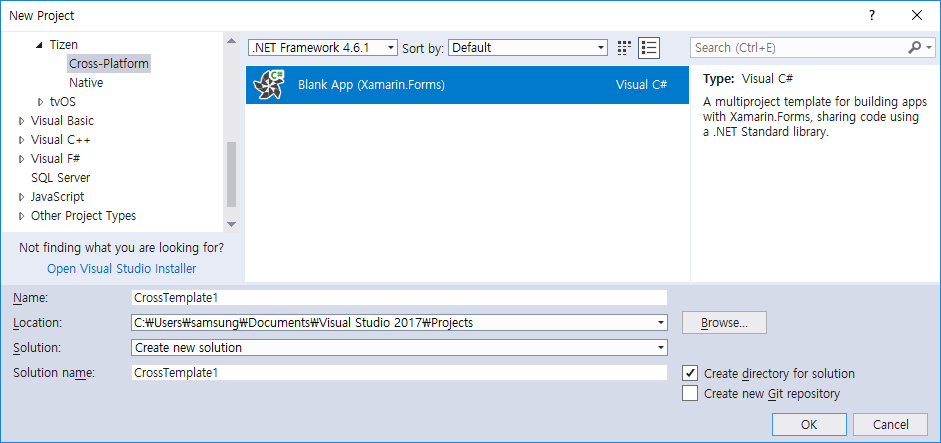
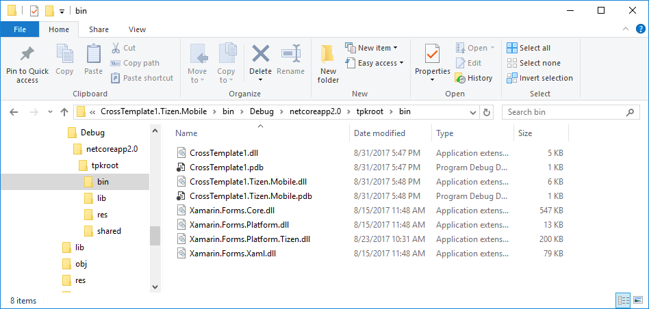

# How to Build a Tizen project in Visual Studio #
This topic provides a step-by-step introduction to building tpk using `Tizen.NET.Sdk` in Visual Studio 2017.
`Tizen.NET.Sdk` provide a feature of tpk packaging and signing.
If Tizen .NET Core project refers to the `Tizen.NET.Sdk` package, TPK file will be created.


### Prerequisites ###
1. Install Visual Studio Tools for Tizen
    - Install Guide : https://github.sec.samsung.net/dotnet/vs-tools-cps/blob/master/docs/how-to-install.md
 
1. Add feed to Nuget.config to restore `Tizen.NET.Sdk`
     - Tools > Options > NuGet Package Manager > Package Sources
     - Develop channel : https://tizen.myget.org/F/dotnet/api/v3/index.json
     

### Create a TPK Package with Visual Studio ###

1. Create Tizen project
    
	
    

1. Check PackageReference `Tizen.NET.Sdk`

    
    
1. Build Project (with Default Certificates)
    - Solution > Mouse Right button > Build Solution (or Ctrl + Shift + B)

    

    - Output Message
    ```
    1>------ Build started: Project: CrossTemplate1, Configuration: Debug Any CPU ------
    1>CrossTemplate1 -> C:\Users\samsung\Documents\Visual Studio 2017\Projects\CrossTemplate1\CrossTemplate1\CrossTemplate1\bin\Debug\netstandard2.0\CrossTemplate1.dll
    2>------ Build started: Project: CrossTemplate1.Tizen.TV, Configuration: Debug Any CPU ------
    3>------ Build started: Project: CrossTemplate1.Tizen.Mobile, Configuration: Debug Any CPU ------
    2>CrossTemplate1.Tizen.TV -> C:\Users\samsung\Documents\Visual Studio 2017\Projects\CrossTemplate1\CrossTemplate1\CrossTemplate1.Tizen.TV\bin\Debug\netcoreapp2.0\CrossTemplate1.Tizen.TV.dll
    2>CrossTemplate1.Tizen.TV -> C:\Users\samsung\Documents\Visual Studio 2017\Projects\CrossTemplate1\CrossTemplate1\CrossTemplate1.Tizen.TV\bin\Debug\netcoreapp2.0\org.tizen.example.CrossTemplate1.Tizen.TV-1.0.0.tpk
    3>CrossTemplate1.Tizen.Mobile -> C:\Users\samsung\Documents\Visual Studio 2017\Projects\CrossTemplate1\CrossTemplate1\CrossTemplate1.Tizen.Mobile\bin\Debug\netcoreapp2.0\CrossTemplate1.Tizen.Mobile.dll
    3>CrossTemplate1.Tizen.Mobile -> C:\Users\samsung\Documents\Visual Studio 2017\Projects\CrossTemplate1\CrossTemplate1\CrossTemplate1.Tizen.Mobile\bin\Debug\netcoreapp2.0\org.tizen.example.CrossTemplate1.Tizen.Mobile-1.0.0.tpk
    ========== Build: 3 succeeded, 0 failed, 0 up-to-date, 0 skipped ==========
    ```

1. Output Directory
    - tpk is created at the output directory
    
    
    - The files that make up the tpk package can be found in the` tpkroot` directory.
    


### Signing with custom certificates ###

### See Also ###