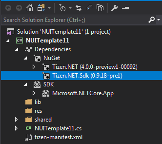
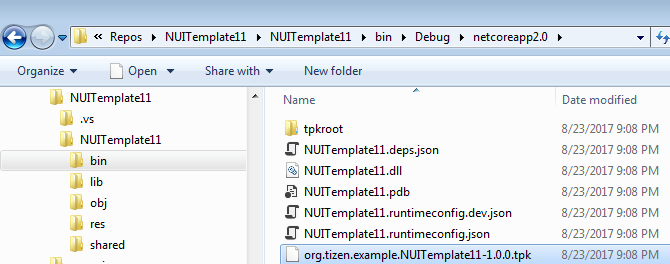

# How to create TPK package

## Prerequisites

Add feed to Nuget.config (https://tizen.myget.org/F/dotnet/api/v3/index.json) (develop channel) to restore Tizen.NET.Sdk develop version.

1. Visual Studio 2017


2. .NET CLI

    ```
      dotnet add package Tizen.NET.Sdk --version 0.9.18-pre1 --source https://tizen.myget.org/F/dotnet/api/v3/index.json
    ```

3. .CSPROJ
    ```xml
    <ItemGroup>
      <PackageReference Include="Tizen.NET.Sdk" Version="0.9.18-pre1" />
    </ItemGroup>
    ```


## How to build tizen project

### Visual Studio 2017
1. Install Visual Studio Tools for Tizen (cps version)

2. Create Template of Tizen.NET category


3. Check Package Reference Tizen.NET.Sdk



4. Build Project (with Default Certificates)
    ```
    1>------ Build started: Project: NUITemplate11, Configuration: Debug Any CPU ------
    1>NUITemplate11 -> c:\users\samsung\Source\Repos\NUITemplate11\NUITemplate11\bin\Debug\netcoreapp2.0\NUITemplate11.dll
    1>NUITemplate11 -> c:\users\samsung\Source\Repos\NUITemplate11\NUITemplate11\bin\Debug\netcoreapp2.0\org.tizen.example.NUITemplate11-1.0.0.tpk
    ========== Build: 1 succeeded, 0 failed, 0 up-to-date, 0 skipped ==========
    ```

5. Output Directory




### dotnet CLI
1. Install dotnet cli 2.0 (https://www.microsoft.com/net/core/)
2. Create console Project 
    ```
    $dotnet new console -n testconsole
    ```
3. Add the `<PackageReference>` element and include `Tizen.NET.Sdk` at your tizen project file.
    ```xml
    <ItemGroup>
      <PackageReference Include="Tizen.NET.Sdk" Version="0.9.18-pre1" />
    </ItemGroup>
    ```
    or

    ```
    $dotnet add package Tizen.NET.Sdk --version 0.9.18-pre1 --source https://tizen.myget.org/F/dotnet/api/v3/index.json
    ```

4. Create the `tizen-manifest.xml` file at project root directory
    ```xml
    <?xml version="1.0" encoding="utf-8"?>
    <manifest xmlns="http://tizen.org/ns/packages" api-version="4" package="org.tizen.example.testconsole" version="1.0.0">
      <profile name="common" />
      <ui-application appid="org.tizen.example.testconsole"
					    exec="testconsole.dll"
					    type="dotnet"
					    multiple="false"
					    taskmanage="true"
					    nodisplay="false"
					    launch_mode="single">
        <label>TestConsol</label>
        <icon>TestConsol.png</icon>
      </ui-application>
    </manifest>
    ```

5. Build Project (with Default Certificates)

    ```
    $ dotnet build
    Microsoft (R) Build Engine version 15.3.409.57025 for .NET Core
    Copyright (C) Microsoft Corporation. All rights reserved.

      testconsole -> /home/tizensdk/develop/Seminar/testconsole/bin/Debug/netcoreapp2.0/testconsole.dll
      testconsole -> /home/tizensdk/develop/Seminar/testconsole/bin/Debug/netcoreapp2.0/org.tizen.example.testconsole-1.0.0.tpk

    Build succeeded.
        0 Warning(s)
        0 Error(s)

    Time Elapsed 00:00:02.16

    ```
6. Build Project (with User Certificate Property)
    ```
    $ dotnet clean

    $ dotnet build /p:"AuthorPath=abc.p12;AuthorPass=test" /p:"DistributorPath=def.p12;DistributorPass=hello"
    ```
> INFO : you can also set certificate information .csproj file
>```xml
><PropertyGroup>
>  <AuthorPath>author_test.p12</AuthorPath>
>  <AuthorPass>author_test</AuthorPass>
>  <DistributorPath>tizen-distributor-signer.p12</DistributorPath>
>  <DistributorPass>tizenpkcs12passfordsigner</DistributorPass>
></PropertyGroup>
>```

