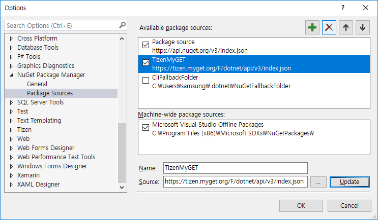
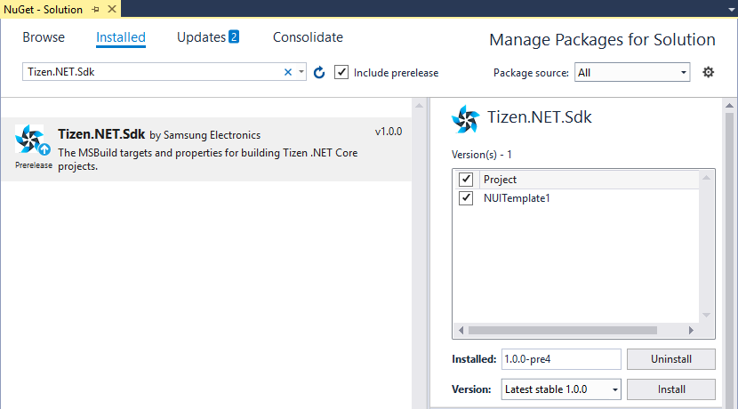
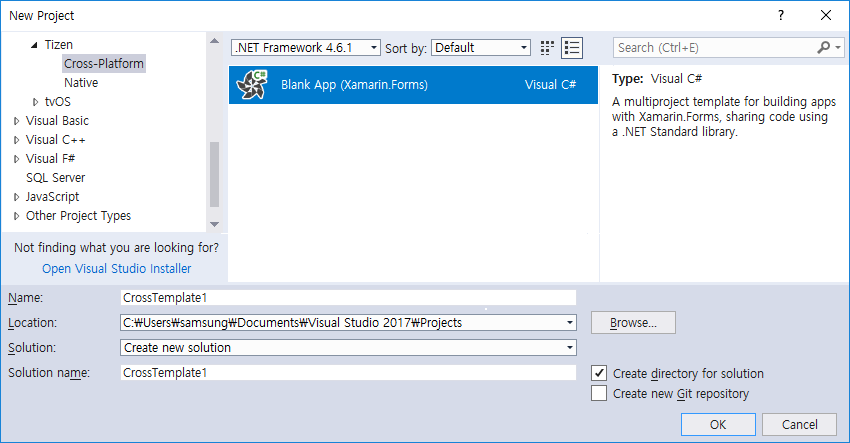
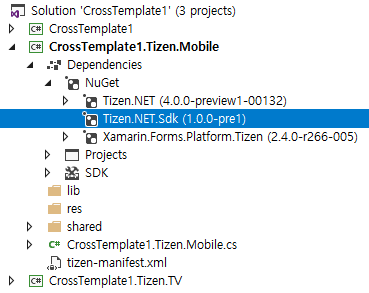
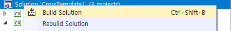
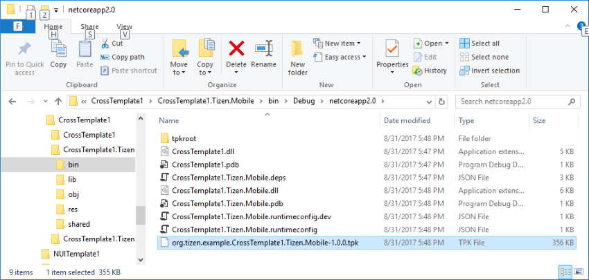
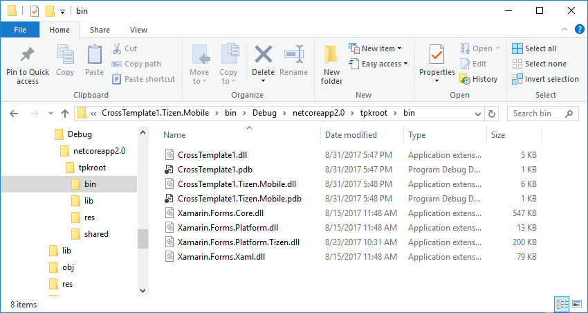

# Creating a TPK Package

You can create a TPK package by building a Tizen project with Visual Studio or .NET CLI (Command Line Interface).

## Prerequisites

Make sure the following prerequisites are fulfilled before building a project:

1. Install the needed software based on whether you want to use Visual Studio or .NET CLI:

   - [Install Visual Studio Tools for Tizen](../how-to-install.md) (cps version).
   - [Install .NET Core version 2.0 or higher](https://www.microsoft.com/net/core).

2. Add a new feed to `Nuget.config` (using the https://tizen.myget.org/F/dotnet/api/v3/index.json develop channel) to restore the Tizen.NET.Sdk development version:

   - In Visual Studio 2017, to add the package source, go to **Tools &gt; Options &gt; NuGet Package Manager &gt; Package Sources**:  
     

     

	 
   - In .NET CLI:

     Add the `<PackageReference>` element and include `Tizen.NET.Sdk` in your Tizen project file using one of the following:
	 - On the command line:
       ```bash
       dotnet add package Tizen.NET.Sdk --version 0.9.18-pre1 --source https://tizen.myget.org/F/dotnet/api/v3/index.json
       ```
	 - In the `.csproj` file:
       ```xml
       <ItemGroup>
         <PackageReference Include="Tizen.NET.Sdk" Version="0.9.18-pre1" />
       </ItemGroup>
       ```
     For more information on `NuGet.config` file locations, see [Config file locations and uses](https://docs.microsoft.com/en-us/nuget/consume-packages/configuring-nuget-behavior#config-file-locations-and-uses).	 
     ```xml
     <configuration>
        <packageSources>
           <add key="nuget.org" value="https://api.nuget.org/v3/index.json" protocolVersion="3" />
           <add key="TizenMyGET" value="https://tizen.myget.org/F/dotnet/api/v3/index.json" />
        </packageSources>
     </configuration>
     ```


## Creating a TPK Package with Visual Studio

You can build TPK packages using the Tizen.NET.Sdk package in Visual Studio 2017. Tizen.NET.Sdk provides a TPK packaging and signing feature. If a Tizen .NET Core project refers to the Tizen.NET.Sdk package, a TPK file is created.

To create a TPK package:

1. Create a new Tizen .NET project:

   

2. Check that a Nuget dependency to the `Tizen.NET.Sdk` package exists:

   

3. Build the project (with default certificates).
   
   Right-click the solution and select **Build Solution** (or press **Ctrl + Shift + B**).

   

   The build process output:
     ```
     1>------ Build started: Project: CrossTemplate1, Configuration: Debug Any CPU ------
     1>CrossTemplate1 -> C:\Users\samsung\Documents\Visual Studio 2017\Projects\CrossTemplate1\CrossTemplate1\CrossTemplate1\bin\Debug\netstandard2.0\CrossTemplate1.dll
     2>------ Build started: Project: CrossTemplate1.Tizen.TV, Configuration: Debug Any CPU ------
     3>------ Build started: Project: CrossTemplate1.Tizen.Mobile, Configuration: Debug Any CPU ------
     2>CrossTemplate1.Tizen.TV -> C:\Users\samsung\Documents\Visual Studio 2017\Projects\CrossTemplate1\CrossTemplate1\CrossTemplate1.Tizen.TV\bin\Debug\netcoreapp2.0\CrossTemplate1.Tizen.TV.dll
     2>CrossTemplate1.Tizen.TV -> C:\Users\samsung\Documents\Visual Studio 2017\Projects\CrossTemplate1\CrossTemplate1\CrossTemplate1.Tizen.TV\bin\Debug\netcoreapp2.0\org.tizen.example.CrossTemplate1.Tizen.TV-1.0.0.tpk
     3>CrossTemplate1.Tizen.Mobile -> C:\Users\samsung\Documents\Visual Studio 2017\Projects\CrossTemplate1\CrossTemplate1\CrossTemplate1.Tizen.Mobile\bin\Debug\netcoreapp2.0\CrossTemplate1.Tizen.Mobile.dll
     3>CrossTemplate1.Tizen.Mobile -> C:\Users\samsung\Documents\Visual Studio 2017\Projects\CrossTemplate1\CrossTemplate1\CrossTemplate1.Tizen.Mobile\bin\Debug\netcoreapp2.0\org.tizen.example.CrossTemplate1.Tizen.Mobile-1.0.0.tpk
     ========== Build: 3 succeeded, 0 failed, 0 up-to-date, 0 skipped ==========
     ```

4. Check the project output directory:
   
    - The TPK file is created in the output directory.
	
      
    
    - The files that make up the TPK package can be found in the` tpkroot` directory.
	
      


## Creating a TPK Package with .NET CLI

You can build TPK packages using the Tizen.NET.Sdk package in .NET CLI. Tizen.NET.Sdk provides a TPK packaging and signing feature. If a Tizen .NET Core project refers to the Tizen.NET.Sdk package, a TPK file is created.

To create a TPK package:

1. Create a new project:  
    ```bash
    $ dotnet new console -n testconsole
    ```

2. Create a `tizen-manifest.xml` file in the project root directory:
    ```xml
    <?xml version="1.0" encoding="utf-8"?>
    <manifest xmlns="http://tizen.org/ns/packages" api-version="4" package="org.tizen.example.testconsole" version="1.0.0">
      <profile name="common" />
      <ui-application appid="org.tizen.example.testconsole"
					    exec="testconsole.dll"
					    type="dotnet"
					    multiple="false"
					    taskmanage="true"
					    nodisplay="false"
					    launch_mode="single">
        <label>TestConsol</label>
        <icon>TestConsol.png</icon>
      </ui-application>
    </manifest>
    ```

3. Build the project:
   - With default certificates:

     ```
     $ dotnet build
     Microsoft (R) Build Engine version 15.3.409.57025 for .NET Core
     Copyright (C) Microsoft Corporation. All rights reserved.

       testconsole -> /home/tizensdk/develop/Seminar/testconsole/bin/Debug/netcoreapp2.0/testconsole.dll
       testconsole -> /home/tizensdk/develop/Seminar/testconsole/bin/Debug/netcoreapp2.0/org.tizen.example.testconsole-1.0.0.tpk

     Build succeeded.
         0 Warning(s)
         0 Error(s)

     Time Elapsed 00:00:02.16
     ```
     The output directory looks like this:

      ```
      $ tree ./bin

      bin
      |-- Debug

          |-- netcoreapp2.0
              |-- org.tizen.example.testconsole-1.0.0.tpk
              |-- testconsole.deps.json
              |-- testconsole.dll
              |-- testconsole.pdb
              |-- testconsole.runtimeconfig.dev.json
              |-- testconsole.runtimeconfig.json
              |-- tpkroot
                  |-- author-signature.xml
                  |-- bin
                  |   |-- testconsole.dll
                  |   |-- testconsole.pdb
                  |-- lib
                  |-- res
                  |-- shared
                  |   |-- res
                  |-- signature1.xml
                  |-- tizen-manifest.xml
      ```
   - With custom certificates:
     ```bash
     $ dotnet clean

     $ dotnet build /p:"AuthorPath=abc.p12;AuthorPass=test" /p:"DistributorPath=def.p12;DistributorPass=hello"
     ```

     > **Note**
     >
     > You can also set certificate information in the `.csproj` file:
     > ```xml
     > <PropertyGroup>
     >    <AuthorPath>author_test.p12</AuthorPath>
     >    <AuthorPass>author_test</AuthorPass>
     >    <DistributorPath>tizen-distributor-signer.p12</DistributorPath>
     >    <DistributorPass>tizenpkcs12passfordsigner</DistributorPass>
     > </PropertyGroup>
     > ```

