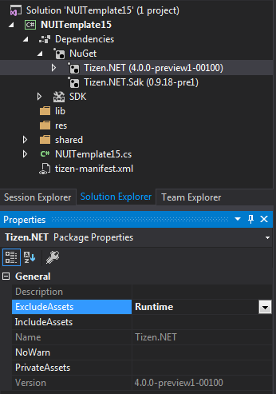
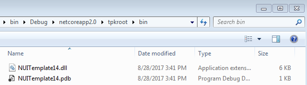
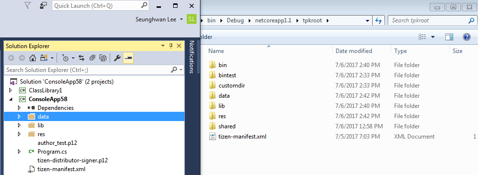
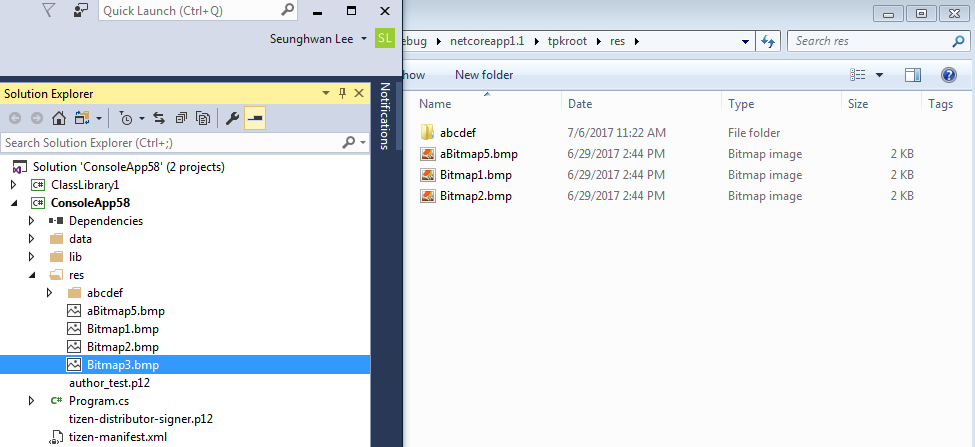
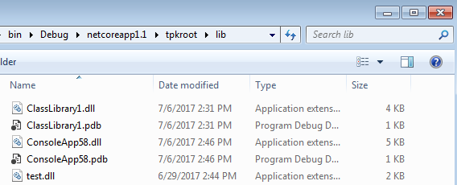

# How to customize TPK package

## Prerequisites
[How to create TPK package](how-to-create-tpk.md)


## Exclude NuGet reference dll from TPK package

If you want to exclude Tizen.NET's dll at your tpk package, you should add attribute `ExcludeAssets` and set value `Runtime`.
Otherwise, all reference files will be included to tpk package.



.csproj
```xml  
<ItemGroup>
  <PackageReference Include="Tizen.NET" Version="4.0.0-preview1-00100">
    <ExcludeAssets>Runtime</ExcludeAssets>
  </PackageReference>
</ItemGroup>
```

Result




[More Information of PackageReference Specification](https://docs.microsoft.com/en-us/nuget/consume-packages/package-references-in-project-files#controlling-dependency-assets)

## Include project resource files to Tpk
When it has more resources that should be add to tpk, it need to set `TizenTpkUserIncludeFiles` item. 
> If you use '\*' wildcard, then include files should be exist.


Example Code : 
```xml
  <ItemGroup>
    <TizenTpkUserIncludeFiles Include="data\**\*" />
  </ItemGroup>
```


Using `TizenTpkSubDir` and` TizenTpkFileName` ItemMeta allows you to configure tpk more dynamically.

Example Code : 

```xml
<ItemGroup>
     <!-- copy 'data\abc.txt' to 'tpkroot\shared\lib\abc.txt' -->
     <TizenTpkUserIncludeFiles Include="data\abc.txt">
       <TizenTpkSubDir>shared\lib</TizenTpkSubDir>
     </TizenTpkUserIncludeFiles>

     <!-- copy 'data\def.txt' to 'tpkroot\sha'red\lib1\test.dll' -->
     <TizenTpkUserIncludeFiles Include="date\def.txt">
       <TizenTpkFileName>test.dll</TizenTpkFileName>
       <TizenTpkSubDir>shared\lib1</TizenTpkSubDir>
     </TizenTpkUserIncludeFiles>

     <!-- bulk change, prepend text ('TEST-') to filename -->
     <MyData Include="data\**\*" />
 
     <TizenTpkUserIncludeFiles Include="@(MyData)">
       <TizenTpkSubDir>data\%(RecursiveDir)</TizenTpkSubDir>
       <TizenTpkFileName>TEST-%(Filename)%(Extension)</TizenTpkFileName>
     </TizenTpkUserIncludeFiles>
</ItemGroup>
```


## Exclude project resource files from Tpk

`TizenTpkUserExcludeFiles` item will remove files from tpkroot.

Example Code : 
```xml
  <ItemGroup>
    <TizenTpkUserExcludeFiles Include="res\Bitmap3.bmp" />
  </ItemGroup>
```


## Exclude specific dll from Tpk

If you want to exclude specific dll file, you should write fullname of dll
(Do not use the '\*' wildcard. '\*' can be used only when the files exists.)

Example Code : 
```xml
  <ItemGroup>
    <TizenTpkUserExcludeFiles Include="Tizen.My.dll" />
  </ItemGroup>
```
## Exclude Multi Files using ExcludePattern from tpk

TizenTpkExcludePattern andTizenTpkNotExcludePattern will be useful for dynamically excluding files

```xml
 <PropertyGroup>
    <!-- Exclude file pattern from tpkroot -->
    <TizenTpkExcludePattern>
      Tizen*.dll;
    </TizenTpkExcludePattern>

    <!-- Include file using pattern to tpkroot, this pattern should be use with TizenTpkExcludePattern -->
    <TizenTpkNotExcludePattern>
      Tizen.Application*.dll;
    </TizenTpkNotExcludePattern>
  </PropertyGroup>
```

## Exclude dll list using custom target

It can exclude static file list using target main project should import target as below

### example

Remove ExcludeAssets Meta


Import custom targets to yourproject.csproj file

```xml
<Project>
...
  <Import Project="ExcludeDLL.targets"/>
...
</Project>
```

Create 'ExcludeDLL.targets' file on your project directory

```xml
<?xml version="1.0" encoding="utf-8"?>
<Project>
  <Target Name="RemoveTizenPlatformAssemblies"
          AfterTargets="TizenResolveTpkPackageFiles">
    <ItemGroup>
      <SuppressPackaging Include="@(TizenResolvedFileToTpk)"
                         Condition="('%(Extension)' == '.dll' or '%(Extension)' == '.pdb' or '%(Extension)' == '.so')
                         and
                         (
                            '%(FileName)' ==  'ElmSharp'  or
                            '%(FileName)' ==  'Microsoft.CSharp'  or
                            '%(FileName)' ==  'Microsoft.VisualBasic'  or
                            '%(FileName)' ==  'Microsoft.Win32.Primitives'  or
                            '%(FileName)' ==  'Microsoft.Win32.Registry'  or
                            '%(FileName)' ==  'mscorlib'  or
                            '%(FileName)' ==  'netstandard'  or
                            '%(FileName)' ==  'SOS.NETCore'  or
                            '%(FileName)' ==  'System.AppContext'  or
                            '%(FileName)' ==  'System.Buffers'  or
                            '%(FileName)' ==  'System.Collections.Concurrent'  or
                            '%(FileName)' ==  'System.Collections'  or
                            '%(FileName)' ==  'System.Collections.Immutable'  or
                            '%(FileName)' ==  'System.Collections.NonGeneric'  or
                            '%(FileName)' ==  'System.Collections.Specialized'  or
                            '%(FileName)' ==  'System.ComponentModel.Annotations'  or
                            '%(FileName)' ==  'System.ComponentModel.Composition'  or
                            '%(FileName)' ==  'System.ComponentModel.DataAnnotations'  or
                            '%(FileName)' ==  'System.ComponentModel'  or
                            '%(FileName)' ==  'System.ComponentModel.EventBasedAsync'  or
                            '%(FileName)' ==  'System.ComponentModel.Primitives'  or
                            '%(FileName)' ==  'System.ComponentModel.TypeConverter'  or
                            '%(FileName)' ==  'System.Configuration'  or
                            '%(FileName)' ==  'System.Console'  or
                            '%(FileName)' ==  'System.Core'  or
                            '%(FileName)' ==  'System.Data.Common'  or
                            '%(FileName)' ==  'System.Data'  or
                            '%(FileName)' ==  'System.Diagnostics.Contracts'  or
                            '%(FileName)' ==  'System.Diagnostics.Debug'  or
                            '%(FileName)' ==  'System.Diagnostics.DiagnosticSource'  or
                            '%(FileName)' ==  'System.Diagnostics.FileVersionInfo'  or
                            '%(FileName)' ==  'System.Diagnostics.Process'  or
                            '%(FileName)' ==  'System.Diagnostics.StackTrace'  or
                            '%(FileName)' ==  'System.Diagnostics.TextWriterTraceListener'  or
                            '%(FileName)' ==  'System.Diagnostics.Tools'  or
                            '%(FileName)' ==  'System.Diagnostics.TraceSource'  or
                            '%(FileName)' ==  'System.Diagnostics.Tracing'  or
                            '%(FileName)' ==  'System'  or
                            '%(FileName)' ==  'System.Drawing'  or
                            '%(FileName)' ==  'System.Drawing.Primitives'  or
                            '%(FileName)' ==  'System.Dynamic.Runtime'  or
                            '%(FileName)' ==  'System.Globalization.Calendars'  or
                            '%(FileName)' ==  'System.Globalization'  or
                            '%(FileName)' ==  'System.Globalization.Extensions'  or
                            '%(FileName)' ==  'System.IO.Compression'  or
                            '%(FileName)' ==  'System.IO.Compression.FileSystem'  or
                            '%(FileName)' ==  'System.IO.Compression.ZipFile'  or
                            '%(FileName)' ==  'System.IO'  or
                            '%(FileName)' ==  'System.IO.FileSystem.AccessControl'  or
                            '%(FileName)' ==  'System.IO.FileSystem'  or
                            '%(FileName)' ==  'System.IO.FileSystem.DriveInfo'  or
                            '%(FileName)' ==  'System.IO.FileSystem.Primitives'  or
                            '%(FileName)' ==  'System.IO.FileSystem.Watcher'  or
                            '%(FileName)' ==  'System.IO.IsolatedStorage'  or
                            '%(FileName)' ==  'System.IO.MemoryMappedFiles'  or
                            '%(FileName)' ==  'System.IO.Pipes'  or
                            '%(FileName)' ==  'System.IO.UnmanagedMemoryStream'  or
                            '%(FileName)' ==  'System.Linq'  or
                            '%(FileName)' ==  'System.Linq.Expressions'  or
                            '%(FileName)' ==  'System.Linq.Parallel'  or
                            '%(FileName)' ==  'System.Linq.Queryable'  or
                            '%(FileName)' ==  'System.Net'  or
                            '%(FileName)' ==  'System.Net.Http'  or
                            '%(FileName)' ==  'System.Net.HttpListener'  or
                            '%(FileName)' ==  'System.Net.Mail'  or
                            '%(FileName)' ==  'System.Net.NameResolution'  or
                            '%(FileName)' ==  'System.Net.NetworkInformation'  or
                            '%(FileName)' ==  'System.Net.Ping'  or
                            '%(FileName)' ==  'System.Net.Primitives'  or
                            '%(FileName)' ==  'System.Net.Requests'  or
                            '%(FileName)' ==  'System.Net.Security'  or
                            '%(FileName)' ==  'System.Net.ServicePoint'  or
                            '%(FileName)' ==  'System.Net.Sockets'  or
                            '%(FileName)' ==  'System.Net.WebClient'  or
                            '%(FileName)' ==  'System.Net.WebHeaderCollection'  or
                            '%(FileName)' ==  'System.Net.WebProxy'  or
                            '%(FileName)' ==  'System.Net.WebSockets.Client'  or
                            '%(FileName)' ==  'System.Net.WebSockets'  or
                            '%(FileName)' ==  'System.Numerics'  or
                            '%(FileName)' ==  'System.Numerics.Vectors'  or
                            '%(FileName)' ==  'System.ObjectModel'  or
                            '%(FileName)' ==  'System.Private.CoreLib'  or
                            '%(FileName)' ==  'System.Private.DataContractSerialization'  or
                            '%(FileName)' ==  'System.Private.Uri'  or
                            '%(FileName)' ==  'System.Private.Xml'  or
                            '%(FileName)' ==  'System.Private.Xml.Linq'  or
                            '%(FileName)' ==  'System.Reflection.DispatchProxy'  or
                            '%(FileName)' ==  'System.Reflection'  or
                            '%(FileName)' ==  'System.Reflection.Emit'  or
                            '%(FileName)' ==  'System.Reflection.Emit.ILGeneration'  or
                            '%(FileName)' ==  'System.Reflection.Emit.Lightweight'  or
                            '%(FileName)' ==  'System.Reflection.Extensions'  or
                            '%(FileName)' ==  'System.Reflection.Metadata'  or
                            '%(FileName)' ==  'System.Reflection.Primitives'  or
                            '%(FileName)' ==  'System.Reflection.TypeExtensions'  or
                            '%(FileName)' ==  'System.Resources.Reader'  or
                            '%(FileName)' ==  'System.Resources.ResourceManager'  or
                            '%(FileName)' ==  'System.Resources.Writer'  or
                            '%(FileName)' ==  'System.Runtime.CompilerServices.VisualC'  or
                            '%(FileName)' ==  'System.Runtime'  or
                            '%(FileName)' ==  'System.Runtime.Extensions'  or
                            '%(FileName)' ==  'System.Runtime.Handles'  or
                            '%(FileName)' ==  'System.Runtime.InteropServices'  or
                            '%(FileName)' ==  'System.Runtime.InteropServices.RuntimeInformation'  or
                            '%(FileName)' ==  'System.Runtime.InteropServices.WindowsRuntime'  or
                            '%(FileName)' ==  'System.Runtime.Loader'  or
                            '%(FileName)' ==  'System.Runtime.Numerics'  or
                            '%(FileName)' ==  'System.Runtime.Serialization'  or
                            '%(FileName)' ==  'System.Runtime.Serialization.Formatters'  or
                            '%(FileName)' ==  'System.Runtime.Serialization.Json'  or
                            '%(FileName)' ==  'System.Runtime.Serialization.Primitives'  or
                            '%(FileName)' ==  'System.Runtime.Serialization.Xml'  or
                            '%(FileName)' ==  'System.Security.AccessControl'  or
                            '%(FileName)' ==  'System.Security.Claims'  or
                            '%(FileName)' ==  'System.Security.Cryptography.Algorithms'  or
                            '%(FileName)' ==  'System.Security.Cryptography.Cng'  or
                            '%(FileName)' ==  'System.Security.Cryptography.Csp'  or
                            '%(FileName)' ==  'System.Security.Cryptography.Encoding'  or
                            '%(FileName)' ==  'System.Security.Cryptography.OpenSsl'  or
                            '%(FileName)' ==  'System.Security.Cryptography.Primitives'  or
                            '%(FileName)' ==  'System.Security.Cryptography.X509Certificates'  or
                            '%(FileName)' ==  'System.Security'  or
                            '%(FileName)' ==  'System.Security.Principal'  or
                            '%(FileName)' ==  'System.Security.Principal.Windows'  or
                            '%(FileName)' ==  'System.Security.SecureString'  or
                            '%(FileName)' ==  'System.ServiceModel.Web'  or
                            '%(FileName)' ==  'System.ServiceProcess'  or
                            '%(FileName)' ==  'System.Text.Encoding'  or
                            '%(FileName)' ==  'System.Text.Encoding.Extensions'  or
                            '%(FileName)' ==  'System.Text.RegularExpressions'  or
                            '%(FileName)' ==  'System.Threading'  or
                            '%(FileName)' ==  'System.Threading.Overlapped'  or
                            '%(FileName)' ==  'System.Threading.Tasks.Dataflow'  or
                            '%(FileName)' ==  'System.Threading.Tasks'  or
                            '%(FileName)' ==  'System.Threading.Tasks.Extensions'  or
                            '%(FileName)' ==  'System.Threading.Tasks.Parallel'  or
                            '%(FileName)' ==  'System.Threading.Thread'  or
                            '%(FileName)' ==  'System.Threading.ThreadPool'  or
                            '%(FileName)' ==  'System.Threading.Timer'  or
                            '%(FileName)' ==  'System.Transactions'  or
                            '%(FileName)' ==  'System.Transactions.Local'  or
                            '%(FileName)' ==  'System.ValueTuple'  or
                            '%(FileName)' ==  'System.Web'  or
                            '%(FileName)' ==  'System.Web.HttpUtility'  or
                            '%(FileName)' ==  'System.Windows'  or
                            '%(FileName)' ==  'System.Xml'  or
                            '%(FileName)' ==  'System.Xml.Linq'  or
                            '%(FileName)' ==  'System.Xml.ReaderWriter'  or
                            '%(FileName)' ==  'System.Xml.Serialization'  or
                            '%(FileName)' ==  'System.Xml.XDocument'  or
                            '%(FileName)' ==  'System.Xml.XmlDocument'  or
                            '%(FileName)' ==  'System.Xml.XmlSerializer'  or
                            '%(FileName)' ==  'System.Xml.XPath'  or
                            '%(FileName)' ==  'System.Xml.XPath.XDocument'  or
                            '%(FileName)' ==  'Tizen.Account.AccountManager'  or
                            '%(FileName)' ==  'Tizen.Account.FidoClient'  or
                            '%(FileName)' ==  'Tizen.Account.OAuth2'  or
                            '%(FileName)' ==  'Tizen.Applications.Alarm'  or
                            '%(FileName)' ==  'Tizen.Applications.Badge'  or
                            '%(FileName)' ==  'Tizen.Applications.Common'  or
                            '%(FileName)' ==  'Tizen.Applications.DataControl'  or
                            '%(FileName)' ==  'Tizen.Applications.MessagePort'  or
                            '%(FileName)' ==  'Tizen.Applications.Notification'  or
                            '%(FileName)' ==  'Tizen.Applications.NotificationEventListener'  or
                            '%(FileName)' ==  'Tizen.Applications.PackageManager'  or
                            '%(FileName)' ==  'Tizen.Applications.Preference'  or
                            '%(FileName)' ==  'Tizen.Applications.RemoteView'  or
                            '%(FileName)' ==  'Tizen.Applications.Service'  or
                            '%(FileName)' ==  'Tizen.Applications.ToastMessage'  or
                            '%(FileName)' ==  'Tizen.Applications.UI'  or
                            '%(FileName)' ==  'Tizen.Applications.WidgetApplication'  or
                            '%(FileName)' ==  'Tizen.Applications.WidgetControl'  or
                            '%(FileName)' ==  'Tizen.Content.Download'  or
                            '%(FileName)' ==  'Tizen.Content.MediaContent'  or
                            '%(FileName)' ==  'Tizen.Content.MimeType'  or
                            '%(FileName)' ==  'Tizen.Context'  or
                            '%(FileName)' ==  'Tizen.Convergence'  or
                            '%(FileName)' ==  'Tizen'  or
                            '%(FileName)' ==  'Tizen.Location'  or
                            '%(FileName)' ==  'Tizen.Location.Geofence'  or
                            '%(FileName)' ==  'Tizen.Log'  or
                            '%(FileName)' ==  'Tizen.Maps'  or
                            '%(FileName)' ==  'Tizen.Messaging'  or
                            '%(FileName)' ==  'Tizen.Messaging.Push'  or
                            '%(FileName)' ==  'Tizen.Multimedia.AudioIO'  or
                            '%(FileName)' ==  'Tizen.Multimedia.Camera'  or
                            '%(FileName)' ==  'Tizen.Multimedia'  or
                            '%(FileName)' ==  'Tizen.Multimedia.MediaCodec'  or
                            '%(FileName)' ==  'Tizen.Multimedia.MediaPlayer'  or
                            '%(FileName)' ==  'Tizen.Multimedia.Metadata'  or
                            '%(FileName)' ==  'Tizen.Multimedia.Radio'  or
                            '%(FileName)' ==  'Tizen.Multimedia.Recorder'  or
                            '%(FileName)' ==  'Tizen.Multimedia.Remoting'  or
                            '%(FileName)' ==  'Tizen.Multimedia.StreamRecorder'  or
                            '%(FileName)' ==  'Tizen.Multimedia.Util'  or
                            '%(FileName)' ==  'Tizen.Multimedia.Vision'  or
                            '%(FileName)' ==  'Tizen.Network.Bluetooth'  or
                            '%(FileName)' ==  'Tizen.Network.Connection'  or
                            '%(FileName)' ==  'Tizen.Network.IoTConnectivity'  or
                            '%(FileName)' ==  'Tizen.Network.Nfc'  or
                            '%(FileName)' ==  'Tizen.Network.Nsd'  or
                            '%(FileName)' ==  'Tizen.Network.Smartcard'  or
                            '%(FileName)' ==  'Tizen.Network.WiFiDirect'  or
                            '%(FileName)' ==  'Tizen.Network.WiFi'  or
                            '%(FileName)' ==  'Tizen.NUI'  or
                            '%(FileName)' ==  'Tizen.PhonenumberUtils'  or
                            '%(FileName)' ==  'Tizen.Pims.Calendar'  or
                            '%(FileName)' ==  'Tizen.Pims.Contacts'  or
                            '%(FileName)' ==  'Tizen.Security'  or
                            '%(FileName)' ==  'Tizen.Security.SecureRepository'  or
                            '%(FileName)' ==  'Tizen.Security.TEEC'  or
                            '%(FileName)' ==  'Tizen.Sensor'  or
                            '%(FileName)' ==  'Tizen.System'  or
                            '%(FileName)' ==  'Tizen.System.Feedback'  or
                            '%(FileName)' ==  'Tizen.System.Information'  or
                            '%(FileName)' ==  'Tizen.System.MediaKey'  or
                            '%(FileName)' ==  'Tizen.System.Storage'  or
                            '%(FileName)' ==  'Tizen.System.SystemSettings'  or
                            '%(FileName)' ==  'Tizen.Telephony'  or
                            '%(FileName)' ==  'Tizen.Tracer'  or
                            '%(FileName)' ==  'Tizen.Uix.InputMethod'  or
                            '%(FileName)' ==  'Tizen.Uix.InputMethodManager'  or
                            '%(FileName)' ==  'Tizen.Uix.Stt'  or
                            '%(FileName)' ==  'Tizen.Uix.SttEngine'  or
                            '%(FileName)' ==  'Tizen.Uix.Tts'  or
                            '%(FileName)' ==  'Tizen.Uix.TtsEngine'  or
                            '%(FileName)' ==  'Tizen.Uix.VoiceControl'  or
                            '%(FileName)' ==  'Tizen.WebView'  or
                            '%(FileName)' ==  'WindowsBase'
                            )
        "/>
      <TizenResolvedFileToTpk Remove="@(SuppressPackaging)"/>
    </ItemGroup>

    <Message Text='Suppressed "%(SuppressPackaging.FileName)%(SuppressPackaging.Extension)" from being included in TPK.' Condition=" '@(SuppressPackaging)' != '' "/>
  </Target>
</Project>
```

Build Project & Check Log
```
....

1>Target RemoveTizenPlatformAssemblies:
1>  Suppressed "ElmSharp.dll" from being included in TPK.
1>  Suppressed "Tizen.Location.Geofence.dll" from being included in TPK.
1>  Suppressed "Tizen.Location.dll" from being included in TPK.
1>  Suppressed "Tizen.Log.dll" from being included in TPK.
1>  Suppressed "Tizen.Maps.dll" from being included in TPK.
1>  Suppressed "Tizen.Messaging.Push.dll" from being included in TPK.
1>  Suppressed "Tizen.Messaging.dll" from being included in TPK.
1>  Suppressed "Tizen.Multimedia.AudioIO.dll" from being included in TPK.

....

```

## Change assembly copy path to Tpk

After the project has been built, the assembly files (.dll, .pdb) will copy to `tpkroot\$(TizenTpkAssemblyDirName)`.
Default `$(TizenTpkAssemblyDirName)` value is bin.
If you want to change assembly directory of tpk then you should set `TizenTpkAssemblyDirName` property value you want.

Example Code : 
```xml
  <PropertyGroup>
    <TizenTpkAssemblyDirName>lib</TizenTpkAssemblyDirName>
  </PropertyGroup>
```



## See Also
- [Packaging tpk with Tizen.NET.Sdk](https://github.sec.samsung.net/dotnet/build-task-tizen/blob/master/doc/tizen.net.sdk-packaging-tpk.md)
- [Tizen.NET.Sdk Reference](https://github.sec.samsung.net/dotnet/build-task-tizen/blob/master/doc/tizen.net.sdk-reference.md)
