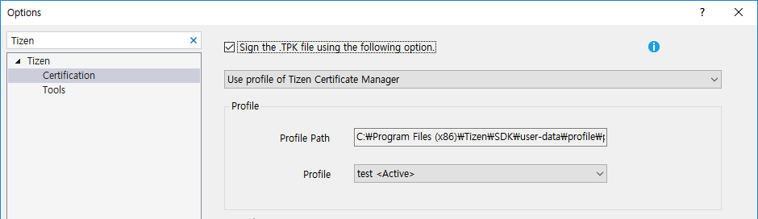
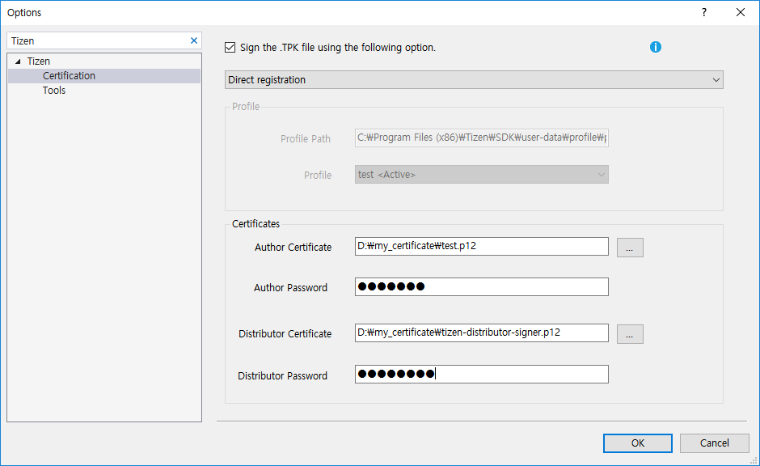
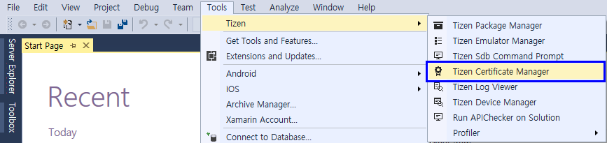
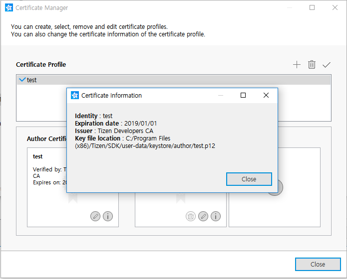

## Certificate Manager ##

Before installing your applications on a device or submitting it to the Tizen Store, it must be signed with a certificate profile. The certificate ensures the source of the application and makes sure it has not been tampered with since its publication. A certificate profile consists of author and distributor certificates. They can be made in Certificate Manager and they can be managed in Tools > Options > Tizen > Certification. The certificates can be created, edited, removed, and set as active in the Certificate Manager. The active certificates are used when packaging your application.

In Visual Studio Tools for Tizen, the certification can be defined in the following ways:

### Using the default certificate ###
   * If you do not need to upload your application to the Tizen Store, you can use a default certificate and deploy your application in the Tizen Emulator. For using this option, set the certification as illustrated in the following figure.

   

### Using an existing certificate profile ###
   * If you have used Tizen Studio and have already generated a certificate profile using the Tizen Certificate Manager, it can be imported in Tools > Options > Tizen > Certification. If you create a Certificate Profile using the ```Tizen Certificate Manager```, it is set as default automatically.

   

### Using your own certificate ###
   * If you already have author and distributor certificates, you can import them in Menu > Tools > Options > Tizen > Certification.

   

## Certificate Profile and Certificates ##
The certificate profile consists of an author certificate and 1 or 2 distributor certificates. To distribute your application, you must create a certificate profile and sign the application with it:

   * An author certificate includes information about the author of the application. It is used to create an author signature, which ensures the integrity of the application from the author since the publication of the application.
   * A distributor certificate includes information about the distributor of the application, such as a store. It is used to create a distributor signature, which ensures the integrity of the application from the distributor since the distribution of the application.

### Creating the Certificate Profile ###

You can create a new certificate profile with the Certificate Manager. To run the Certificate Manager, in the Visual Studio menu, select Tools > Tizen > Tizen Certificate Manager.



In the Certificate Manager, click the plus icon (Plus icon) to create a new profile.


You can create a new certificate profile with the creation wizard.


### Adding the Author and Distributor Certificates ###

To add author and distributor certificates:

1. Create a new author certificate or use a previously created author certificate.


2. Fill in the required information.


3. You can use the default Tizen distributor certificate or another distributor certificate if you have one. In general, the default Tizen distributor certificate is used and you do not need to modify distributor certificates. You can also select the privilege level of the distributor certificate (in native and Web applications)).


### Managing the Certificate Profile ###

You can also view, edit, and remove the certificate profiles you have created.


To manage a certificate profile:

* Click the info icon () to see detailed information of the certificate.



* Click the pencil icon () to change the author or distributor certificate of the selected certificate profile.


* Click the trash icon () to remove the selected certificate profile.


* The active profile is used when you package your application. Click the check icon to set the selected certificate profile as active. The active profile is also set in Tools > Options > Tizen > Certification automatically.