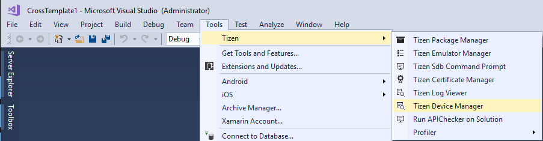
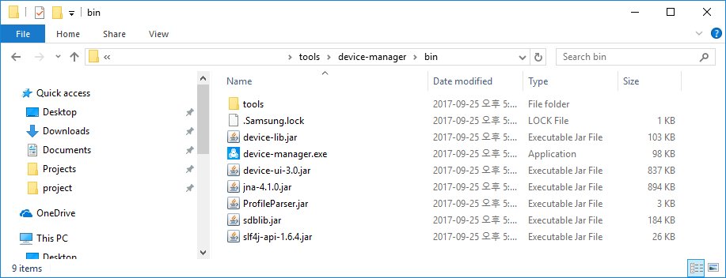
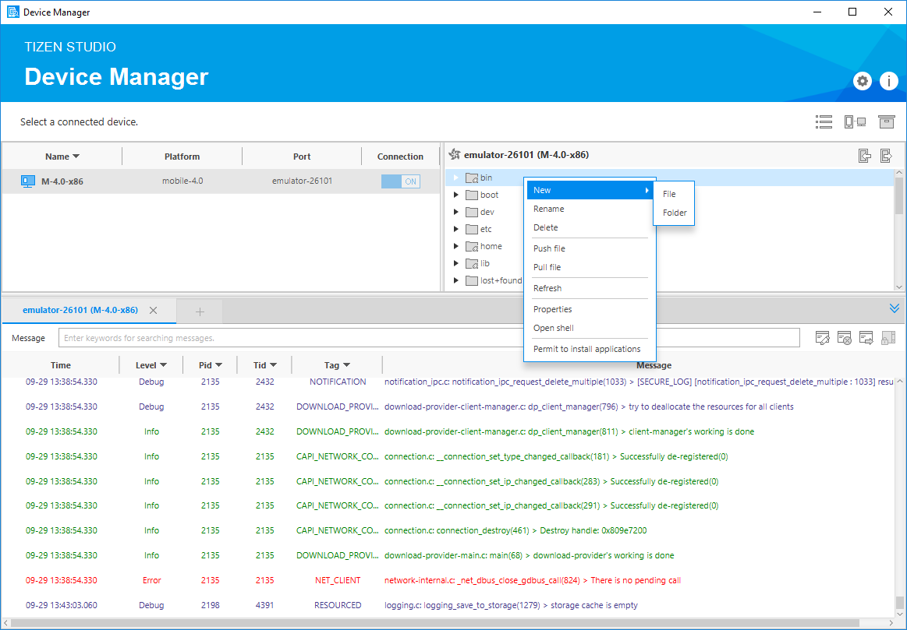
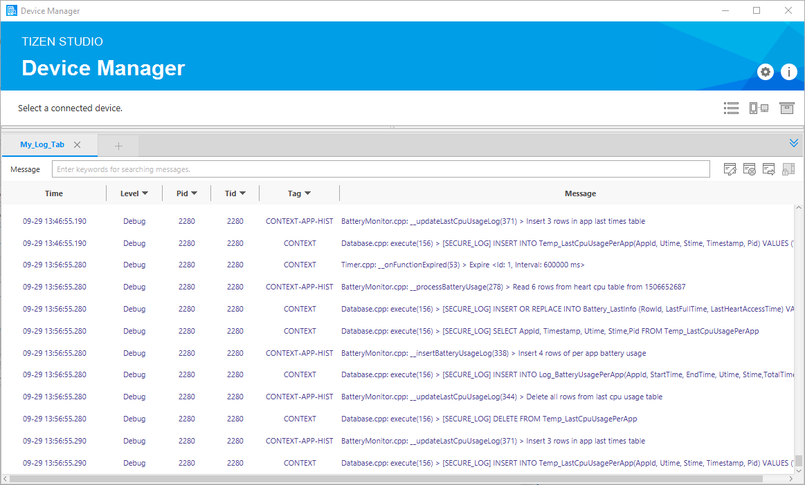
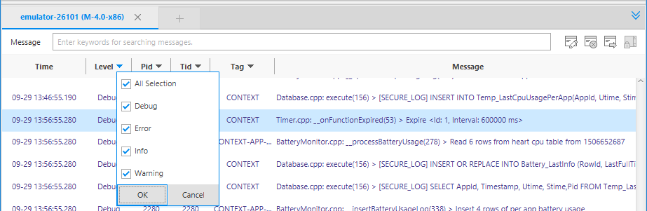
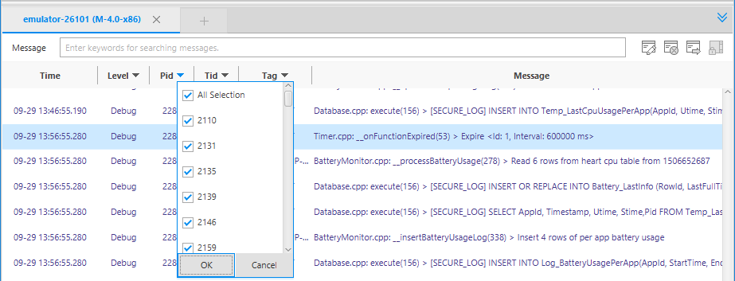

## Device Manager ##

Tizen Device Manager is a standalone tool that provides informations of connected Tizen device or emulators for application debugging.

With this tool, you can manage the connected devices or emulators and you can also push or pull files from host PC to devices. Plus, the log viewer in device manager can help you to check logs from connected devices too.

The features provided are as follows.

* Connection Explore View
* Log View

---

### Launching Tizen Device Manager ###

You can launch the Tizen Device Manager with below action

* From Visual Studio tools for Tizen, select Tools > Tizen > Tizen Device Manager.



* From File Explorer, select ```%tizen_baseline_root%/tools/device-manager/bin```.



If you can select this tool with above, Tizen Device Manager will be shown.


---

### Connection Explore View ###

The connection explorer view shows the devices or emulators connected to the system.

A list of connected devices is available after connecting a device or launching a Tizen emulator with a tree view.

The connection explorer view provides the following actions for the connected devices:

* Show a list of connected devices and connects devices for running and debugging the application.
* Provide file operations on connected devices like as push or pull.
* Send or receive files between the Project Explorer and Connection Explorer views by dragging and dropping.
    * Showing folder/file list of connected device
    * Information of file (date/size)
    * Create / Delete / Rename
    * Upload / Download
* Explore the file system on the connected devices.
* Launch the Emulator Manager to handle the multiple instances of the emulator.



---

### Log View ###

The Log view helps you debug your application by capturing all the events logged by the platform and your application.

The Log view shows the logs through the Tizen.Library.

You can create a log message as below. Tizen.Library is referenced in your project. So, you can call Log function.

```
using System;
using Tizen;

namespace CrossTemplate1.Tizen.Mobile
{
    class Program : global::Xamarin.Forms.Platform.Tizen.FormsApplication
    {
        protected override void OnCreate()
        {
            base.OnCreate();
            LoadApplication(new App());
            Log.Debug("TEST", "Test Debug Message!");
            Log.Error("TEST", "Test Error Message!");
            Log.Fatal("TEST", "Test Fatal Message!");
            Log.Info("TEST", "Test Info Message!");
            Log.Verbose("TEST", "Test Verbose Message!");
            Log.Warn("TEST", "Test Warn Message!");
        }

        static void Main(string[] args)
        {
            var app = new Program();
            global::Xamarin.Forms.Platform.Tizen.Forms.Init(app);
            app.Run(args);
        }
    }
}
```

---

### Adding and Removing the Log Tab ###

Adding a log tab:

1. Click the Add LogTab icon.
2. Type the tab name in the Name field and select a device in the Device list.
3. Click ```OK```.




Removing a log tab:

* Click the log tab which you want to remove.
* Click the Remove LogTab button.

---

### Understanding and Filtering Logs ###

The log table consists of the following fields:

* Time: log time

* Level: priority level indicates the urgency of the log message

* Pid: process ID

* Tid: thread ID

* Tag: identification of the log message source

* Message: log message

In the log table, you have the following options and functions:

* Log level filtering option

    * In the Log view, you can filter the log messages using the V (verbose), D (debug), I (info), W (warning), E (error), and F (fatal) menu to show specific log messages suitable to the selected type.

    

* Keyword filtering option
    * You can filter the log messages by selecting one of the PID, Tag, and Message options, or entering keywords at the search box which is in the bottom of the log view. The keywords must be separated by a space and a comma.

    

* Scroll lock
    * The log table shows the latest logs by default. This can make you uncomfortable when checking the specified log. Enable scroll lock when checking a specified log.

    
 
* Clearing the table
    * You can remove all log messages from the log tab by clicking the clear the log icon.

    

* Exporting logs to a file
    * You can export the current log messages in the log tab and save them as a log file by clicking the export the log icon.

    
 

