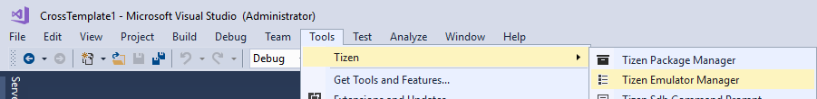
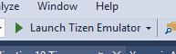
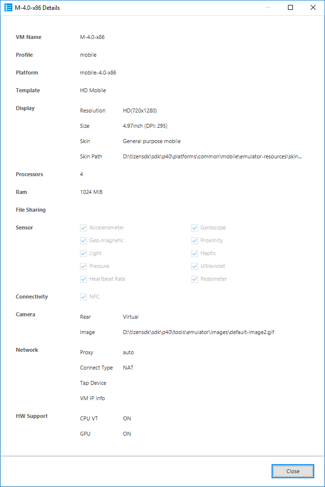
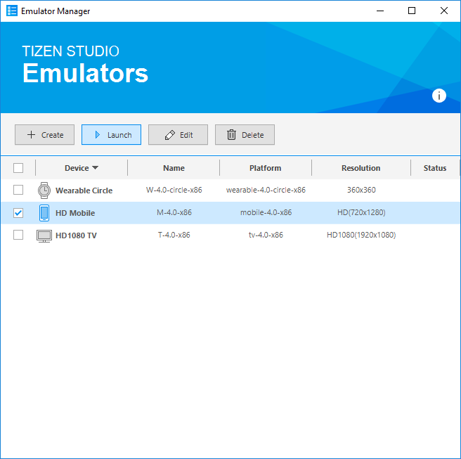

## Emulator Manager ##

The Visual Studio Tools for Tizen provides emulators to run your application in a virtual environment.

In order to test the application in a variety of environments, you need a variety of emulators. The Visual Studio Tools for Tizen provides the Emulator Manager to help you easily create and manage the emulator instances.

Basically, the Emulator Manager allows you to easily generate emulator instances from a pre-defined platform and template. In addition, you can define the settings of the virtual device, such as skin, resolution, and hardware devices.

The main features of the Emulator Manager are:

* Creating a new emulator instance or hardware profile
* Managing an existing emulator instance or hardware profile
* Deleting an emulator instance or hardware profile
* Launching and stopping the emulator instance

---

### Accessing the Emulator Manager ###

If you do not have the Emulator Manager installed, you can install it using the Visual Studio Tools for Tizen installer.

There are 2 different ways to access the Emulator Manager from Visual Studio:

* Go to ```Tools > Tizen```, and select ```Tizen Emulator Manager```

   

* Click ```Launch Tizen Emulator``` on the Visual Studio toolbar.

   

---

### Creating an Emulator Instance ###

The Emulator Manager can help you to select the recommended platform and template. When you need another device environment, you can edit the existing emulator instance, or create a new one with a more suitable platform and template. You can also create platforms and templates to suit your needs.


To create a new emulator instance:

1. In the Emulator Manager, click ```Create```.
2. Select the platform (system image), and click ```Next```.
3. Select the template (device definition), and click ```Next```.
4. Change properties as needed, and click ```Finish```.

The emulator instance appears in the Emulator Manager.

To view the detailed information, right-click the emulator to see a context menu.

```
Note

To run the application faster, switch on CPU VT and GPU. If CPU VT is disabled, check Increasing the Application Execution Speed for more information. If GPU is disabled, install the latest vendor-provided graphic driver.

Mobile emulator supports HD(720x1280) or WVGA(480x800) resolutions.
```



---

### Creating Platforms ###

To create an emulator, you have to first select the platform. You can create, modify, and delete a custom platform, and view the generated platforms. Most application developers do not need a custom platform, but it can be useful for a platform developer.


To create a custom platform:

1. Click the create icon (Create icon).
2. In the dialog box, select a base platform and platform image file. 
   
   You can create a custom platform using a qcow2 or raw format image.
   
   Qcow2 is a platform image format that is released with the Tizen Studio. Using the Emulator Manager's "Export as" feature, you can also create a qcow2 image.
   
   A platform image of the development stage is in the raw format. If you try launching an emulator with a raw image, you can see the current state of this image. This can be useful for platform developers.

3. Click ```OK``` to save your configuration and click ```Next```.

   The newly created platform is added to the list with a settings icon.

   

### Creating Templates ###

The Emulator Manager provides several device template types. A device template refers to, for example, the screen resolution and size, and the sensors in the device specification. You can make an emulator instanced based on the desired template.


You can create a new template from the beginning, or clone a template and change some properties.

To create a new template, click the create icon () to open a dialog box. Click ```OK``` to save your settings.

To clone a new template, click the clone icon (), make the appropriate changes, and click ```OK```.

After configuring the template, click ```Next```. The new device template is added to the list with a settings icon.


---

### Managing the Emulator ###

In the Emulator Manager, you can edit, delete, reset, and export emulator instances:

* To edit an emulator instance, click ```Edit```, make the appropriate changes, and click ```Confirm```.
* To delete an emulator instance, click ```Delete```.
* To reset an emulator instance, right-click it and select ```Reset```.
*To export an emulator instance, right-click it and select ```Export As```. Specify the new image file location.

When you export the emulator instance, the same state as in the platform image is replicated.

---

### Managing Platforms and Templates ###

To manage the template:

* To modify a template, click the modify icon (), make the appropriate changes, and click Confirm. You can only modify the custom device templates you have created.
* To delete a template, click the delete icon (). You can only delete the custom device templates you have created.

To manage the platforms:

* To modify a custom platform, click the modify icon (), make the appropriate changes, and click Confirm. You can only modify the custom platforms you have created.
* To delete a custom platform, click the delete icon (). You can only delete the custom platforms you have created.

---

### Launching an Emulator Instance ###

To launch an emulator instance:

* Launch the Emulator Manager and select an emulator instance on the list.
* Click ```Launch```.



* The selected emulator is booted after a few seconds.


* The debug and launch options are activated after the emulator has booted. The name of the emulator instance is displayed on the toolbar.


---