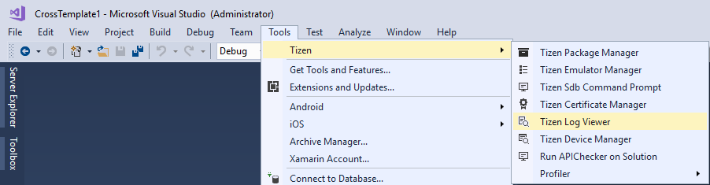
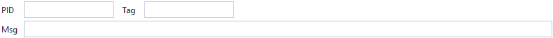
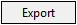

## Log Viewer ##

Log Viewer enables that you can check your log messages in Visual Studio. This tool shows the messages same as log viewer in device manager. However, this tool can be imported in Visual Studio.

### Viewing Logs in Log Tabs ###
 If you want to open the Log Viewer, go to Tools > Tizen > Tizen Log Viewer in the Visual Studio menu.

The Log Viewer helps you debug your application by capturing all the events logged by the platform and your application. The Log Viewer shows the logs through the dlog logging service. The service consists of the dlogutil and dlog library. You can also see logs with the dlogutil command in the CLI environment, and create log entries with the dlog library.

---

### Understanding and Filtering Logs ###

The log table consists of the following fields:

* Time: log time

* Level: priority level indicates the urgency of the log message

* Pid: process ID

* Tid: thread ID

* Tag: identification of the log message source

* Msg: log message

In the log table, you have the following options and functions:

* Log level filtering option
    * In the Log Viewer, you can filter the log messages using the V (verbose), D (debug), I (info), W (warning), E (error), and F (fatal) buttons to show specific log messages suitable to the selected type.

    

* Keyword filtering option
    * You can filter the log messages by selecting one of the PID, Tag, and Message options, or entering keywords in the bottom of the Log Viewer. The keywords must be separated by a space.

    

* Scroll lock
    * The log table shows the latest logs by default. This can make you uncomfortable when checking the specified log. Enable scroll lock when checking a specified log.

    

* Clearing the table
    * You can remove all log messages from the log tab by clicking the Clear button.

    

* Exporting logs to a file
    * You can export the current log messages in the Log Viewer and save them as a log file by clicking the Export button.

    