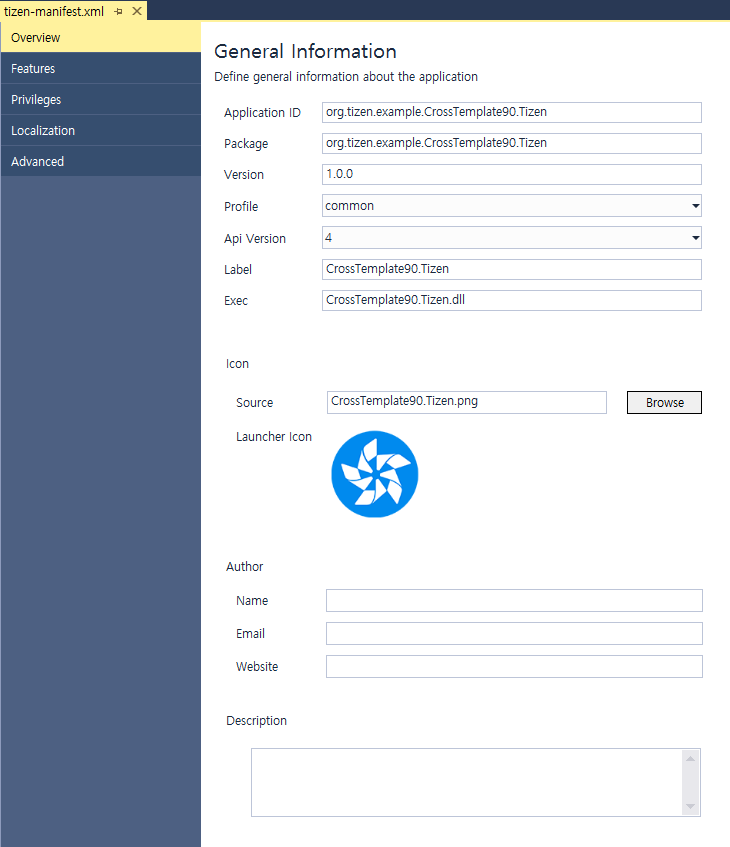
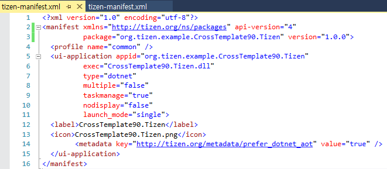

# Manifest Editor #

A Tizen .NET application project contains a manifest file, called `tizen-manifest.xml`, which is used to describe the application information.  The manifest file is composed of XML elements, which include the root `<manifest>` element and its child elements representing application information, such as `<version>` and `<privileges>`. The child elements are organized into a specific hierarchy. The elements can have attributes associated with them, providing more information about the element.

There are 2 different ways to edit the `tizen-manifest.xml` file:

- Use the manifest editor to modify the manifest in a form editor:

  Double-click the `tizen-manifest.xml` file in the **Solution Explorer** view.

  **Figure: Manifest editor**
  
  

- Use the text editor to modify the XML structure directly:

  1. Right-click the `tizen-manifest.xml` file in the **Solution Explorer** view.
  2. Select **Open with &gt; XML (Text) Editor**.

  **Figure: Text editor**

  

> **Note**
>
> The `tizen-manifest.xml` file must conform to both the standard XML file format and the Tizen .NET application specification requirements. Editing the manifest file XML structure with the text editor is intended for advanced users only. If the file does not conform to the standard and the requirements, errors can occur during installation.


## Manifest Element Hierarchy

The Tizen .NET application manifest file consists of XML elements organized in a hierarchy. The following tree structure shows the relationship between the elements of the `tizen-manifest.xml` file.

| `<manifest>` |                                   |                          |                  |
| ------------ | --------------------------------- | ------------------------ | ---------------- |
|              | `<author>`                        |                          |                  |
|              | `<description>`                   |                          |                  |
|              | `<profile>`                       |                          |                  |
|              | `<ui-application>`                |                          |                  |
|              |                                   | `<label>`                |                  |
|              |                                   | `<icon>`                 |                  |
|              |                                   | `<metadata>`             |                  |
|              |                                   | `<app-control>`          |                  |
|              |                                   |                          | `<privilege>`    |
|              |                                   |                          | `<operation>`    |
|              |                                   |                          | `<uri>`          |
|              |                                   |                          | `<mime>`         |
|              |                                   | `<datacontrol>`          |                  |
|              |                                   |                          | `<privilege>`    |
|              |                                   | `<background-category>`  |                  |
|              |                                   | `<splash-screens>`       |                  |
|              |                                   |                          | `<splash-screen>`|
|              | `<shortcut-list>`                 |                          |                  |
|              |                                   | `<shortcut>`             |                  |
|              |                                   |                          | `<icon>`         |
|              |                                   |                          | `<label>`        |
|              | `<account>`                       |                          |                  |
|              |                                   | `<account-provider>`     |                  |
|              |                                   |                          | `<icon>`         |
|              |                                   |                          | `<label>`        |
|              |                                   |                          | `<capability>`   |
|              | `<privileges>`                    |                          |                  |
|              |                                   | `<privilege>`            |                  |
|              |                                   | `<app-defined-privilege>`|                  |
|              | `<provides-appdefined-privileges>`|                          |                  |
|              |                                   | `<app-defined-privilege>`|                  |
|              | `<feature>`                       |                          |                  |

## Manifest Elements

The following sections summarize the elements used in the `tizen-manifest.xml` file of a .NET application.

### <manifest> Element

This element contains the manifest information for a Tizen .NET application. The `<manifest>` element is an easily readable description of the Tizen package and serves as a container for the other elements of the configuration document.

For more information on the relationship between the elements, see the [element hierarchy](#hierarchy).

**Occurrences:**

- 1

**Expected children (in the following order):**

| Child element           | Occurrences          |
| ----------------------- | -------------------- |
| `<author>`              | 1 (optional)         |
| `<description>`         | 1 or more (optional) |
| `<profile>`             |                      |
| `<ui-application>`      | 1 (optional)         |
| `<shortcut-list>`       |                      |
| `<account>`             |                      |
| `<privileges>`          |                      |
| `<feature>`             | 1 or more (optional) |


**Attributes:**

- `api-version`

  API version number for the application (available value: number in the "x" format, for example, `4`)

- `install-location`

  Installation location for the application (available value: `"auto"`)

  **Note**This attribute is read-only. Do not attempt to modify it.

- `package`

  Package of the application (available value: `"org.tizen.<PackageName>"`)

- `type`

  Package type of the application (available value: `"tpk"`)

  **Note**This attribute is read-only. Do not attempt to modify it.

- `version`

  Version number of the application (available value: number in the "x.y.z" format, where 0 <= x <= 255, 0 <= y <= 255, and 0 <= z <= 65535)

**For example:**

```xml
<manifest xmlns="http://tizen.org/ns/packages" api-version="4" package="org.tizen.uiapp" version="1.0.0">
   <author>.....</author>
   <description>.....</description>
   <profile name="common"/>
   <ui-application>.....</ui-application>
   <shortcut-list>.....</shortcut-list>
   <account>.....</account>
   <privileges>.....</privileges>
   <feature>.....</feature>
</manifest>
```

### <author> Element

This element represents the creator of the Tizen package.

For more information on the relationship between the elements, see the [element hierarchy](#hierarchy).

**Occurrences:**

- 1 (optional)

**Attributes:**

- `email`

  Email of the package creator (available value: any valid email ID string value)

- `href`

  Web site of the package creator, such as a homepage or a profile on a social network (available value: any valid Web site string value)

**Expected value:**

- Package creator name in string

**For example:**

```xml
<author email="email@email.com" href="http://test.com">author</author>
```

### <description> Element

This element contains an easily readable description of the Tizen package.

For more information on the relationship between the elements, see the [element hierarchy](#hierarchy).

**Occurrences:**

- 1 or more (optional)

**Attributes:**

- `xml:lang`Language and country code (available value: "<2-letter lowercase language code (ISO 639-1)>-<2-letter lowercase country code (ISO 3166-1 alpha-2)>")

**Expected value:**

- Description value in string

**For example:**

```xml
<description xml:lang="en-us">This is a sample</description>
```

### <profile> Element

This element contains the targeted requirements for specific device categories, which layer on top of the Tizen Common Platform, including additional components for devices, APIs, and hardware requirements. The platform must conform to the Tizen common requirements as well as at least 1 profile.

The `<profile>` element determines on which kind of device the Tizen package operates. This element has no child elements.

**Occurrences:**

- 1

**Attributes:**

- `name`Profile name (available values: `common`, `mobile`, `tv`, `wearable`)

**For example:**

```xml
<profile name="mobile"/>
```

### <ui-application> Element

This element contains the manifest information for a Tizen .NET UI application with a graphical user interface (GUI).

For more information on the relationship between the elements, see the [element hierarchy](#hierarchy).

**Occurrences:**

- 1 or more (optional)

**Expected children (in the following order):**

| Child element           | Occurrences          |
| ----------------------- | -------------------- |
| `<label>`               | 1 or more (optional) |
| `<icon>`                | 1 or more (optional) |
| `<app-control>`         | 1 or more (optional) |
| `<metadata>`            | 1 or more (optional) |
| `<datacontrol>`         | 1 or more (optional) |
| `<background-category>` | 1 or more (optional) |

**Attributes:**

- `appid`Application unique ID (string) This can be used for launching or terminating the application explicitly.
- `exec`Application executable file path (string)
- `hw-acceleration`Indicates the application hardware acceleration status (available values: not defined (depends on the system setting), `on` (use hardware acceleration), `off` (do not use hardware acceleration))By default, this value is not defined.
- `launch_mode`Application launch mode (available values: `single` (launched as a main application), `group` (launched as a sub application), `caller` (caller application [defines the launch mode](../../../org.tizen.guides/html/native/app_management/app_controls_n.htm#mode) with the `app_control_set_launch_mode()` function))By default, this value is set to `single`.
- `multiple`Indicates whether the application can be launched as a multiple (available values: `true`, `false`)**Note**This attribute is read-only. Do not attempt to modify it.
- `nodisplay`Indicates whether the application is shown in the app tray (available values: `true`, `false`)
- `taskmanage`Indicates whether the application is shown in the task manager (available values: `true`, `false`)
- `type`Tizen application type (available values: `dotnet`)**Note**This attribute is read-only. Do not attempt to modify it.

**For example:**

```xml
<ui-application appid="org.tizen.uiapp" exec="uiapp" hw-acceleration="on" launch_mode="single"
                multiple="false" nodisplay="false" taskmanage="true" type="dotnet">
   <label>uiapplication</label>
   <label xml:lang="en-gb">testlang</label>
   <icon>uiapp.png</icon>
   <app-control>
      <operation name="http://tizen.org/appcontrol/operation/dial"/>
      <mime name="application/vnd.ms-excel"/>
   </app-control>
   <metadata key="testkey" value="testvalue"/>
   <datacontrol access="ReadOnly"
                providerid="http://uiapp.com/datacontrol/provider/uiapp" type="Sql"/>
</ui-application>
```

### <shortcut-list> Element

This element contains the shortcut template list used for adding a shortcut to the home screen.

For more information on the relationship between the elements, see the [element hierarchy](#hierarchy).

**Occurrences:**

- 1 (optional)

**Expected children:**

| Child element | Occurrences |
| ------------- | ----------- |
| `<shortcut>`  | 1 or more   |

**For example:**

```xml
<shortcut-list>
   <shortcut>.....</shortcut>
</shortcut-list>
```

#### <shortcut> Element

This element contains the information that indicates the shortcut for the application on the home screen.

**Occurrences:**

- 1 (optional)

**Expected children:**

| Child element | Occurrences |
| ------------- | ----------- |
| `<icon>`      | 1           |
| `<label>`     | 1 or more   |

**Attributes:**

- `appid`Application unique ID (string)This can be used for launching or terminating the application explicitly.
- `extra_data`Data for user content (string)Shortcut element property in the manifest file
- `extra_key`Key for user content (string)Shortcut element property in the manifest file

**For example:**

```xml
<shortcut appid="org.example.shortcut" extra_data="data" extra_key="key">
   <icon>shortcut.png</icon>
   <label>shortcut</label>
   <label xml:lang="en-us">short</label>
</shortcut>
```

### <account> Element

This element contains a set of user accounts and account provider-related information for a Tizen application.

For more information on the relationship between the elements, see the [element hierarchy](#hierarchy).

**Occurrences:**

- 1 (optional)

**Expected children:**

| Child element        | Occurrences |
| -------------------- | ----------- |
| `<account-provider>` | 1 or more   |

**For example:**

```xml
<account>
   <account-provider>.....</account-provider>
</account>
```

#### <account-provider> Element

This element contains specific service provider or user account protocol-related information.

**Expected children:**

| Child element  | Occurrences          |
| -------------- | -------------------- |
| `<icon>`       | 1 (optional)         |
| `<label>`      | 1 or more (optional) |
| `<capability>` | 1 or more (optional) |

**Attributes:**

- `appid`Application unique ID (string)This can be used for launching or terminating the application explicitly.
- `multiple-accounts-support`Indicates whether multiple accounts are supported (available values: `true`, `false`)
- `providerid`ID of the account provider (string)

**For example:**

```xml
<account-provider appid="org.tizen.uiapp" multiple-accounts-support="false" providerid="org.tizen.uiapp">
   <icon>.....</icon>
   <label>.....</label>
   <capability>.....</capability>
</account-provider>
```

#### <icon> Element

This element contains the account provider icon image. Since the icons are used on the device under **Settings > Accounts**, place them in a shared directory.

**Attributes:**

- `section`Usage information for the icon image (available values: `account` (image size: 72 x 72 for density xhigh and 48 x 48 for density high), `account-small` (image size: 45 x 45 for density xhigh and 30 x 30 for density high))

**Expected value:**

- Icon file name

**For example:**

```xml
<icon section="account">uiapp.png</icon>
<icon section="account-small">uiapp.png</icon>
```

#### <capability> Element

This element contains the account provider capability. The capabilities are defined as `http://<VENDOR_INFORMATION>/account/capability/<NAME>`.

**Expected value:**

- IRI string

**For example:**

```xml
<capability>http://tizen.org/account/capability/calendar</capability>
```

### <privileges> Element

This element contains the set of required privileges for a Tizen application.

Applications that use sensitive APIs must declare the required privileges in the `tizen-manifest.xml` file. Since the privilege categories differ for each API type, make sure you define the [correct privilege related to the API you need](../../../org.tizen.training/html/native/details/sec_privileges_n.htm).

Click **+** to open the **Add Privilege** dialog.

**Figure: Editing the <privileges> element in the manifest editor**


For more information on the relationship between the elements, see the [element hierarchy](#hierarchy).

**Occurrences:**

- 1 (optional)

**Expected children:**

| Child element             | Occurrences          |
| ------------------------- | -------------------- |
| [`privilege`](#privilege) | 1 or more (optional) |

**For example:**

```xml
<privileges>
   <privilege>.....</privilege>
</privileges>
```

#### <privilege> Element

This element contains a required privilege for a Tizen application.

**Occurrences:**

- 1 or more (optional)

**Expected value:**

Name (mandatory, the URI of the Device API privilege)

For example:

- `http://tizen.org/privilege/application.admin`
- `http://tizen.org/privilege/appmanager.launch`
- `http://tizen.org/privilege/account.read`

For more information on the expected values, see [Security and API Privileges](../../../org.tizen.training/html/native/details/sec_privileges_n.htm).

**For example:**

```xml
<privilege>http://tizen.org/privilege/application.admin</privilege>
<privilege>http://tizen.org/privilege/appmanager.launch</privilege>
<privilege>http://tizen.org/privilege/account.read</privilege>
<appdefined-privilege>http://{provider-pkgid}/appdefined/exampleprivilege2</appdefined-privilege>
```

#### <appdefined-privilege> Element

Used to get the required access privileges provided by a consumer package.

**Occurrences:**

- 0 or more (optional)

**Attributes:**

- `license`Optional name of the license file used to verify the privilege

**Expected value:**

- Name (mandatory, the name of the app-defined privilege)

**For example:**

```xml
<appdefined-privilege license="example_license">http://{provider-pkgid}/appdefined/exampleprivilege1</appdefined-privilege>
<appdefined-privilege>http://{provider-pkgid}/appdefined/exampleprivilege2</appdefined-privilege>
```

### <provides-appdefined-privilege> Element

Used to specify the app-defined access privileges provided by a provider package.

**Occurrences:**

- 0 or 1 (optional)

**For example:**

```xml
<provides-appdefined-privileges>
    <appdefined-privilege>.....</appdefined-privilege>
    <appdefined-privilege>.....</appdefined-privilege>
</provides-appdefined-privileges>
```

#### <appdefined-privilege> Element

Used to get the required access privileges provided by a provider package.

**Occurrences:**

- 0 or more (optional)

**Attributes:**

- `license`Optional name of the license file used to verify the privilege

**Expected value:**

- Name (mandatory, the name of the app-defined privilege)

**For example:**

```xml
<provides-appdefined-privileges>
    <appdefined-privilege license="example_license">http://{provider-pkgid}/appdefined/exampleprivilege1</appdefined-privilege>
    <appdefined-privilege>http://{provider-pkgid}/appdefined/exampleprivilege2</appdefined-privilege>
</provides-appdefined-privileges>
```

### <feature> Element

This element contains a list of required features for feature-based filtering in the Tizen Store.

The element is used to define the hardware and software components for the Tizen application. In order to use or access an API that is specialized for each vendor or platform, the feature must be declared. This element has no child elements.

**Figure: Editing the <feature> element in the manifest editor**


For more information on the relationship between the elements, see the [element hierarchy](#hierarchy).

**Occurrences:**

- 1 or more (optional)

**Attributes:**

- `name` (mandatory, a feature key URI)Item name used in feature-based filtering in the Tizen Store, for example, `"http://tizen.org/feature/camera"` or `"http://tizen.org/feature/fmradio"`For more information on the expected values and the application filtering mechanism, see [Application Filtering](../../../org.tizen.training/html/native/details/app_filtering_n.htm).

**Expected value:**

- `true`

**For example:**

```xml
<feature name="http://tizen.org/feature/camera">true</privilege>
<feature name="http://tizen.org/feature/fmradio">true</privilege>
```
