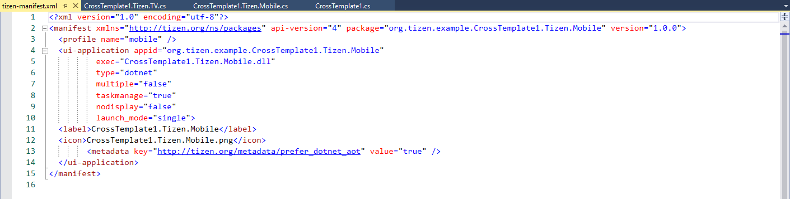

## Manifest Editor ##

A Tizen .Net application project consists of exactly 1 manifest file, called tizen-manifest.xml, which is used to describe the application information. The manifest file is composed of XML elements, which include the root <manifest> element and its child elements representing application information, such as <version>, and <privileges>. The child elements are organized into a specific hierarchy. The elements can have attributes associated with them, providing more information about the element.

### Editing the Manifest File ###

There are 2 different ways to edit the ```tizen-manifest.xml``` file:

* Use the text editor to modify the XML structure directly:


   1. Right-click the ```tizen-manifest.xml``` file in the Solution Explorer.
   2. Select ```Open with > XML (Text) Editor```.

* Use the manifest editor to modify the manifest in a form editor:

Double-click the ```tizen-manifest.xml``` file in the Solution Explorer.


```
Note
The tizen-manifest.xml file must conform to both the standard XML file format and the Tizen .Net application specification requirements. Editing the manifest file XML structure with the text editor is intended for advanced users only. If the file does not conform to the standard and requirements, errors can occur during installation.
```