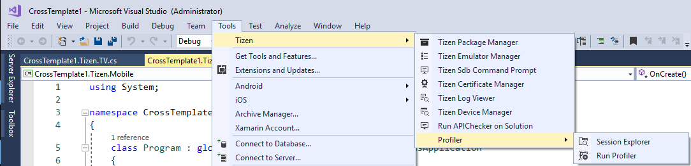
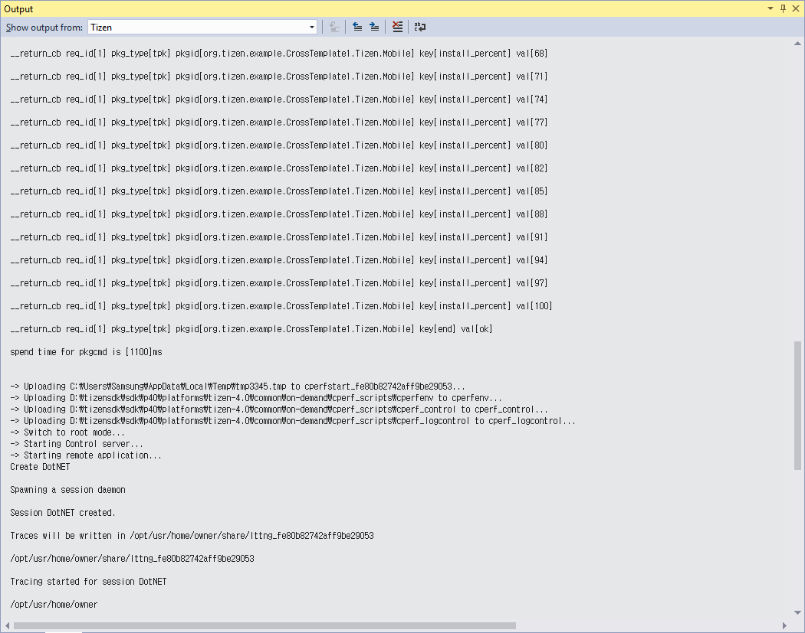
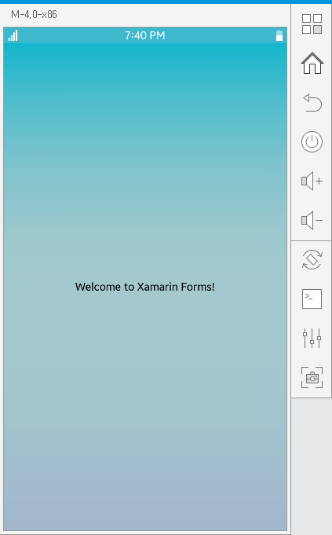
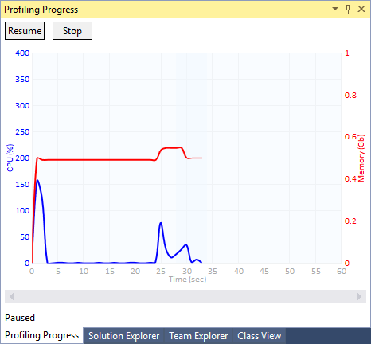
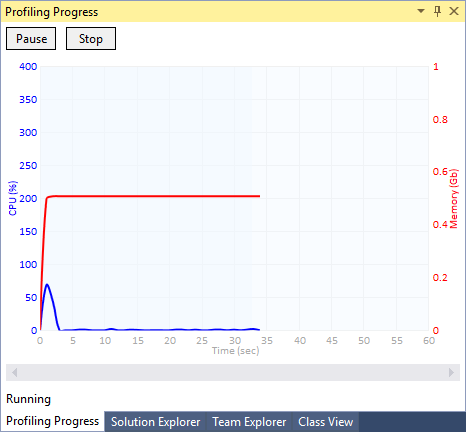
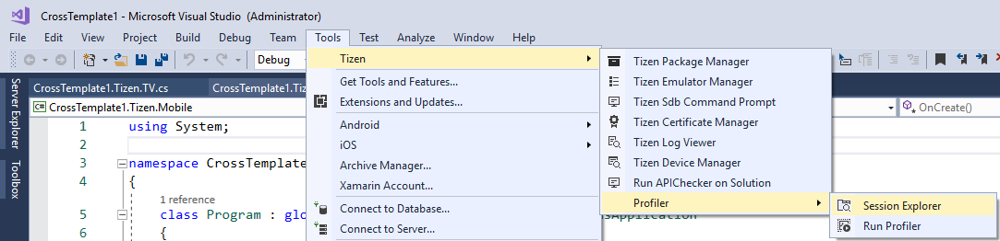
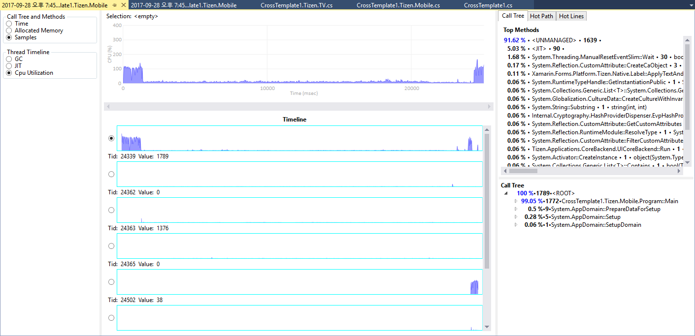
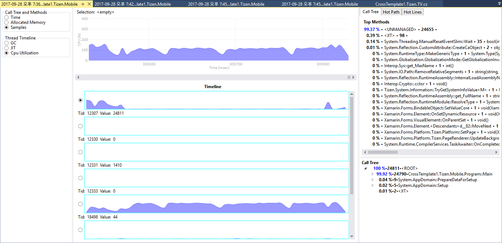
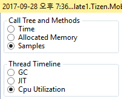
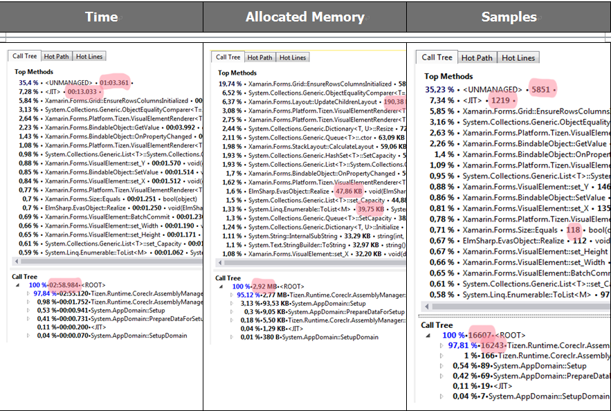

# Get Started with Performance Profiling (Preview)
### Step 1. Configuring and Running Profiling
   * In the menu, choose Tools > Tizen > Profiler > Run profiler

     

   * In the opened panel, specify profiling options
   
     

      1) path to application will be set up automatically in accordance with the opened Solution
      2) Profiling preset – Predefined sets of options for different profiling aspects (less options included - less overhead and less data collected and processed):
         1) CPU sampling – Trace CPU and Source Lines, ignore Memory
         2) Memory Allocation - Trace Memory Allocation and Source Lines, ignore CPU
         3) Complex Profiling – Trace all available information: CPU, Source Lines, Memory Allocation
      3) Sampling Options; 
         1) Sampling interval – sampling time interval in ms (default - 10)
         2) High granularity – high-granularity sampling (this option allows for better precision and sample regularity, however, low granularity – is preferred for better efficiency)
      4) Trace Options;
         1) Trace execution – trace CPU utilization
         2) Trace Memory – trace Memory allocation per method
         3) Trace source lines – turns line source mapping on
         4) Stack Track – this option enables hybrid trace method which register stack changes while memory allocations
      5) CPU Tracing Options;
         1) Enable CPU – turns on/off tracing CPU utilization
         2) Trace Process – turns on/off CPU utilization for the whole application
         3) Trace Threads - turns on/off CPU utilization for each thread
         4) Trace Interval – sampling interval (ms) 
      6) Misc Options
         1) Delayed start – delays application start in seconds.

   * Press “Ok’ button. “Output” Window will display logs from a process of installation an application to emulator, and running the application with profiling
    
     

   * In case of errors – the Output Window will display them
   * In success – the application should start in Emulator
   
     

   * “Profiling Progress” Window will be displaying live an information with CPU and Memory utilization

     

   * To pause profiler, press “Pause” button. A time interval when profiling information is not collected is highlighted with light blue color.
   
     

   * To continue collection of data press “Resume” button
   
     

   * To stop profiling, press “Stop” button. “Output” Window will be displaying logs with stopping the application and getting profiling data from Emulator
   
     

   * All errors will be displayed there

### Step 2. Opening a ssession
   * Open “Session Explorer” Window - Tools > Tizen > Profiler > Session Explorer
   
     

   * This Window displays a list of profiling sessions collected in the opened Solution. If there is not an opened Solution, this Window will be empty. The list contains:
      1) date and time of session’s creation
      2) profiling Preset used to create session
      3) name of a project
      4) (optional) user defined Session Annotation. This annotation is useful to distinguish between several sessions collected on the same date and with the same preset
      
      

   * To delete a session or to change its annotation press Right Mouse Button
   
     

      1) Press “Edit Annotation” to edit session’s annotation (empty by default)
      
        

      2) Press “Delete” to delete the session

   * Additional session’s information is displayed in “Properties” Window (usually places below “Session Explorer’ Window). This windows displays values of parameters that has been used to configure the profiler for this session.
    
     

   * Mouse Double Click on the session name in “the Session Explorer” to open the session for analysis
   
     

### Step 3. Analyzing profiling data 
   * When a session is opened, three panels are visible:
      1) Filters Panel in the left panel
      2) Timeline Charts Panel in the center panel
      3) Info Panel in the right panel
      
         

   * Filters Panel allows to filter profiling data by:
      1) Time, Allocated Memory, Samples. Based on the selected filter, corresponding information is displayed in the right panel – Info Panel (will be described in details below).
       
         

      2) “Thread Timeline” options Garbage Collection (GC), Just In Time Compilation (JIT) and CPU Utilization one can change the view in the center panel “Timeline Charts Panel” (will be described in details below).

   * Timeline Charts Panel displays 
      1) CPU utilization of the application in the top part of the panel
      

      2) GC, JIT or CPU Utilization for separate threads in the bottom part of the panel
      

   * To filter collected data by time, press Mouse Left Button on the upper chart and select interval. Selected interval will be highlighted in grey. Data in the right panel will be changed according to the selection.
    
      

   * To clear the selected interval, click any place in the chart. Data in the right panel will be reset as well.
   * Methods Panel consists 3 tabs: Call Tree, Hot Path, Hot Lines
      1) Call Tree Tab displays Top Methods & Call Tree on the selected time interval for the selected thread
       
         

      2) Hot Path Tab displays Hot Path on the selected time interval for the selected thread
      
         

         1) In the collapsed state, the Hot Path Item displays the hottest method. When expanding – the whole path from this method will the root calling method is displayed.

      3) Hot Lines Tab displays Top Source Lines on the selected time interval for the selected thread (source lines numbers are displayed in brackets […])
       
         
         
   * Depending on the profiling mode chosen at the left, different data is displayed. Table 1 shows different types of data displayed in the right panel. Filtered by Time – shows how much time every method has occupied (highlighted in red). Filtered by Allocated memory – shows an amount of memory allocations per method (in Kb or Mb). Filtered by Samples – shows amount of samples per method.
    
     
   * Double click on the selected line in Hot Lines Tab opens a source file where hot lines are highlighted with intensity that corresponds to the “hottest” level of this line
    
          
