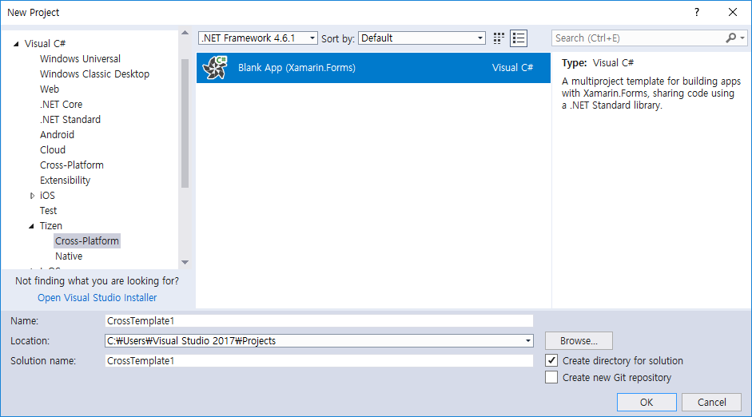
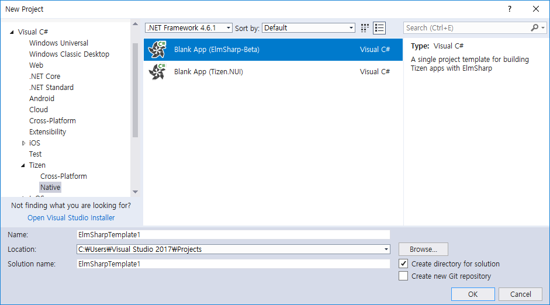
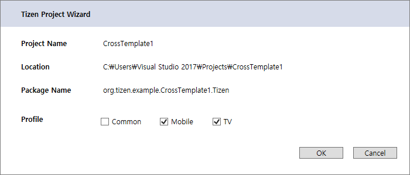

# Project Wizard

The Project Wizard of Visual Studio Tools for Tizen is a tool that is used to create a Tizen .Net application project.

The Visual Studio Tools for Tizen provides 4 project templates. When you create a new project, you can select a specific template, which the Project Wizard uses to automatically create basic functionalities for the application. The default project files and folders are also created.

In the Project Wizard, you can select a templates and profile to create the project. In addition, you can set basic project properties, such as the project name, package name and location.

To open the Project Wizard, select File > New > Project > Templates > Visual C# > Tizen.

## Templates ##

You can select a template for your project. The Project Wizard creates the project based on the selected template.

Visual Studio Tools for Tizen provides 3 templates with a basic structure where you can start the native application project:

#### Blank App (Xamarin.Forms) ####
  * Use this template for creating a Tizen Xamarin Application (Common, Mobile and TV)
  * Also use this template in case of adding Tizen Project to Xamarin Forms solution.

#### Blank App (ElmSharp-Beta) ####
  * Use this for creating a Tizen Application using ElmSharp APIs.
  
#### Blank App (Tizen.NUI) ####
  * Use this for creating a Tizen Application using Tizen NUI APIs.

After selecting a template and setting the location in your local repository, Click OK.

## Profile ##

In case of Blank App (Xamarin.Forms), the Tizen Project Wizard is shown for setting the project name and selecting the profile that you want to add in your solution.

To move to the next step, select the profile, and click OK.

The solution shown in the following figure contains both profiles (Mobile and TV).

