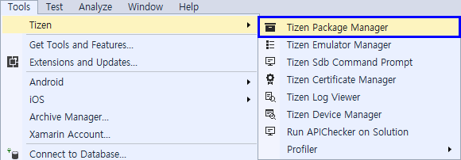
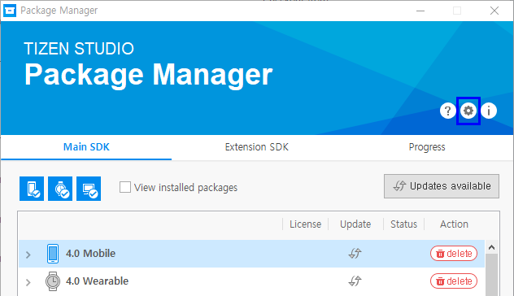
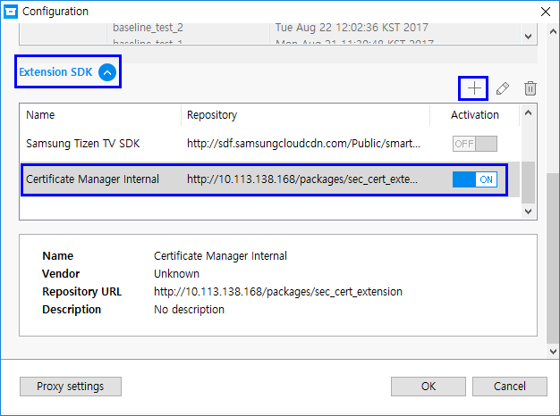
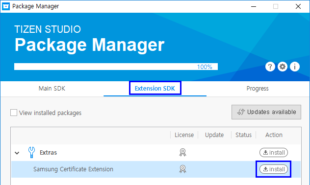
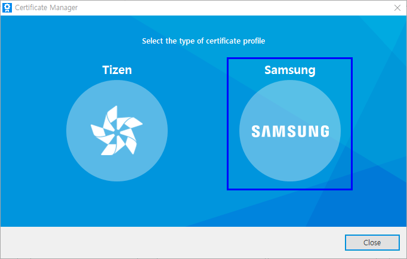
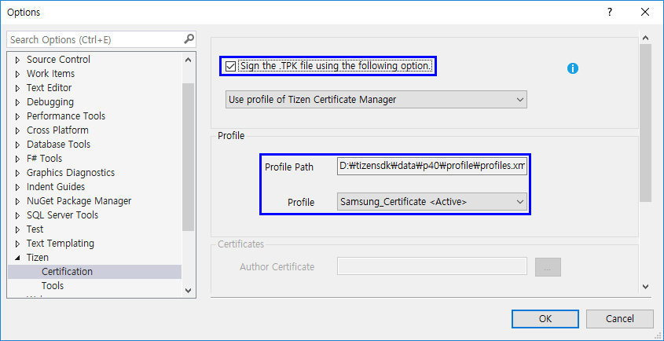
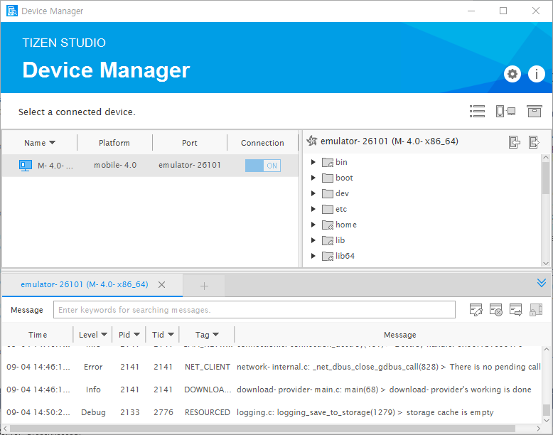
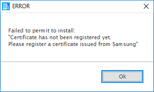

## How to use Samsung Certificates and deploy it in devices ##

### Install Samsung Certificate Extension ##

1. Execute ```Tizen Package Manager``` in Tools menu



2. Run ```Tizen Package Manager``` and move ```Configuration``` menu



]

* (Only under Develop stage) Set the repository server for Samsung Cerificate Extension
   * Extension SDK > '+' > Add ```http://10.113.138.168/packages/sec_cert_extension```



3. Install Samsung Certificate Manager



---

### Make Samsung Certificate ###

1. Execute ```Tizen Certificate Manager```

2. Click the plus icon ('+') to create a new profile


3. Select Samsung certificate



4. Refer [Certificate Manager](certificate-manager.md) from next step
   * Except for loging to Samsung account and adding DUIDs, almost is same between Samsung and Tizen

---

### Activate Samsung Certificate in option ###

1. Go to option menu (Tools > Options > Tizen > Certification)



---

### Push ```device_profiler.xml``` (in case of using 1.0 distribute certificate)

1. Execute ```Tizen Device Manager``` and Connect device or emulator



2. Click ```Permit to install applications``` in folder hierarchy window


3. Check the success message


* If Device Manager shows below message, check that DUIDs which you added is compatible with connected devices


