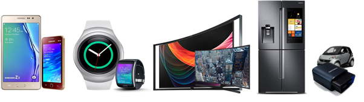
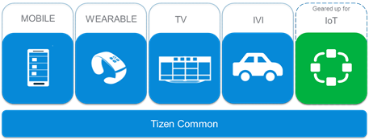
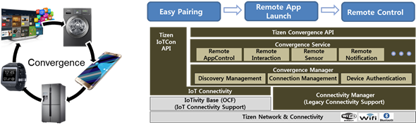
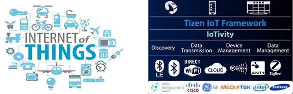
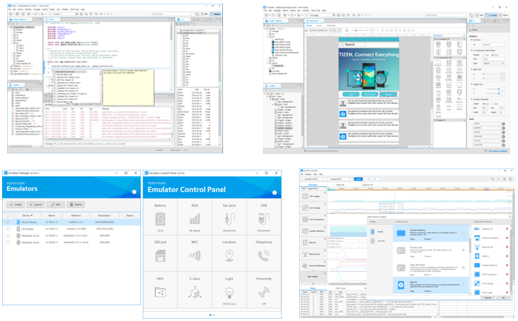
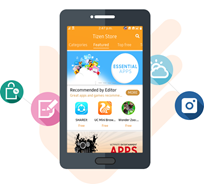

# Introduction to Tizen

Tizen is an open source operating system based on Linux, hosted by the Linux Foundation, and open to all developers.  Tizen has been advancing to connect everything, smart TVs, smart phones, wearable devices, and IoT devices. Developers and users of devices powered by Tizen can experience seamless connectivity among all devices.

## Connect Everything

As diverse devices are getting smarter and more connected, there is a strong need for a software platform for integrated services with connected products. Tizen is designed for this and has been advancing to connect everything. To support different types of devices with seamless user experience, Tizen categorizes the features and functions as profiles. There are currently 4 profiles and the amount will grow as more products are included in the ecosystem. In the near future, lots of Internet-connected devices are anticipated to be on the market and IoT (Internet of Things) services will pervade everyone's daily life. Tizen is moving forward to the future of everything connected.

## Openness, Optimization, and Opportunities

Tizen is a Linux-based, open-source software platform. Anyone can contribute and freely develop the system software and applications, which is beneficial for both device manufacturers and application developers. Furthermore, by supporting Web applications with open Web technologies, Tizen provides developers with flexibility and extensibility. Based on the open ecosystem, users can expect various experiences from Tizen devices and services. With its openness, Tizen can pursue continuing progress and expanding ecosystem.

Tizen is built to work on diverse devices and profiles are defined accordingly. Currently, 3 profiles are supported: [mobile](mobile.md), [wearable](wearable.md), and [TV](tv.md). Features of each profile provide product-optimized functionality and performance.

From Tizen 3.0, all profiles are built on top of a common, shared infrastructure called Tizen Common. Based on the common components, devices and features under new categories or profiles can be easily added up for emerging technologies. Therefore, Tizen is adaptable and customizable for new products. In the foreseeable future, for example, IoT devices and services will be prevalent and Tizen is taking proactive steps toward the opportunities in the new markets.

## IoT Capability 

The most important things that enable Tizen to move to the next level are IoT and convergence capabilities:

- **Device Convergence**: Tizen provides a device-to-device convergence framework for easy data sharing and direct remote control between devices. Using this framework, you can handle events or data on the remote device as if they were local. Device Convergence in Tizen opens up a host of capabilities that developers can use to create a new way of experiencing connectivity.
- **IoTivity for Connectivity**: In an IoT world, where everything is connected, it is important that a software platform supports seamless connectivity among all devices. For seamless connectivity, Tizen is closely co-operating with Open Connected Foundation (OCF), which is taking the lead in providing specifications and an open-source solution for IoT connectivity. It is getting great support from companies including Cisco, GE, Mediatek, Intel, and Samsung. OCF's standard is being implemented as an open source, which is called IoTivity. All the profiles in Tizen 3.0 includes IoTivity, which means that all Tizen devices is IoTivity-ready.
  

## Convergence Platform for the Emerging Era

Since 2012, Tizen has been expanding as smart gadgets have become generalized and connected. By accommodating various device types, Tizen is gearing up for the new era of convergence. As of now, there is a wide variety of Tizen devices on the market:

- Mobile phones: Samsung Z-series (Z1, Z2, Z3, Z4)
- Tablets: DIGMA Plane 8501 3G
- Wearables: Gear-series (Gear 2, Gear 2 Neo, Gear S, Gear S2, Gear S3)
- Smart TVs: Samsung SUHD, UHD, LED TVs
- Cameras: Samsung NX-series, Gear 360
- Smart Appliances: Samsung Family Hub Fridge

Over 3 million units of Tizen phones were sold in 2015. In addition, Samsung is holding the highest market share in the global TV market and its recent models are all based on Tizen platform. It is expected for the Tizen platform to broaden its ecosystem with increasing market requirements and user demands.

## Productivity

To facilitate developing Tizen applications, the [Tizen Studio](https://developer.tizen.org/development/tizen-studio) is provided as an integrated development environment (IDE). It helps developers to develop, build, debug, profile, and emulate Tizen applications. The Tizen Studio is equipped with useful tools for developers, including native UI builder, emulator, and Dynamic Analyzer for profiling. In the integrated environment, developers can experience comfortable and productive development of Tizen native and Web applications.

## Application Marketplace

As a platform, Tizen provides the foundation for many different applications and services, which lead to rich user experiences and chances of new businesses. For easy access and reliable trade of applications, efficient distribution channels are necessary for both users and developers. The [Tizen Store](http://www.tizenstore.com/) is a marketplace of Tizen applications, where users can find useful applications and developers can distribute their valuable creations. It provides various application categories, such as All Games, Education, Entertainment, Kids, Finance, Lifestyle, and Social networking. Users can download applications of their choice and enrich their experiences with the Tizen devices. Application developers can monetize or share their applications for free in the marketplace.

## Versions

- [Tizen 4.0 M1](../versions/tizen-4-0-m1.md)
- [Tizen 3.0](../versions/tizen-3-0.md)
