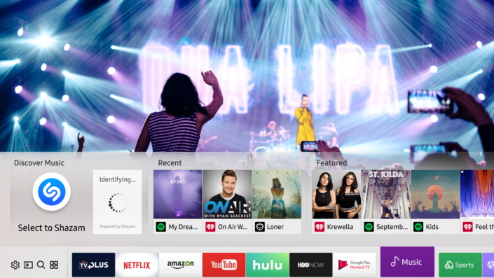
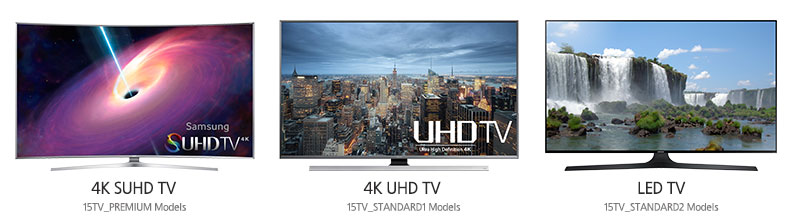

# Tizen TV

The Tizen TV profile allows you to develop applications for Samsung Smart TVs.

Tizen Open Source Project introduced an expanded Tizen platform for Smart TVs at the fifth annual [Tizen Developer Conference](https://www.tizen.org/events/2017/tizen-developer-conference-2017) (TDC)  in San Francisco at the Hilton Union Square.

**Figure: Samsung Smart TV applications**

The TV profile provides various exciting features:

- **Ready to connect! Get involved!**  
Samsung encourages you to participate in the development of the Tizen platform. Various policies have already been made in collaboration with partners and developers, especially for Voice Touch, Samsung Checkout, Sports/Music services, and the security solutions for the 2017 Smart TV models.  
  Samsung Checkout is a pre-installed payment system on Samsung Smart TVs that allows the user to conveniently make payments for digital content.
- **Updated graphics engine and Wayland computer protocol**  
The benefit of using the latest Tizen 3.0 platform is the software, which provides new functionality thanks to an updated graphics engine and Wayland computer protocol. These deliver enhanced graphics, improved stability, and an improved user interface, creating a more desirable Smart TV user experience.
- **Voice Touch**  
Voice Touch, one of the new Smart TV "touch" capabilities, provides the user a more intuitive way to use the voice recognition function. When the user says out loud the title on the TV Apps screen into their remote control, the icon is activated and the application launched without any navigation or other actions.
- **Making applications with Tizen .NET**  
By the end of 2017, Samsung plans to make the Tizen .NET framework public. Since announcing last November its collaboration with Microsoft on .NET open-source projects, such as .NET Core and Xamarin.Forms, Samsung has steadily released preview versions of the Tizen .NET SDK to help you build more powerful applications. The previews allow you to practice on the new framework and encourage you to participate in the framework's ongoing development.

## Developing Applications for Tizen TV

Samsung has completely redesigned its Smart TV experience. With a new intuitive menu, enhanced recommendations, and quick access to your favorite shows, movies, apps, and games, it is easy to discover your favorites.

The Samsung Smart TV SDK combines TV features with Web-based technologies. The SDK provides tools for developing Samsung TV applications for the Tizen platform.

To develop applications for the TV profile:

- [Smart TV Quick-start Guide](http://developer.samsung.com/tv/develop/getting-started/quick-start-guide)

## Tizen TV Devices

Samsung Electronics provides various TV models that support the Tizen platform.

For more information on developing a Samsung Smart TV application, go to [SAMSUNG SMART TV](http://developer.samsung.com/tv).

**Figure: Samsung Smart TVs**

