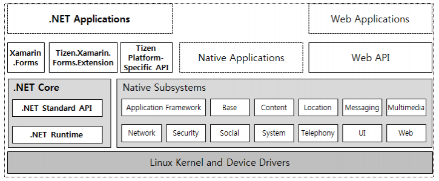

# Tizen 4.0
Since the first release in 2012, Tizen has evolved adapting to the market requirements and technical advances. As smart devices are widespread in the market, Tizen is deployed to mobile phones, wearable devices, TVs, and home appliances accordingly.In the near future, lots of IoT (Internet of Things) services will pervade everyone's life. Tizen is moving forward as a convergence platform and Tizen 4.0 is another big step to the world of everything connected.

Figure. Evolution of Tizen

In addition to the previous achievements, Tizen 4.0 presents more advances in development environment, configuration, and maintenance, which are invigorating the Tizen ecosystem in every respect.

The key features are as follows:
* **Tizen .NET Architecture**: By embracing Microsoft's .NET Core and Xamarin.Forms, Tizen .NET provides developers with extended environmentfor cross-platform development.

Figure. Tizen .NET Architecture

* **Tizen-specific C# API**: In addition to C and Web languages, C# is newly supported as an application language. As C# is one of the mostlyused programming languages, it is expected to boost the application ecosystem with .NET Standard API. Further, Tizen API allows applications to access platform-specific interfaces and functionalities: multimedia, network, system, telephony, etc.

* **Visual Studio Tools for Tizen**: As an IDE (Integrated Development Environment), Tizen Studio provides useful tools for developing, debugging, and emulating Tizen applications. Now, those tools are integrated with Microsoft's Visual Studio as extensions. Tizen-specific tools, such as Tizen Project Wizard, Emulator Manager, Device Manager, etc., are easily launched through the Visual Studio.

* **Tizen RT and IoT.js**: IoT devices are likely to have limited computing power. Therefore, there is a need for lightweight platforms for low-end devices. Tizen RT is an RTOS-based platform fitting into the typical conditions of IoT devices. For applications on Tizen RT, IoT.js is a good solution for applications. IoT.js is a lightweight JavaScript engine and framework.

* **Unified Build System**: With a single package repository by utilizing building blocks, Tizen applications can be generated for all device types, such as Mobile devices, wearable devices, TVs, washer & dryers, refrigerators, IoT devices, etc. Tizen's new approach of configurable platform with building blocks makes it possible to configure and create new platforms easily to cover all device types.

* **Cloud-based DevOps**: To provide better environment of DevOps, cloud-based virtualization technologies like VM with Jenkins and Packer are preparing. Accordingly, easy-to-use and easy-to-deploy tools and services for DevOps will be presented continuously.

For more details, see Tizen 4.0 release note.
