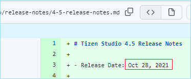
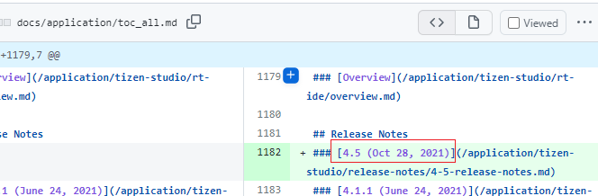

# Review points in Release Notes

This page describes the review points that were often asked to be updated.

When you review a release note page, check these points and get the page consistency.

There are two release notes, release note for Tizen studio, and release note for Tizen Platform.

- [Tizen Studio](#studio)
   - [Release date](#studio_date)
   - [Tone](#studio_tone)
   - [toc_all.md](#studio_toc)
- [Tizen Platform](#tizen)
   - [Release date](#tizen_date)
   - [Tone](#tizen_tone)
   - [Release Details](#tizen_detail)

## Tizen Studio

To add release note for Tizen Studio, 3 files must be added and updated.

- Added : Release note for new version
- Updated : 
  - toc_all.md
  - /tizen-studio/release-notes/release-notes.md

**Ref. :** https://github.com/Samsung/tizen-docs/pull/1523

### Release date

Use the actual date. When the release date is changed during the review, update it.

### Tone

Use "has been pp".

### toc_all.md

Use the same release date that is written in the release note.

|In release note|In toc_all.md|
|---|---|
|||

## Tizen Platform

To add release note for Tizen platform, 2 files are needed to be added and updated.

- Added : Release note for new version
- Updated : toc_all.md

**Ref. :** https://github.com/Samsung/tizen-docs/pull/1517

### Release date

Use the actual date. When the release date is changed during the review, update it.

### Tone

Use "has been pp".

### Release Details

Tizen Platform release note has 2 big sections. One is **Release Notes** and the other is **Release Details**.

In **Release Notes** the updated history is listed up. In **Release Details**  the download link for the binaries are listed up.

As the download links are created after approval of Tizen Platform, during the review the links often not be created yet. 

Skip the **Release details** section during the review, and add that section when download links are created after the platform approval.

**Ref. :** https://github.com/Samsung/tizen-docs/pull/1547