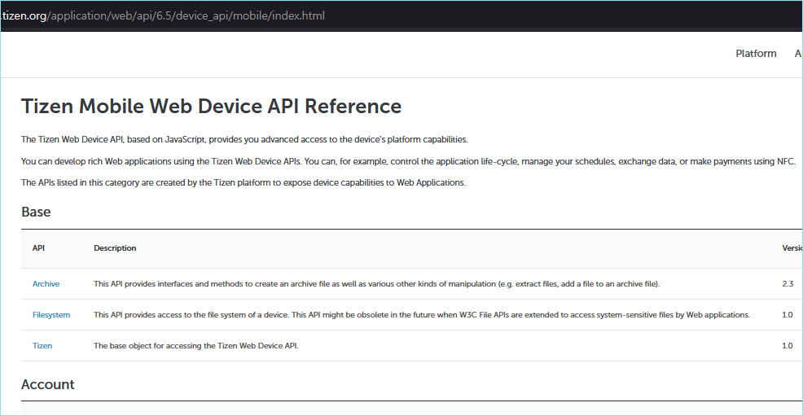
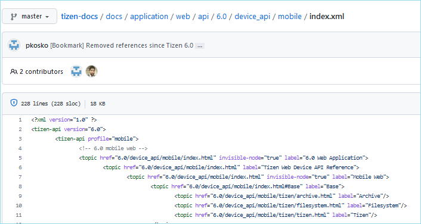
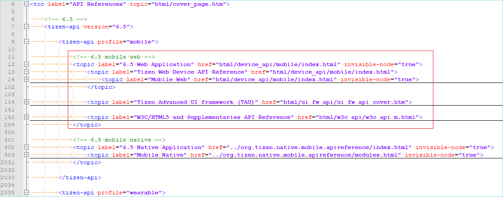
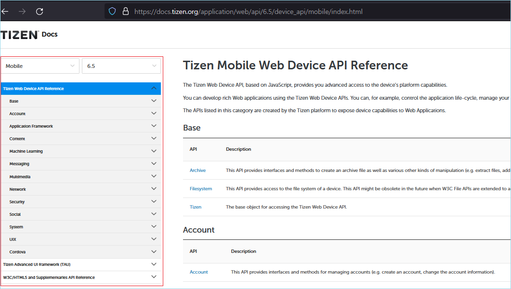

# Review points in Web API

This page describes the review points that were often asked to be updated.
Unlike .NET or Native, Web contains the API file also in tizen-docs repository. If the files under /appliation/web/api are updated, refer this page.

Web API files are in HTML format. So don't be confused. These files must follow HTML format (as like \<strong> or \<li>), not markdown format (as like \*\* or \-).

As most updates are in `device_api` folder these days, this description is for the case of updates in `device_api` folder. If Web api in `ui_fw_api` or `w3c_api` is updated, check the folder structure and relation with other pages also to not to miss related pages update.


## Add new page

When a new page is created, check the `toc.xml`, `index.html`, and `index.xml` of the created page.

```
- /application/web/api/<VERSION>/device_api/<PROFILE>/inde.html
- /application/web/api/<VERSION>/device_api/<PROFILE>/index.xml
- /docs/application/web/api/toc.xml
```

**Example :**

- /application/web/api/*6.5*/device_api/*wearable*/inde.html
- /application/web/api/*6.5*/device_api/*wearable*/index.xml
- /docs/application/web/api/toc.xml

### index

There are two kinds of index file, `index.html` and `index.xml`.
`index.html` is used as a  cover page for each profile in Web API. This page is displayed on doc.tizen.org.



This index.html is for Tizen 6.5 Web API for Mobile as written in the Address bar.

index.xml lists up the page structure.



This index.xml is for Tizen 6.0 Web API for Mobile as written in the Address bar.

**Example :**

If a new pages is added under `Base` section of `mobile` profile, `index.html` and `index.xml` for mobile profile both must be updated to include the new page in `Base` section.

### toc.xml

toc.xml file is to manage the LNB of API pages. According to the structure listed in toc.xml, the LNB in API pages is created. In previous days it listed up all Native & Web API structure, but now only listing up Web API is enough. 

index.xml is used in toc.xml. 

**Example :**

To fill the mobile web section of Tizen 6.5 that is marked with a red rectangle in below image, use information in index.xml. 



With this structure information, LNB of the Tizen 6.5 mobile Web API is created.

