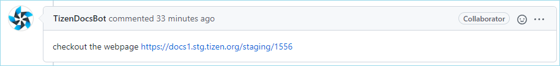
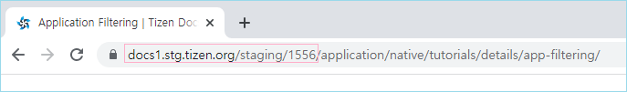

# Review points with stg

When a PR is created, a stg URL is built with the updates in the PR.

To check how the update looks on docs.tizen.org, use the stg URL.

- Because of the capacity issue, the stg URL are deleted after some days. To check the stg URL of old PR, trigger the stg build again by closing and reopening the PR.

   

- Sometimes the stg build fails. In that case, ask iljooo.kim to check the build of tizen-docs git repository