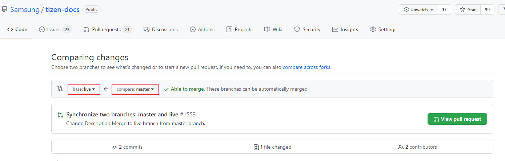

# Applying changes in master to docs.tizen.org

This page describes how to apply the updates in tizen-docs github to docs.tizen.org.

There are 2 main branches, **master** and **live** branches.

- master branch : To handle the updates for the latest Tizen platform version,

- live branch : To update docs.tizen.org site.

So to update the content for the latest published Tizen platfrom, the update must be applied to master first by a PR.

When master branch is updated, click `Next pull request` in the tizen-docs github page. In the Compare changes UI, set `live` as the base branch and `master` as the compare branch.

The page shows the commits to be applied to live branch. 

When there are some conflicts, you can resolve them after creating a merging PR. Check history of branches in case of resolving the conflicts.

Click `View pull request` to create a merge PR.

**Ref. :** https://github.com/Samsung/tizen-docs/pull/1551

