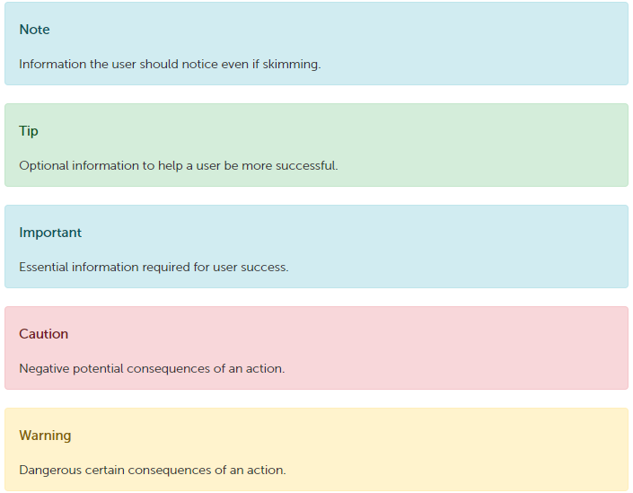

# Tizen Custom Markdown Reference

Some custom markdown were added for Tizen Docs.

## Alerts (Note, Tip, Important, Caution, Warning)

```
> [!NOTE]
> Information the user should notice even if skimming.

> [!TIP]
> Optional information to help a user be more successful.

> [!IMPORTANT]
> Essential information required for user success.

> [!CAUTION]
> Negative potential consequences of an action.

> [!WARNING]
> Dangerous certain consequences of an action.
```

These alerts look like this on docs.tizen.org:



## Links to external sites in a new window

The following case opens a new window to links:
```
[Tizen Developer](https://developer.tizen.org){:target="_blank"}
```
