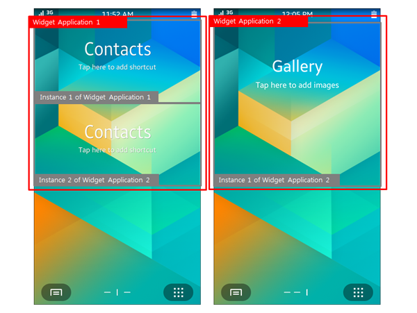
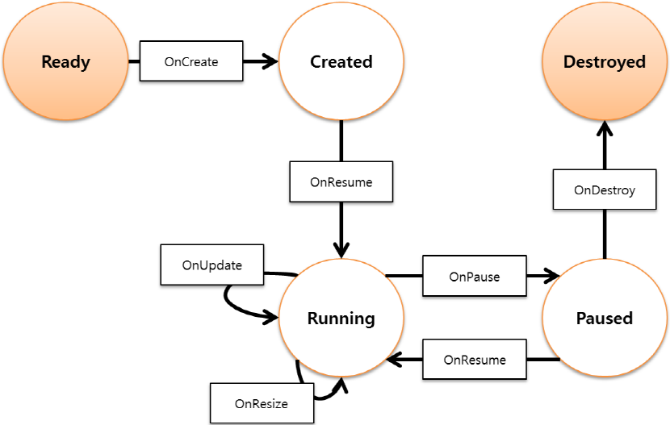

# Widget Application

You can create widget applications, which are Tizen .NET applications shown on the home screen. They are launched by the home screen when the user selects them in the **Add Widget** menu.

The main widget application features include:

- Creating widget applications

  You can [create a widget application](#create), which usually has 1 process for maintaining the main loop. Within the process, the framework can [create multiple widget instances](#app_instance) that can share the same resources.

  The widget application can also share data with other applications.

- Managing multiple widget instances

  Whenever a widget instance is requested, the framework creates one. You can manage the widget instances by updating or destroying them, or by retrieving information about them.

- Managing the life-cycle

  You can manage the [widget instance](#widget-instance-states-and-events) life-cycle through callback methods that are triggered as the instance state changes.

- Creating the widget UI

  The widget application can draw a UI on the home screen.

  > **Note**
  >
  > The widget application UI has a limitation with the scroll action to provide a better user experience. Design the widget UI to display all the information within the given area of the screen points.


## Prerequisites

To enable your application to use the widget functionality:

1. To use the methods and properties of the Tizen.Applications namespace, include it in your application:

   ```
   using Tizen.Applications;
    ```

2. Edit the widget application settings in the manifest file.


<a name="app_instance"></a>
## Widget Application and Widget Instance

The Tizen.Applications.WidgetApplication class provides the `WidgetApplication(IDictionary< Type, string > typeInfo)` constructor, which allows a widget application to have multiple widget classes. The widget applications with multiple classes can make diverse class instances whenever widget viewer applications, such as the home screen and the lock screen, request for a widget instance.

The widget instance has its own life-cycle similar to the widget application. However, the widget instance is only an object shown by the widget viewer applications. Many widget instances can be running on the same widget application process.

**Figure: Each widget application has 1 or more widget instances**



## Widget Instance States and Events

The following figure illustrates the widget instance states during the instance life-cycle:

- When the application is in the Ready state, the instance does not exist.
- When the instance is created, it is in the Created state.
- When the instance is visible, it is in the Running state.
- When the instance is invisible, it is in the Paused state.
- When the instance is destroyed, it is in the Destroyed state.

**Figure: Widget instance life-cycle**



The following table lists the callbacks you can use as the instance state changes.

**Table: Instance state change callbacks**

| Callback      | Description                              |
|---------------|------------------------------------------|
| `OnCreate()`  | Called after the widget instance is created. |
| `OnDestroy()` | Called before the widget instance is destroyed. |
| `OnPause()`   | Called when the widget is invisible.     |
| `OnResume()`  | Called when the widget is visible.       |
| `OnResize()`  | Called before the widget size is changed. |
| `OnUpdate()`  | Called when an event for updating the widget is received. |

You can declare a widget class by inheriting the Tizen.Applications.WidgetBase class. For example:

```
class MyWidget : WidgetBase
{
    public override void OnCreate(Bundle content, int w, int h) {}

    public override void OnPause() {}

    public override void OnResume() {}

    public override void OnResize(int w, int h) {}

    public override void OnUpdate(Bundle content, bool isForce) {}

    public override void OnDestroy(WidgetDestroyType reason, Bundle content) {}
}
```

<a name="create"></a>
## Creating the Widget Application

The widget application starts with the `Main()` function, which creates and initializes the application. The `Run()` method of the Tizen.Applications.WidgetApplication class is used to start the application event loop.

The `Tizen.Applications.WidgetApplication` class provides 2 kinds of constructors:

- If you create the widget application with the `WidgetApplication(Type type)` constructor, that widget application's ID is the same as the application ID.
- Using the `WidgetApplication(IDictionary<Type, string> typeInfo)` constructor, you can make widget applications with multiple widget classes.

A widget viewer application can add the widget application by using the widget application ID.

```
class Program
{
    static void Main(string[] args)
    {
        Elementary.Initialize();
        Elementary.ThemeOverlay();
        WidgetApplication app = new WidgetApplication(typeof(MyFirstWidget));
        WidgetApplication app = new WidgetApplication(new Dictionary<Type, string>()
        {
            {typeof(MySecondWidget), "second@org.tizen.MyWidget"}
        });
        app.Run(args);
    }
}
```

...


## Related Information
- Dependencies
  - Tizen 4.0 and Higher
