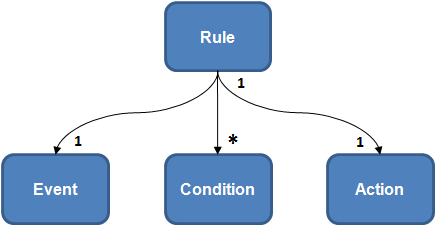

# Markdown style guide

Much of what makes Markdown great is the ability to write plain text, and get great formatted output as a result. To keep the slate clean for the next author, your Markdown should be simple and consistent with the whole corpus wherever possible.

All basic and GitHub Flavored Markdown (GFM) is supported. For more information on these, see:

- [Baseline Markdown syntax](https://daringfireball.net/projects/markdown/syntax)
- [GFM documentation](https://guides.github.com/features/mastering-markdown)

Contents:

1.  [Document layout](#document-layout)
1.  [Trailing whitespace](#trailing-whitespace)
1.  [Headings](#headings)
    1.  [ATX-style headings](#atx-style-headings)
    1.  [Add spacing to headings](#add-spacing-to-headings)
1.  [Text styling](#text-styling)
    1.  [Special characters](#special-characters)
1.  [Lists](#lists)
    1.  [Ordered lists](#ordered-lists)
    1.  [Undrdered lists](#unordered-lists)
    1.  [Nested list spacing](#nested-list-spacing)
1.  [Named anchors](#named-anchors)
1.  [Code](#code)
    1.  [Generic code block](#generic-code-block)
    1.  [Inline code blocks with language identifier](#inline-code-blocks-with-language-identifier)
    1.  [Escape newlines](#escape-newlines)
    1.  [Nest codeblocks within lists](#nest-codeblocks-within-lists)
1.  [Links](#links)
    1.  [Internal Links](#internal-links)
    1.  [External Links](#external-links)
1.  [Images](#images)
    1.  [Static image or animated gif](#static-image-or-animated-gif)
    1.  [Linked image](#linked-image)
1.  [Videos](#videos)
1.  [Tables](#tables)
1.  [Horizontal rule](#horizontal-rule)
1.  [Prefer lists to tables](#prefer-lists-to-tables)
1.  [Samples](#samples)

## Document layout

In general, most documents benefit from some variation of the following layout:

```markdown
# Document Title

Short introduction.

[TOC]

## Topic

Content.

## Related information

- Dependencies
- See also
  - https://link-to-more-info
```

1.  `# Document Title`: The first heading should be a level one heading, and should ideally be the same or nearly the same as the filename. The first level one heading is used as the page `<title>`.

1.  `author`: *Optional*. If you'd like to claim ownership of the document or if you are very proud of it, add yourself under the title. However, revision history generally suffices.

1.  `Short introduction.` 1-3 sentences providing a high-level overview of the topic. Imagine yourself as a complete newbie, who landed on your "Extending Foo" doc and needs to know the most basic assumptions you take for granted.
    "What is Foo? Why would I extend it?"

1.  `[TOC]`: If you use hosting that supports table of contents, such as Gitiles,
    put `[TOC]` after the short introduction. See
    [`[TOC]` documentation](https://gerrit.googlesource.com/gitiles/+/master/Documentation/markdown.md#Table-of-contents).

1.  `## Topic`: The rest of your headings should start from level 2.

1.  `## Related information`: Put miscellaneous information at the bottom for the user who wants to know more or didn't find what she needed.

## Trailing whitespace

Don't use trailing whitespace, use a trailing backslash.

The [CommonMark spec](http://spec.commonmark.org/0.28/#hard-line-breaks) decrees that two spaces at the end of a line should insert a `<br />` tag. However, many directories have a trailing whitespace presubmit check in place, and many IDEs will clean it up anyway.

Best practice is to avoid the need for a `<br />` altogether. Markdown creates paragraph tags for you simply with newlines: get used to that.

## Headings

### ATX-style headings

```markdown
## Heading 2
```

Headings with `=` or `-` underlines can be annoying to maintain and don't fit with the rest of the heading syntax. The user has to ask: Does `---` mean H1 or H2?

```markdown
Heading - do you remember what level? DO NOT DO THIS.
---------
```

### Add spacing to headings

Prefer spacing after `#` and newlines before and after:

```markdown
...text before.

# Heading 1

Text after...
```

Lack of spacing makes it a little harder to read in source:

```markdown
...text before.

#Heading 1
Text after... DO NOT DO THIS.
```

Use sentence-style capitalization. Always capitalize:
- The first word of a heading.
- The word following a colon in a title or heading (for example, "How to: Sort an array").

Headings should be done using atx-style, that is, use 1-6 hash characters (#) at the start of the line to indicate a heading, corresponding to HTML headings levels H1 through H6. Examples of first- and second-level headers are used above.

There **must** be only one first-level heading (H1) in your topic, which will be displayed as the on-page title.

If your heading finishes with a `#` character, you need to add an extra `#` character in the end in order for the title to render correctly. For example, `# Async Programming in F# #`.

Second-level headings will generate the on-page TOC that appears in the "In this article" section underneath the on-page title.

### Third-level heading
#### Fourth-level heading

## Text styling

**Bold**
Use for UI elements.

`Code`
Use for inline code, language keywords, package names, command-line commands, database table and column names, and URLs that you don't want to be clickable.
Use for files, folders, paths (for long items, split onto their own line), new terms.

### Special characters

Markdown uses special characters such as \*, \`, and \# for formatting. If you wish to include one of these characters in your content, you must do one of two things:

- Put a backslash before the special character to "escape" it (for example, `\*` for a \*)
- Use the [HTML entity code](http://www.ascii.cl/htmlcodes.htm) for the character (for example, `&#42;` for a &#42;).


## Lists

### Ordered lists

1. This
2. Is
3. An
4. Ordered
5. List

### Unordered lists

- This
- is
- a
- bulleted
- list


### Nested list spacing

When nesting lists, use a 4 space indent for both numbered and bulleted lists:

```markdown
1.  2 spaces after a numbered list.
    4 space indent for wrapped text.
2.  2 spaces again.

-   3 spaces after a bullet.
    4 space indent for wrapped text.
    1.  2 spaces after a numbered list.
        8 space indent for the wrapped text of a nested list.
    2.  Looks nice, don't it?
-   3 spaces after a bullet.
```

The following works, but it's very messy:

```markdown
- One space,
with no indent for wrapped text.
     1. Irregular nesting... DO NOT DO THIS.
```

Even when there's no nesting, using the 4 space indent makes layout consistent
for wrapped text:

```markdown
-   Foo,
    wrapped.

1.  2 spaces
    and 4 space indenting.
2.  2 spaces again.
```

However, when lists are small, not nested, and a single line, one space can suffice for both kinds of lists:

```markdown
- Foo
- Bar
- Baz.

1. Foo.
2. Bar.
```

## Links

### Internal Links

To link to a header in the same Markdown file (also known as anchor links), you'll need to find out the id of the header you're trying to link to. To confirm the ID, view the source of the rendered article, find the id of the header (for example, `id="blockquote"`), and link using # + id (for example, `#blockquote`).
The id is auto-generated based on the header text. So, for example, given a unique section named `## Step 2`, the id would look like this `id="step-2"`.

- For example: [Links](#links)

To link to a Markdown file in the same repo, use [relative links](https://www.w3.org/TR/WD-html40-970917/htmlweb.html#h-5.1.2), including the ".md" at the end of the filename.

- For example: [Readme file](../CONTRIBUTING.md)

To link to a header in a Markdown file in the same repo, use relative linking + hashtag linking.

- For example: [Sample 1](sample1.md#create)

### External Links

To link to an external file, use the full URL as the link.

- For example: [GitHub](http://www.github.com)

If a URL appears in a Markdown file, it will be transformed into a clickable link.

- For example: http://www.github.com

## Named anchors

Explicit anchors can be inserted anywhere in the document using <a name="tag"></a>.

Implicit anchors are automatically created for each heading. For example ## Section 1 will have the anchor section-1.

> **Anchor generation**
>
> - spaces are replaced with hyphens (-)
> - other characters are replaced with underscores (_)
> - runs of hyphens and underscores are collapsed

## Code

### Generic code block

The recommended approach is to use code blocks with language identifiers as explained in the previous section to ensure the proper syntax highlighting in the documentation site. Use generic code blocks only when necessary.
```
function fancyAlert(arg) {
    if(arg) {
        $.docs({div:'#foo'})
    }
}
```

### Inline code blocks with language identifier

It is best practice to explicitly declare the language, so that neither the syntax highlighter nor the next editor must guess.

Use three backticks (\`\`\`) + a language ID to apply language-specific color coding to a code block. Here is the list of supported languages showing the markdown label for each language ID. 

#### Supported Languages

| Name        | Markdown Label |
| ----------- | -------------- |
| C++         | cpp            |
| C#          | csharp         |
| JavaScript  | javascript     |
| JSON        | json           |
| NodeJS      | nodejs         |
| PHP         | php            |
| Shell       | shell, bash    |
| Python      | python         |
| Ruby        | ruby           |
| SQL / T-SQL | sql            |
| XAML        | xaml           |
| XML         | xml            |


The following are examples of code blocks using the language IDs for C# (\`\`\`csharp), Python (\`\`\`python), and Bash (\`\`\`bash).

#### C\#

<pre>
```csharp
using System;
namespace HelloWorld
{
    class Hello
    {
        static void Main()
        {
            Console.WriteLine("Hello World!");

            // Keep the console window open in debug mode.
            Console.WriteLine("Press any key to exit.");
            Console.ReadKey();
        }
    }
}
```
</pre>

#### Python

<pre>
```python
friends = ['john', 'pat', 'gary', 'michael']
for i, name in enumerate(friends):
    print "iteration {iteration} is {name}".format(iteration=i, name=name)
```
</pre>

#### Bash

<pre>
```bash
$ mkdir ~/bin/$ PATH=~/bin:$PATH
$ sudo vim /usr/local/bin/git-proxy
```
</pre>

### Escape newlines

Because most commandline snippets are intended to be copied and pasted directly
into a terminal, it's best practice to escape any newlines. Use a single
backslash at the end of the line:

<pre>
```shell
bazel run :target -- --flag --foo=longlonglonglonglongvalue \
--bar=anotherlonglonglonglonglonglonglonglonglonglongvalue
```
</pre>

#### Nest codeblocks within lists

If you need a codeblock within a list, make sure to indent it so as to not break
the list:

```markdown
-   Bullet.

    ```c++
    int foo;
    ```

-   Next bullet.
```

You can also create a nested code block with 4 spaces. Simply indent 4
additional spaces from the list indentation:

```markdown
-   Bullet.

        int foo;

-   Next bullet.
```

## Images

### Static Image or Animated gif



### Linked Image

[](https://www.tizen.org)

## Videos

Currently, you can embed both YouTube videos with the following syntax:

### YouTube

To get the video's correct URL, right-click on the video, select **Copy Embed Code**, and copy the URL from the `<iframe>` element.

```markdown
[](<youtube_video_link>)
```

For example:

```markdown
[](https://youtube.com/embed/NdvWwU0gKt8)
```

You can use HTML for videos.

## Tables

| Tables           |      Are      |  Cool |
| ---------------- | :-----------: | ----: |
| col 1 is default | left-aligned  |    $1 |
| col 2 is         |   centered    |   $12 |
| col 3 is         | right-aligned | $1600 |

You can use a [Markdown table generator tool](http://www.tablesgenerator.com/markdown_tables) to help creating them more easily.

## Horizontal rule

---

## Prefer lists to tables

Any tables in your Markdown should be small. Complex, large tables are difficult
to read in source and most importantly, **a pain to modify later**.

```markdown
Fruit | Attribute | Notes
--- | --- | --- | ---
Apple | [Juicy](https://example.com/SomeReallyReallyReallyReallyReallyReallyReallyReallyLongQuery), Firm, Sweet | Apples keep doctors away.
Banana | [Convenient](https://example.com/SomeDifferentReallyReallyReallyReallyReallyReallyReallyReallyLongQuery), Soft, Sweet | Contrary to popular belief, most apes prefer mangoes.

DO NOT DO THIS
```

[Lists](#lists) and subheadings usually suffice to present the same information
in a slightly less compact, though much more edit-friendly way:

```markdown
## Fruits

### Apple

* [Juicy](https://SomeReallyReallyReallyReallyReallyReallyReallyReallyReallyReallyReallyReallyReallyReallyReallyReallyLongURL)
* Firm
* Sweet

Apples keep doctors away.

### Banana

* [Convenient](https://example.com/SomeDifferentReallyReallyReallyReallyReallyReallyReallyReallyLongQuery)
* Soft
* Sweet

Contrary to popular belief, most apes prefer mangoes.
```

However, there are times when a small table is called for:

```markdown
Transport | Favored by | Advantages
--- | --- | ---
Swallow | Coconuts | Otherwise unladen
Bicycle | Miss Gulch | Weatherproof
X-34 landspeeder | Whiny farmboys | Cheap since the X-38 came out
```

## Samples

[API Guide Sample](sample1.md) 
