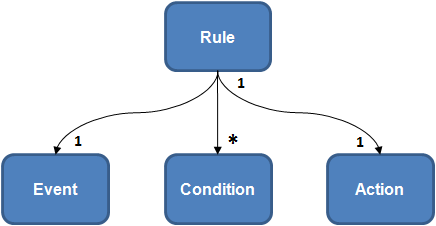

# Layout

This is template for API Guide document.

```markdown
# Document Title

Short introduction.

[TOC] or [Main features]

## [Prerequisites]

## Topic

Content.

## Related information

- Dependencies
- See also
  - https://link-to-more-info
```

1.  `# Document Title`: The first heading should be a level one heading, and should ideally be the same or nearly the same as the filename. The first level one heading is used as the page `<title>`.

1.  `Short introduction.` 1-3 sentences providing a high-level overview of the topic. Imagine yourself as a complete newbie, who landed on your "Extending Foo" doc and needs to know the most basic assumptions you take for granted.
    "What is Tizen? Why would I extend it?"

1.  `[TOC]`: If you use hosting that supports table of contents, such as Gitiles,
    put `[TOC]` after the short introduction.

1.  `[Prerequisites]`: If APIs or Tools need prerequisites, you should it before `Topic` description.

1.  `## Topic`: The rest of your headings should start from level 2.

1.  `## Related information`: Put miscellaneous information at the bottom for the user who wants to know more or didn't find what she needed.

## Section details

### Title

This section shows the title of the contents with \#. It should ideally be the same or nearly the same as the filename.

Example:
```markdown
# Alarm
```

### Short introduction

This section shows what the component is.

Example:
```markdown
You can use alarms to launch applications or send user notifications at specific times. The mechanism involved in launching the application is the class.

The class allows launching an application explicitly, giving its package name, or providing certain criteria that the application must meet. For example, the criteria can include the type of data on which the application must be able to operate. The structure containing the criteria is called an application control.

```

### [TOC]

This section shows contents of documents or major features of APIs.

In case of contents:

Example:
```markdown
Contents:

- [Prerequisites](#prerequisites)
- [Setting an Alarm after Specific Time](#scenario_1)
- [Setting an Alarm on a Specific Date](#scenario_2)
- [...](#scenario_3)
```

In case of main features:

Main features should be described in the form of a gerund.

Example:
```markdown
The main features of the `Alarm` and `AlarmManager` classes include:

-   Setting alarms with a specific delay
    You can set an alarm to trigger after a specific amount of time.

-   Setting alarms for specific dates
    You can set an alarm for a specific date.
- ...
```

### Prerequisites

This section shows the required features, privileges, or conditions.

Example:
```markdown
## Prerequisites

To enable your application to use the alarm functionality:

1. To use the Alarm API applications), the application has to request permission by adding the following privileges to the `tizen-manifest.xml` file:

   <privileges>
      <privilege>http://tizen.org/privilege/alarm.get</privilege>
      <privilege>http://tizen.org/privilege/alarm.set</privilege>
      <!--If an alarm is used to send a notification-->
      <privilege>http://tizen.org/privilege/notification</privilege>
   </privileges>

2. To use the methods and properties of the `Tizen.Applications.Alarm` and `Tizen.Applications.AlarmManager`classes, include the [Tizen.Applications](https://developer.tizen.org/dev-guide/csapi/namespaceTizen_1_1Applications.html) namespace in your application:

   using Tizen.Applications;

3. ...
```

### Topic

This section describes detailed features. One of features can be a heading.

Example:
```markdown
## Trigering events

This feature is ......
```
- Procedure

  You can shows steps to explain how to do in topic section.

Example:
```markdown
## Setting an Alarm with a Specific Delay

You can set an alarm which, when it expires, either launches an application or sends a notification to the user:

-   To set an alarm to launch an application:

    You need 2 applications: the "AlarmRegister" application that sets the alarm, and the "AlarmTarget" application that is launched when the alarm expires.

    1. In the AlarmRegister application:
        1. To identify which application to start when the alarm expires, the [Tizen.Applications.AlarmManager](https://developer.tizen.org/dev-guide/csapi/classTizen_1_1Applications_1_1AlarmManager.html) class needs an application control instance.Create a new instance of the [Tizen.Applications.AppControl](https://developer.tizen.org/dev-guide/csapi/classTizen_1_1Applications_1_1AppControl.html) class, and set the `Operation` and `ApplicationID` properties for it. The `Operation` property identifies the operation to be performed, and the `ApplicationID` property identifies the `appid` of the target application to be launched. You can get the `appid` of the target application from its `tizen-manifest.xml` file.

            ```
            int DELAY = 2;
            int PERIOD = 1;

            AppControl appControl = new AppControl();

            appControl.Operation = AppControlOperations.Default;
            appControl.ApplicationId = "org.tizen.alarmslave";
            ```
        2.  To schedule an alarm after a delay, use the `CreateAlarm()` method of the `Tizen.Applications.AlarmManager` class, with the initial delay, interval for subsequent alarms, and instance of the `Tizen.Applications.AppControl` class as parameters.The method creates the alarm as a new instance of the [Tizen.Applications.Alarm](https://developer.tizen.org/dev-guide/csapi/classTizen_1_1Applications_1_1Alarm.html) class.
            ```
            Alarm myAlarm = AlarmManager.CreateAlarm(DELAY, PERIOD, appControl);
            ```
    2. Implement the AlarmTarget application:
        A scheduled alarm calls AlarmTarget's `app_control_cb()` callback when the alarm expires:

-   To set an alarm to send a notification to the user:
    Create a notification to be sent to the user as an instance of the Tizen.Applications.Notifications.Notification class:

## Triggering an Alarm
You can trigger ...

```

## Other elements

### Image

A image has a caption if it is needed.

```markdown
**Figure: Rule components**


```

### Note

  should add "Note" with strong.

```markdown
> **Note**
>
> The system can adjust when the alarm expires.
> ...
```

### Table

This section shows table element.

```markdown
**Table: tm fields**

| Member   | Type | Meaning                  | Range |
| -------- | ---- | ------------------------ | ----- |
| `tm_sec` | int  | Seconds after the minute | 0-61* |
```


## Samples

- [Sample 1](sample1.md)

